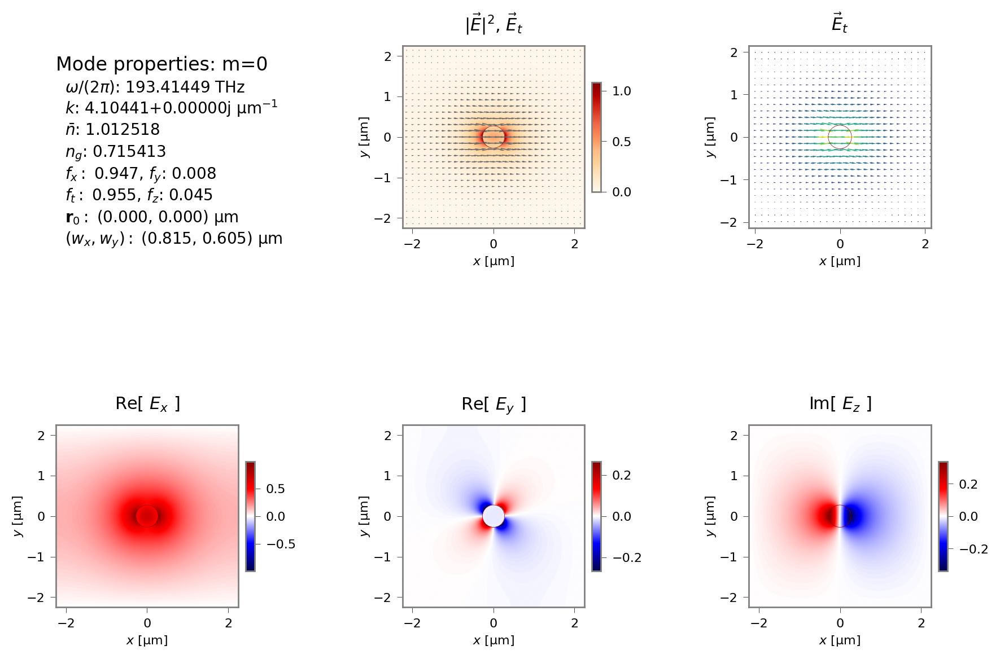
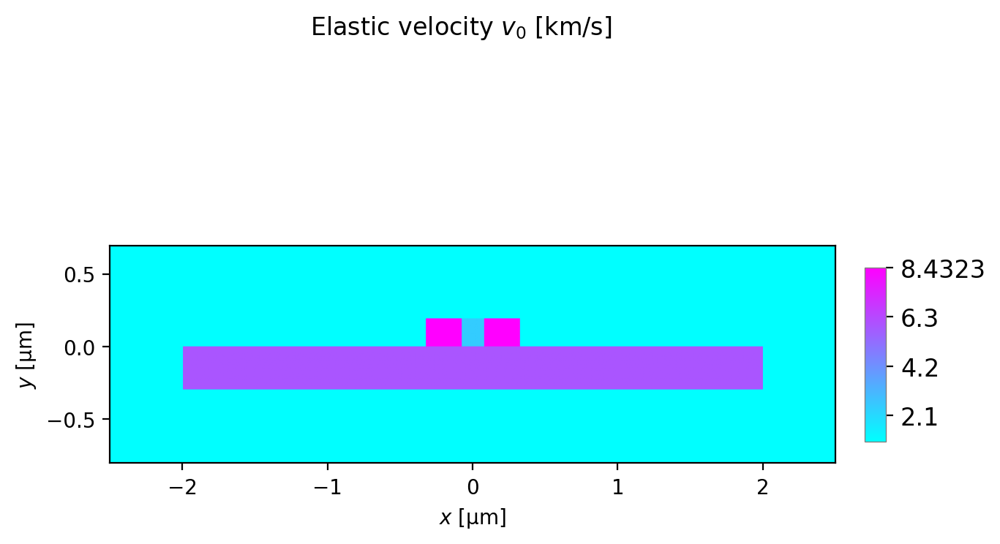
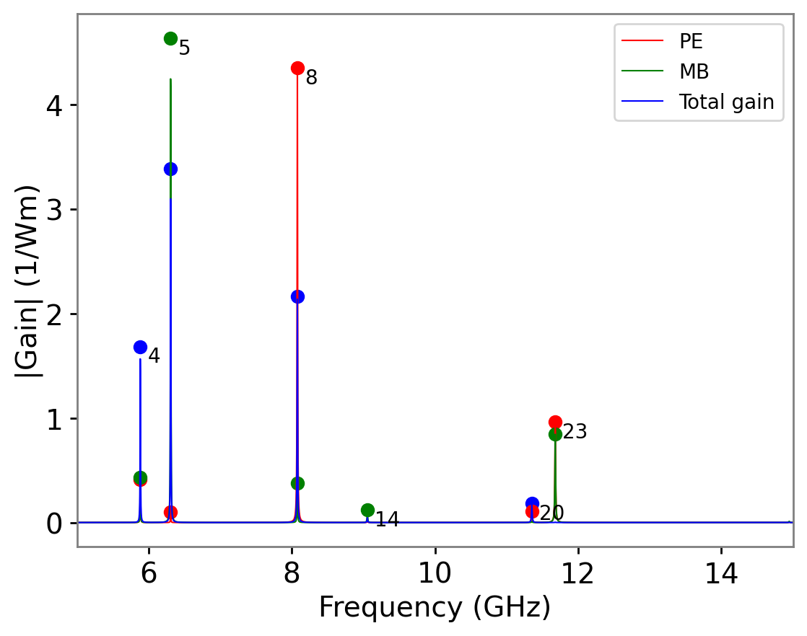
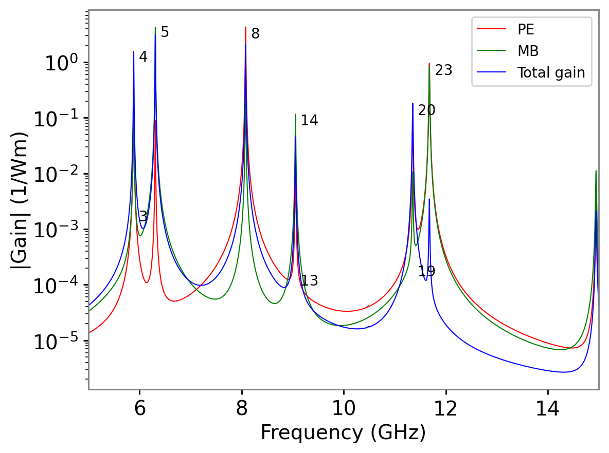
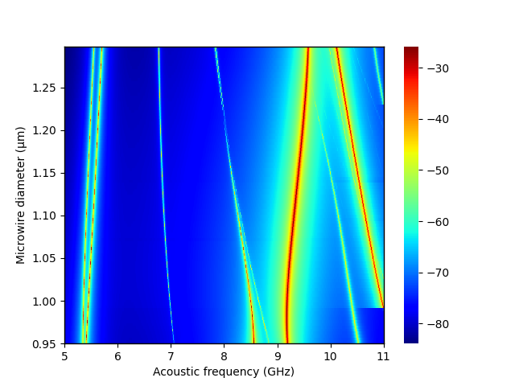

# NumBAT - The Numerical Brillouin Analysis Tool

NumBAT integrates electromagnetic and acoustic mode solvers to study the interaction of optical and acoustic waves in photonic waveguides, with a particular focus on stimulated Brillouin scattering.

## Capabilities

NumBAT's capabilities are constantly growing. The current feature set includes:
- Eigenmode calculation and visualisation of optical waveguide modes
- Eigenmode calculation and visualisation of elastic waveguide modes
- Calculation of stimulated Brillouin gain coefficients for both the photoelastic and moving boundary effects
- An extensible library of waveguide material files
- Support for full elastic anisotropy
- Templates for a large range of waveguide structures and a simple framework for defining user templates to support novel waveguide designs

Support for piezoelectric effects is in development.

NumBAT is essentially an eigenmode solver. It does *not* perform longitudinal integration of the SBS coupled mode equations, but the gain coefficients it produces can easily be used as parameters in standard ODE solvers to find the longitudinal evolution of the optical and elastic fields.

## Implementation

NumBAT uses the finite element method to solve modal fields for both the optical and elastic fields, as solutions to Maxwell's equations and the elastic wave equation respectively.

The core finite element solvers are written in modern Fortran. Meshing is performed using the Gmsh open source tool.

All user interaction with NumBAT is performed through a sophisticated python front end, either using `.py` scripts or Jupyter notebooks.

## Example results

NumBAT calculates a wide range of results, including optical and elastic mode profiles, Brillouin gain spectra, and bulk mode dispersion curves for any elastic material.

### Bulk dispersion properties

Calculate dispersive and polarisation properties of elastic modes for arbitrary anistropy.


### Optical and elastic dispersion relations

Calculate dispersion relations for optical and elastic waveguide modes.


### Optical and elastic mode profiles

Plot and analyse properties of optical and elastic waveguide modes.




### Refractive index and stiffness profiles

Generate profiles of refractive index, stiffness, elastic phase velocity, and density profiles.



### Brillouin gain profiles

Generate Brillouin gain spectra for arbitrary combinations of optical and elastic modes and correlate key peaks against mode numbers.





## Availability

NumBAT is developed on Linux and builds from source under Linux, MacOS and Windows. A binary release for Windows is also available.

The current release of NumBAT can be found at [https://github.com/michaeljsteel/NumBAT](https://github.com/michaeljsteel/NumBAT).

Current documentation is available at [ReadTheDocs](http://numbat-au.readthedocs.io/en/latest/) or in the `NumBAT.pdf` file in the root directory.

## Installation

NumBAT builds natively on Linux, MacOS and Windows. A pre-built binary install is also available for Windows.

### Build from source

The full build of NumBAT requires a number of additional libraries and compilation tools. On each platform, you should use a relatively recent compiler.

For detailed instructions, please see the Installation chapter in the [HTML documentation](http://numbat-au.readthedocs.io/en/latest/) or in the pdf version of the documentation `NumBAT.pdf` in the main directory.

### Binary install

On Windows, you can also try the [binary installer](https://github.com/michaeljsteel/NumBAT/releases/tag/v2.1.3). This installs the NumBAT specific code. You will still need to have installs of python and Gmsh as well.

You should still read the Installation chapter in the [HTML documentation](http://numbat-au.readthedocs.io/en/latest/) or in the pdf version of the documentation `NumBAT.pdf` in the main directory, to learn how to correctly setup python and Gmsh to work with NumBAT.

## Credits

NumBAT was developed by Michael Steel, Bjorn Sturmberg, Kokou Dossou, and Christopher Poulton in a collaboration between Macquarie University and the University of Technology Sydney, as part of the Australian Research Council Discovery Project DP160101691.

## How to cite

If you find NumBAT useful in your work, we would appreciate a citation as follows:

**Optica Style**

B. C. P. Sturmberg, K. B. Dossou, M. J. A. Smith, B. Morrison, C. G. Poulton, and M. J. Steel, "Finite element analysis of stimulated Brillouin scattering in integrated photonic waveguides", J. Lightwave Technol. **37**, 3791-3804 (2019).

**BibTeX:**

```bibtex
@article{numbat2017,
   authors={B. C. P. Sturmberg, K. B. Dossou, M. J. A. Smith, B. Morrison, C. G. Poulton, and M. J. Steel},
   title={Finite element analysis of stimulated Brillouin scattering in integrated photonic waveguides},
   journal={Journal of Lightwave Technology},
   volume={37},
   year={2019},
   pages={3791--3804},
   doi={10.1109/JLT.2019.2920844},
   url={https://github.com/michaeljsteel/NumBAT}
}
```
