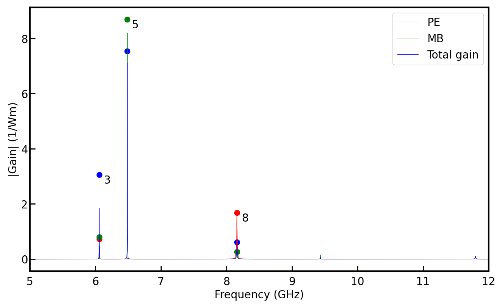
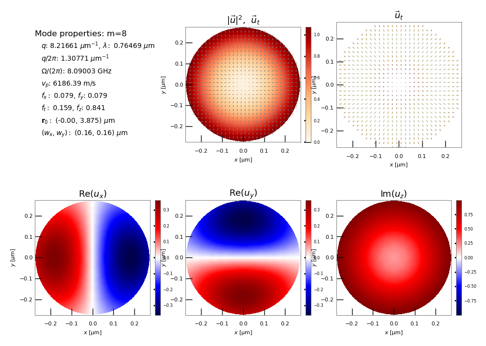

Welcome to NumBAT!
--------------------

NumBAT, the Numerical Brillouin Analysis Tool, integrates electromagnetic and acoustic mode solvers to calculate the interactions of optical and acoustic waves in waveguides.

NumBAT was developed by Michael Steel, Bjorn Sturmberg, Kokou Dossou, and Christopher Poulton in a collaboration between Macquarie University and the University of Technology Sydney, as part of the Australian Research Council Discovery Project DP160101691.

Example results
-----------------

Availability
------------
NumBAT is developed on Linux and builds from source under Linux, MacOS and Windows. A binary release for Windows is also available.

Download
---------

The current release of NumBAT can be found at https://github.com/michaeljsteel/NumBAT.

Current documentation is available
at  `ReadTheDocs <http://numbat-au.readthedocs.io/en/latest/>`_ or in the ``NumBAT.pdf`` file in the root directory.

Installation
-------------
NumBAT builds natively on Linux, MacOS and Windows.

A pre-built binary install is also available for Windows.

Build from source
^^^^^^^^^^^^^^^^^^
The full build of NumBAT requires a number of additional libraries and compilation tools. On each platform, you should use a relatively recent compiler.

For detailed instructions, please see the Installation chapter in the `HTML documentation <http://numbat-au.readthedocs.io/en/latest/>`_ or in the pdf version of the documentation ``NumBAT.pdf`` in the main directory.

Binary install
^^^^^^^^^^^^^^^^^^
On Windows, you can also try the `binary installer <https://github.com/michaeljsteel/NumBAT/releases/tag/v2.0.0.1>`_.

You should still read the Installation chapter in the `HTML documentation <http://numbat-au.readthedocs.io/en/latest/>`_ or in the pdf version of the documentation ``NumBAT.pdf`` in the main directory, to learn how to correctly setup python and gmsh to work with NumBAT.

