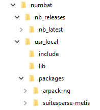

.. include:: numbatdefs.txt

.. _chap-install-label:

*******************
Installing NumBAT
*******************

This chapter provides instructions on installing |NUMBAT| on each platform.
Please email |NUMBAT_EMAIL| to let us know of any difficulties you encounter, or suggestions for improvements to the install procedure on any platform, but especially for MacOS or Windows.

Information for all platforms
================================
While |NUMBAT| is developed on Linux, it can also be built on MacOS X as a
native command-line application, and under Windows using a virtual machine running Linux.
A native Windows build is currently in development. 

In all cases, the current source code for |NUMBAT| is hosted `here on Github <https://github.com/michaeljsteel/|NUMBAT|>`_. Please always download the latest release from the github page.

Install locations
---------------------

There is no need to install |NUMBAT| in a central location
such as ``/usr/local/`` or ``/opt/local/`` though you may certainly choose to do so.

Here and throughout this documentation, we use the string ``<NumBAT>`` to indicate the root |NUMBAT| install directory (e.g. ``/usr/local/NumBAT``, ``/home/mike/NumBAT``, ``/home/myuserid/research/NumBAT``).

Installing on Linux
================================

|NUMBAT| has been developed and tested on Ubuntu 23.04 with the following
package versions: Python 3.11.4, Numpy 1.24.2, Arpack-NG, Suitesparse 7.1.0,
and Gmsh 4.8.4.  |NUMBAT| also depends on the BLAS and :eq: libraries. We
strongly recommend linking |NUMBAT| against optimised versions, such as the MKL
library provided in the  free Intel OneAPI library.

|NUMBAT| has also been successfully installed by users on Debian and
RedHat/Fedora, and with different versions of packages, but these installations
have not been as thoroughly documented so may require user testing.  In
general, any relatively current Linux system should work without trouble.

|NUMBAT| building and installation is easiest if you have root access, but it
is not required.  See the section below if you do not have root access (or the
ability to run ``sudo``) on your machine.

The following steps use package syntax for Ubuntu/Debian systems. For other
Linux flavours, you may need to use different package manager syntax and/or
slightly different package names.

The code depends critically on matrix-vector operations provided by Lapack and
Blas libraries. We strongly recommend using an optimised library such as the
Intel OneAPI library (for Intel CPUs) or the AMD Optimizing CPU Libraries
(AOCL) for AMD CPUs.  The steps below demonstrate the Intel OneAPI approach.

Required libraries
--------------------------

#. Before installing, ensure your system is up to date ::

    $ sudo apt-get update
    $ sudo apt-get upgrade

#. Install the required libraries using your distribution's package manager.

   On Ubuntu, perform the following::

    $ sudo apt-get install gcc gfortran make gmsh 
    $ sudo apt-get install libatlas-base-dev libblas-dev liblapack-dev 
    $ sudo apt-get install suitesparse umfpack libsuitesparse-dev arpack-ng

#. If you using the Intel OneAPI math libraries, you need both of the following:

    - *Intel OneAPI Base Toolkit*:
        This is the main Intel developer environment including C/C++ compiler and many high performance math libraries.

        Download and run the `installer <https://www.intel.com/content/www/us/en/developer/tools/oneapi/base-toolkit-download.html>`_ accepting all defaults.

    - *Intel OneAPI HPC Toolkit*
        This adds the Intel Fortran compiler amongst other HPC tools.

        Download and run the `installer <https://www.intel.com/content/www/us/en/developer/tools/oneapi/hpc-toolkit-download.html>`__ accepting all defaults.

#. If you using the Intel OneAPI math libraries, you should add the library path
   ``/opt/intel/oneapi/2024.1/lib`` to your ``LD_LIBRARY_PATH`` variable in one of your shell startup files (eg. ``~/.bashrc``). 

Building |NUMBAT| itself
--------------------------

#. Create a python virtual environment for working with |NUMBAT|.
   You can use any name and location for your tree.
   To specify a virtual environment tree called `nbpy3` in your home directory, enter ::

    $ cd ~
    $ python3 -m virtualenv nbpy3

#. Activate the new python virtual environment ::

      $ source ~/nbpy3/bin/activate

#. Install necessary python libraries ::

      $ pip3 install numpy matplotlib scipy psutils sphinx

   Ensure that your ``numpy`` version  is from the 1.26.x and not the new 2.0.0 line.

#. Create a working directory for your |NUMBAT| work and move into it.

#. To download the current version from the git repository and install any missing library dependencies, use ::

    $ git clone https://github.com/michaeljsteel/NumBAT.git
    $ cd NumBAT

#. Open the file ``<NumBAT>/backend/fortran/Makefile`` in a text editor and check the settings associated with the variables ``PLAT`` that control the preferred math library. The default setting is to use the Intel OneAPI library which is the recommended configuration.

#. Now at last, we can build |NUMBAT| by running the following in the root ``<NumBAT>`` directory. ::

   $ make build

#. If this completes without error, you are ready to proceed to the next chapter to begin using |NUMBAT|.

#. If the build halts with a ``make`` error of the form ``*** No rule to make target ...``, try running ``make build`` a couple more times.

#. If you hit a compile error you can't resolve, please get in touch at |NUMBAT_EMAIL|.

Other build configurations
--------------------------

The default compiler for Linux is GCC's ``gfortran``.

It is also possible to build |NUMBAT| with the ``ifx`` compiler from Intel's free OneAPI HPC toolkit.

**This is experimental and likely to fail for you.**

To do so,

#. Install the Intel OneAPI Base and HPC Toolkits.
#. Adjust your LD_LIBRARY_PATH variable in your ``~/.bashrc`` or equivalent to include ``/opt/intel/oneapi/2024.1/lib``.
#. Change the ``COMPILER_VENDOR`` switch in ``<NumBAT>/backend/fortran/Makefile``.
#. In ``<NumBAT>/backend/fortran``, run::

    $ make clean
    $ make

Installing without root access
----------------------------------------------------
Compiling and installing |NUMBAT| itself does not rely on having root access to your machine. However, installing the supporting libraries such as SuiteSparse and Arpack
is certainly simpler if you have root or the assistance of your system admin.

If this is not possible, you can certainly proceed by building and installing all the required libraries into your own tree within your home directory.
It may be helpful to create a tree like the following so that the relevant paths mirror those of a system install::

   $HOME/
    |---my_sys/
         |---usr/
              |---include/
              |---lib/
              |---bin/

Troubleshooting Linux installs
-------------------------------
Performing a full build of |NUMBAT| and all its libraries from scratch is a non-trivial task and it's possible you will hit a few stumbles.
Here are a few traps to watch out for:

#. Please ensure to use relatively recent libraries for all the Python components. This includes using 
   
   - Python: 3.10 or later
   - ``matplotlib``: 3.9.0 or later
   - ``scipy``:  1.13.0 or later
   - ``numpy``:  1.26.2 or later

#. But try not to use very recently released major upgrades. 
   
   Notably the 2.0.0 series of ``numpy``, which was only released in mid-June 2024 includes major changes to ``numpy`` architecture and is  not yet supported.

#. Be sure to follow the instructions above about setting up the virtual environment for |NUMBAT| excusively. This will help prevent incompatible Python modules being added over time.

#. In general, the GCC build is more tested and forgiving than the build with the Intel compilers and we recommend the GCC option.  However, we do recommend using the Intel OneAPI math libraries as described above. This is the easiest way to get very high performance LAPACK and BLAS libraries with a well-designed directory tree.

#. If you encounter an error about "missing symbols" in the NumBAT fortran module, there are usually two possibilities:

   - A shared library (a file ending in ``.so``) is not being loaded correctly because it can't be found in the standard search path. To detect this, run ``ldd nb_fortran.so`` in the ``backend/fortran`` directory and look for any lines containing ``not found``. 

     You may need to add the directory containing the relevant libraries to your ``LD_LIBRARY_PATH`` in your shell setup files (eg. ``~/.bashrc`` or equivalent).

   - You may have actually encountered a bug in the |NUMBAT| build process. Contact us for assistance as described in the introduction.

Installing on MacOS
================================

|NUMBAT| can also be installed on MacOS, though this is currently somewhat experimental and has only been performed on certain versions of MacOS.  Any comments on difficulties and solutions will be appreciated.

The following steps have worked for us:

#. Open a terminal window on your desktop.

#. Ensure you have the Xcode Command Line Tools installed. This is the basic package for command line development on MacOS. Enter the following command and then follow the prompts.

   $ xcode-select --install

   **Note** that there is a different version of the Xcode tools for each major release of MacOS. If you have upgraded your OS, say from Ventura to Sonoma, you must install the corresponding version of Xcode.

   If the installer says Xcode is installed but an upgrade exists, you almost certainly want to apply that upgrade.

#. Make a folder for |NUMBAT| studies and clone the github repository::

   $ mkdir numbat
   $ cd numbat
   $ git clone https://github.com/michaeljsteel/NumBAT.git
   $ cd NumBAT

#. If it is not already on your system, install the  `MacPorts package manager <https://macports.org/install.php>`_.

#. Install the  `Gmsh  <https://gmsh.info>`_ mesh generation tool.
   Just the main Gmsh installer is fine. The SDK and other features are not required.

   **Note:** After the installer has run, you must move the Gmsh application into your Applications
   folder by dragging the Gmsh icon into Applications.

#. Install a current gcc (we used gcc)::

   $ sudo port install gcc13

#. Install the Lapack and Blas linear algebra libraries::

   $ sudo port install lapack

#. Install the Arpack eigensolver::

   $ sudo port install arpack

#. Install the SuiteSparse matrix algebra suite::

   $ sudo port install suitesparse

#. Install a current python (we used python 3.12):

   Use the standard installer at `<https://www.python.org/downloads/macos/>`_.

   (Note that this will install everything in `/Library/Frameworks` and **not** override
   the System python in `/System/Library/Frameworks.`)

#. Install python `virtualenv` package

   $ cd /Library/Frameworks/Python.framework/Versions/3.12/bin/
   $ ./python3.12 -m pip install --upgrade pip
   $ ./pip3 install virtualenv

#. Create a |NUMBAT|-specific python virtual environment in `~/nbpy3`

    $ cd /Library/Frameworks/Python.framework/Versions/3.12/bin/
    $ ./python3 -m virtualenv ~/nbpy3

#. Activate the new python virtual environment (note the leading fullstop) ::

    $ . ~/nbpy3/bin/activate

#. Install necessary python libraries ::

    $ pip3 install numpy matplotlib scipy psutil

#. Check that the python installs work and create a matplotlib .config directory::

   $ python3.12
   $ import matplotlib
   $ import numpy
   $ import scipy
   $ import psutil

#. Install the |NUMBAT| matplotlib style file::

   $ mkdir -pR $HOME/.matplotlib/stylelib/
   $ cp <NumBAT>/backend/|NUMBAT|style.mplstyle $HOME/.matplotlib/stylelib

#. Move to the |NUMBAT| fortran directory::

   $ cd backend/fortran

#. Open the file `Makefile` in your preferred text editor and edit the lines at the top  of the file so that:

     - The line `PLAT=MacOS` is active and the others are commented out with a leading `#` symbol.
     - The value of `MYPYENV` matches the folder of your python virtual environment set up above.
     - The value of `PYVERMAJMIN` and `SYSTEMPYINC` are set appropriately.

#. Now at last, we can build |NUMBAT| ::

   $ make

#. If this completes without error, you are ready to proceed to the next chapter to begin using |NUMBAT|.

#. If you hit a compile error you can't resolve, please get in touch at |NUMBAT_EMAIL|.

Installing on Windows
================================

Installing the Linux version via a Virtual Machine
------------------------------------------------------

The easiest way to run |NUMBAT| on  Windows is usually by installing Ubuntu as
a virtual machine using either `Microsoft Hyper-V
<https://wiki.ubuntu.com/Hyper-V>`_ or `Oracle Virtual Box
<https://ubuntu.com/tutorials/how-to-run-ubuntu-desktop-on-a-virtual-machine-using-virtualbox#1-overview>`_.

Then |NUMBAT| can be installed using exactly the same procedure as described
above for standard Linux installations.  It is also possible to build |NUMBAT|
using the `Windows Subsystem for Linux
<https://msdn.microsoft.com/en-au/commandline/wsl/install_guide>`_, but dealing
with installing the additional required packages may be quite painful.

Installing the Native Windows version
-------------------------------------------

**This build is experimental and very likely to fail for you.**

There is now an experimental version of |NUMBAT| built entirely using the native Windows toolchain including
Visual Studio and the Intel Fortran compiler. There are a surprising number of steps and tools required, but it should go relatively smoothly.

#. **Python environment**

    The standard Python solution for Windows is the Anaconda distribution.

    If you do not have a current Python, download the `Anaconda installer <https://docs.anaconda.com/free/anaconda/install/windows/>`_ and follow the instructions.

#. **Windows build tools**

    The following tools are all free but will use several GB of disk space.

    - *Visual Studio*:
        This is the primary Microsoft development environment.

        To install the free Community 2022 edition, download the `main installer <https://visualstudio.microsoft.com/vs/community/>`_ and follow the instructions.

    - *Intel OneAPI Base Toolkit*:
        This is the main Intel developer environment including C/C++ compiler and many high performance math libraries.

        Download and run the `installer <https://www.intel.com/content/www/us/en/developer/tools/oneapi/base-toolkit-download.html>`_ accepting all defaults.

    - *Intel OneAPI HPC Toolkit*
        This adds the Intel Fortran compiler amongst other HPC tools.

        Download and run the `installer <https://www.intel.com/content/www/us/en/developer/tools/oneapi/hpc-toolkit-download.html>`__ accepting all defaults.

    - *Git*
        This is a source control that we use to download |NUMBAT| and some other tools.

        Download and run the  `latest Git for Windows release <https://git-scm.com/download/win>`_, accepting all defaults.

        Some users may prefer to use a graphical interface such as `GitHub Desktop <https://desktop.github.com/>`_. This is fine too.

    - *CMake*
        This is a cross-platform build tool we will need for building some of the libraries.

        Download and run the  `latest release <https://cmake.org/download/>`_ accepting all defaults.

NumBAT code and libraries
^^^^^^^^^^^^^^^^^^^^^^^^^
We can now build the supporting libraries, and then |NUMBAT| itself.

#. Choose a location for the base directory for building |NUMBAT| and supporting libraries,
    say ``c:\Users\<myname>\numbat``, which we will refer to as ``<NumBAT_BASE>``.

#. Use the Start Menu to open the *Intel OneAPI Command Prompt for Intel 64 for Visual Studio 2022*.
   This is simply a Windows terminal with some Intel compiler environment variables pre-defined.

#. In the terminal window, change to the ``<NumBAT_BASE>`` directory, then execute the following commands::

    $ mkdir nb_releases
    $ mkdir usr_local
    $ mkdir usr_local\include
    $ mkdir usr_local\lib
    $ mkdir usr_local\packages
    $ cd usr_local\packages
    $ git clone https://github.com/opencollab/arpack-ng.git arpack-ng
    $ git clone https://github.com/jlblancoc/suitesparse-metis-for-windows.git suitesparse-metis
    $ cd ..\nb_releases
    $ git clone https://github.com/michaeljsteel/NumBAT.git nb_latest

#. Your ``<NumBAT_BASE>`` tree should now look like this:

Building SuiteSparse
""""""""""""""""""""""
This library performs sparse matrix algebra, used in the eigensolving routines of |NUMBAT|.

1. In the Intel command terminal, cd to ``<NumBAT_BASE>\usr_local\packages\suitesparse-metis``.

2. Enter the following command. It may take a minute or two to complete::

    $ cmake -B build .

3. If that completes correctly, use Windows Explorer to open ``<NumBAT_BASE>\usr_local\packages\suitesparse-metis\build\SuiteSparseProject.sln`` with Visual Studio 2022.

4. In the pull-down menu in the ribbon, select the *Release* build. Then hit the second Green Arrow in the ribbon to build the whole project.  This will take a couple of minutes.

5. Return to the command terminal and  cd to ``<NumBAT_BASE>\usr_local``. Then execute the following commands::

    $ copy packages\suitesparse-metis\build\lib\*.dll lib
    $ copy packages\suitesparse-metis\build\lib\*.lib lib
    $ copy packages\suitesparse-metis\build\lib\*.lib lib
    $ copy packages\suitesparse-metis\SuiteSparse\AMD\Include\*.h include
    $ copy packages\suitesparse-metis\SuiteSparse\UMFPACK\Include\*.h include
    $ copy packages\suitesparse-metis\SuiteSparse\SuiteSparse_config\*.h include

Building Arpack-ng
""""""""""""""""""""""
This library performs an iterative algorithm for finding matrix eigensolutions.

1. In the Intel command terminal, cd to ``<NumBAT_BASE>\usr_local\packages\arpack-ng``.

2. Enter the following command. It may take a minute or two to complete::

    $ cmake -B build -T "fortran=ifx" -D CMAKE_BUILD_TYPE=Release -D BUILD_SHARED_LIBS=OFF .

    (Note the final dot!)

3. If that completes correctly, use Windows Explorer to open ``<NumBAT_BASE>\usr_local\packages\arpack-ng\build\arpack.sln`` with Visual Studio 2022.

4. In the pull-down menu in the ribbon, select the *Release* build. Then hit the second Green Arrow in the ribbon to build the whole project.  This will take a couple of minutes.

5. Return to the command terminal and  cd to ``<NumBAT_BASE>\usr_local``. Then execute the following commands::

    $ copy packages\arpack-ng\Release\* lib
    $ copy packages\arpack-ng\ICB\*.h include

Building |NUMBAT|
""""""""""""""""""""""
At long last, we are ready to build |NUMBAT| itself.

1. Create a python virtual environment for working with |NUMBAT|.
   You can use any name and location for your environment.
   To specify a virtual environment tree called `nbpy3` in your home directory, open the *Anaconda prompt* from the Start Menu
   and  enter ::

    $ cd
    $ python3 -m virtualenv nbpy3

#. Activate the new python virtual environment ::

    $ source ~/nbpy3/bin/activate

#. Install the necessary python libraries ::

    $ pip3 install numpy matplotlib scipy psutils

#. Move to your root ``<NumBAT_BASE>`` directory and then to the |NUMBAT| folder itself::

    $ cd ``<NumBAT_BASE>``
    $ cd nb_releases\nb_latest

   From this point, we refer to the current directory as ``<NumBAT>``.  In other words, ``<NumBAT> = <NumBAT_BASE>\nb_releases\nb_latest``.

#. Open the file ``<NumBAT>/backend/fortran/Makefile.win`` in a text editor and change any absolute paths that involve your username.

#. Now at last, we can build |NUMBAT| by running the following in the root ``<NumBAT>`` directory. ::

   $ cd backend\fortran
   $ make -f Makefile.win

   This should take 2 to 3 minutes.

#. If this completes without error, you are ready to proceed to the next chapter to begin using |NUMBAT|.

#. If you hit a compile error you can't resolve, please get in touch at |NUMBAT_EMAIL|.

Installing via Docker
----------------------------------

There is also an outdated Docker package for Windows that could be updated to support the current version of |NUMBAT| if there is demand. Let us know.

.. On non-ubuntu OSes you may also need to compile a local version of Suitesparse, which is described in the next section.

.. Manual installation of SuiteSparse
.. ----------------------------------

.. The FEM routine used in |NUMBAT| makes use of the highly optimised `UMFPACK <https://www.cise.ufl.edu/research/sparse/umfpack/>`_ (Unsymmetric MultiFrontal Package) direct solver for sparse matrices developed by Prof. Timothy A. Davis. This is distributed as part of the  SuiteSparse libraries under a GPL license. It can be downloaded from `https://www.cise.ufl.edu/research/sparse/SuiteSparse/ <https://www.cise.ufl.edu/research/sparse/SuiteSparse/>`_

.. This is the process we have used in the past, however this was some years ago and may need to be modified.

.. Unpack SuiteSparse into ``|NUMBAT|/backend/fortran/``, it should create a directory there; ``SuiteSparse/``
.. Make a directory where you want SuiteSparse installed, in my case SS_installed ::

    $ mkdir SS_installed/

.. edit SuiteSparse/SuiteSparse\_config/SuiteSparse\_config.mk for consistency across the whole build; i.e. if using intel fortran compiler ::

    line 75 F77 = gfortran --> ifort

.. set path to install folder::

    line 85 INSTALL_LIB = /$Path_to_EMustack/|NUMBAT|/backend/fortran/SS_installed/lib
    line 86 INSTALL_INCLUDE = /$Path_to_EMustack/|NUMBAT|/backend/fortran/SS_installed/include

.. line 290ish commenting out all other references to these::

    F77 = ifort
    CC = icc
    BLAS   = -L/apps/intel-ct/12.1.9.293/mkl/lib/intel64 -lmkl_rt
    LAPACK = -L/apps/intel-ct/12.1.9.293/mkl/lib/intel64 -lmkl_rt

.. Now make new directories for the paths you gave 2 steps back::

    $ mkdir SS_installed/lib SS_installed/include

.. Download `metis-4.0 <http://glaros.dtc.umn.edu/gkhome/fsroot/sw/metis/OLD>`_ and unpack metis into SuiteSparse/ Now move to the metis directory::

    $ cd SuiteSparse/metis-4.0

.. Optionally edit ``metis-4.0/Makefile.in`` as per ``SuiteSparse/README.txt`` plus with ``-fPIC``::

    CC = gcc
    or
    CC = icc
    OPTFLAGS = -O3 -fPIC

.. Now make ``metis`` (still in SuiteSparse/metis-4.0/)::

    $ make

.. Now move back to ``|NUMBAT|/backend/fortran/`` ::

    $ cp SuiteSparse/metis-4.0/libmetis.a SS_installed/lib/

.. and then move to ``SuiteSparse/`` and execute the following::

    $ make library
    $ make install
    $ cd SuiteSparse/UMFPACK/Demo
    $ make fortran64
    $ cp SuiteSparse/UMFPACK/Demo/umf4_f77zwrapper64.o into SS_installed/lib/

.. Copy the libraries into ``|NUMBAT|/backend/fortran/Lib/`` so that ``|NUMBAT|/`` is a complete package that can be moved across machine without alteration. This will override the pre-compiled libraries from the release (you may wish to save these somewhere).::

    $ cp SS_installed/lib/*.a |NUMBAT|/backend/fortran/Lib/
    $ cp SS_installed/lib/umf4_f77zwrapper64.o |NUMBAT|/backend/fortran/Lib/

.. Edit ``|NUMBAT|/backend/fortran/Makefile`` to reflect what compiler you are using and how you installed the libraries. The Makefile has further details.

.. Then finally run the setup.sh script!

#. To build the pdf documentation you are currently reading, use ::

    $ make docs

Note however most of the figures will only be available after you have run all the example problems in the  ``tutorial`` ``lit_ex`` and ``JOSAB_tutorial`` directories.
This can be done by running ``make`` in each of those directories. Be aware that  some of these problems are quite large and may require some time to complete depending on your computer's performance.

Building the documentation
===============================

You can rebuild the documentation you are currently reading by moving into the ``<NumBAT>/docs`` directory and running either ``make html`` or ``make latexpdf``.

In each case, the output is placed in the ``<NumBAT>/docs/build`` directory.

Note however most of the figures will only be available after you have run all the example problems in the  ``tutorial`` ``lit_ex`` and ``JOSAB_tutorial`` directories.
This can be done by running ``make`` in each of those directories. Be aware that  some of these problems are quite large and may require some time to complete depending on your computer's performance.

