.. include:: numbatdefs.txt

.. _chap-josab-label:

***********************
JOSA-B Tutorial Paper
***********************

Introduction
-------------------------------------------

Dr Christian  Wolff and colleagues  have used |NUMBAT| throughout their 2021 SBS tutorial paper
`Brillouin scattering—theory and experiment: tutorial <http://dx.doi.org/10.1364/JOSAB.416747>`_ published in J. Opt. Soc. Am. B.
This set of examples works through their discussions of backward SBS,
forward Brillouin scattering, and intermodal forward Brillouin scattering.

As the calculations in this paper used |NUMBAT| with essentially the same code in these
tutorials, we do not bother to include the original figures.

Example 1 -- Backward SBS in a circular silica waveguide
^^^^^^^^^^^^^^^^^^^^^^^^^^^^^^^^^^^^^^^^^^^^^^^^^^^^^^^^^
Figure 15 in the paper shows the fundamental optical field of a silica 1 micron waveguide, with the gain and other parameters shown in Table 2.
The corresponding results generated with ``sim-josab-01.py`` are as follows:

   Fundamental optical mode fields.

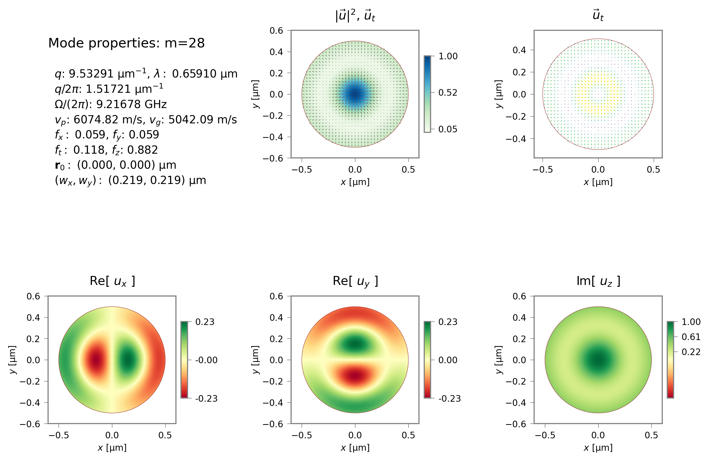

   Elastic mode with largest SBS gain.

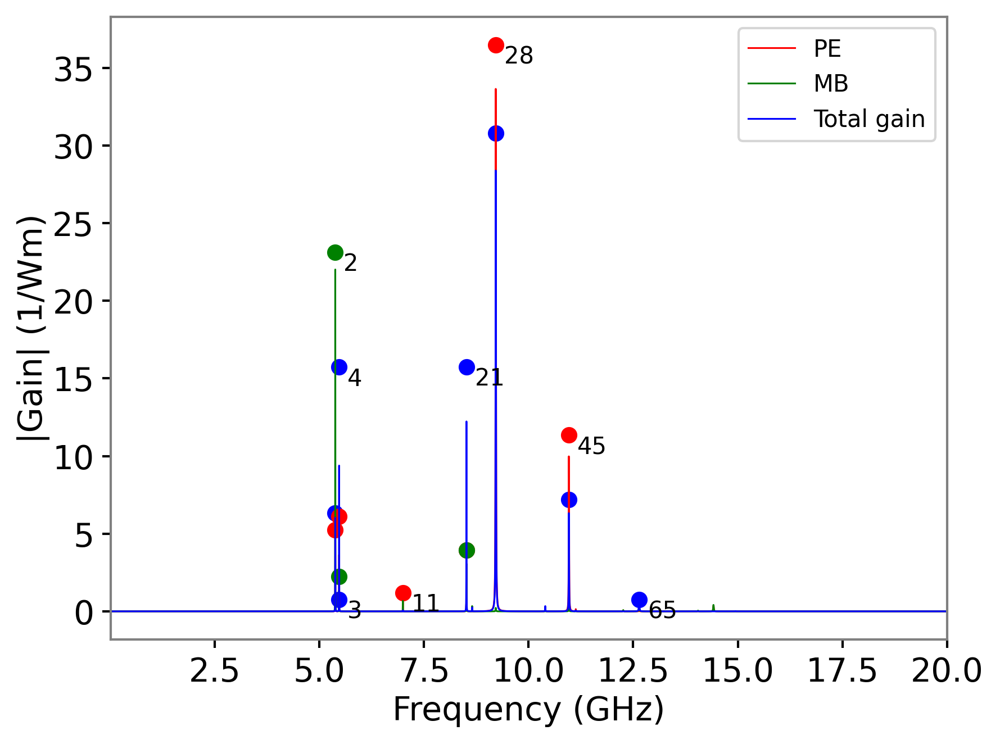

   Gain spectrum for the silica waveguide.

.. raw:: latex

    \clearpage

Example 2 -- Backward SBS in a rectangular silicon waveguide
^^^^^^^^^^^^^^^^^^^^^^^^^^^^^^^^^^^^^^^^^^^^^^^^^^^^^^^^^^^^^^^^^^^^^^^^^^^^^^^^
Figure 14 in the paper calculates the backwards SBS properties  of a
rectangular :math:`450x200` nm silicon waveguide.
The corresponding results generated with ``sim-josab-02.py`` are as follows:

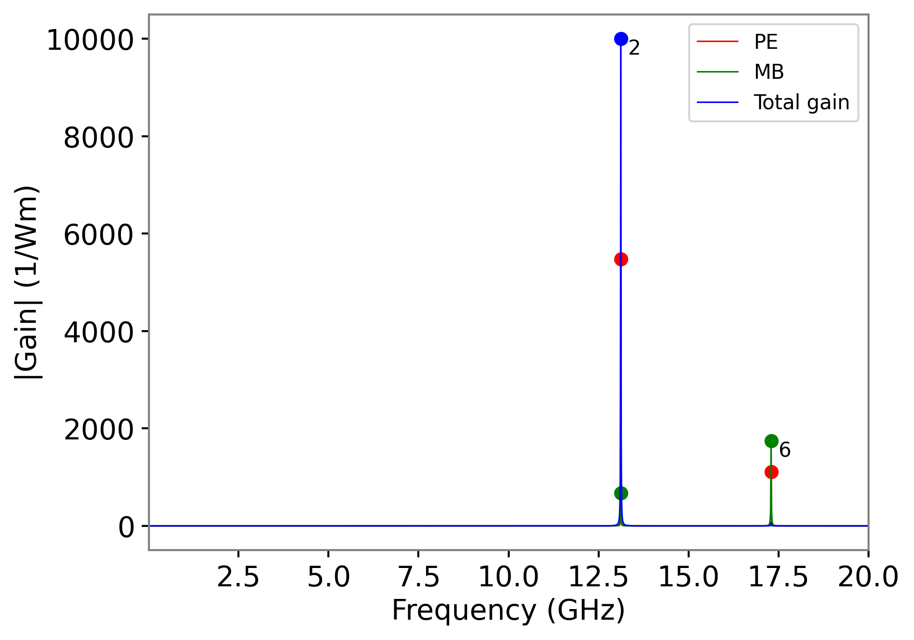

The fields and gain parameters are as follows:

   Fundamental optical mode fields.

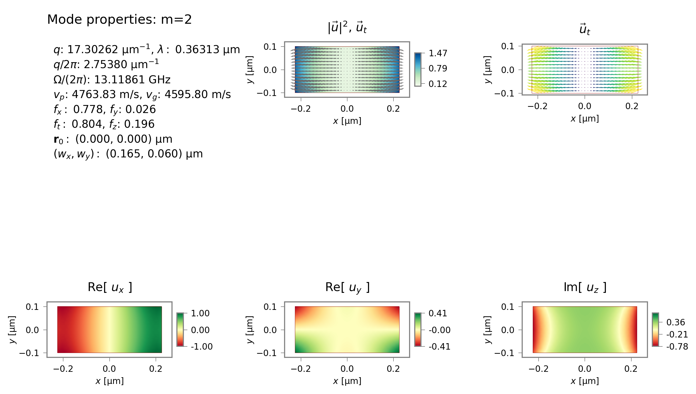

   Fundamental elastic mode fields for mode 2.

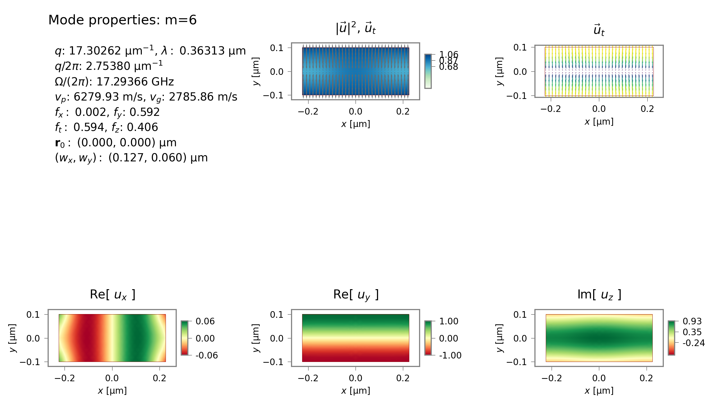

   Fundamental elastic mode fields for mode 6.

We can reproduce Fig. 13 showing the elastic dispersion of this waveguide
silicon waveguide using ``sim-josab-02b-acdisp.py``.

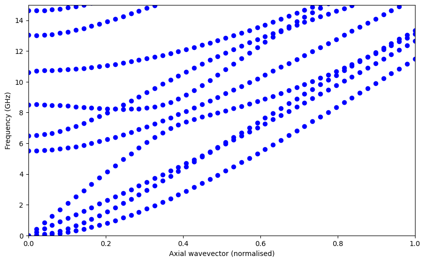

   Acoustic dispersion diagram with modes categorised by symmetry as in Table 1 of "Formal selection rules for Brillouin scattering in integrated waveguides and structured fibers" by C. Wolff, M. J. Steel, and C. G. Poulton ``https://doi.org/10.1364/OE.22.032489``

.. raw:: latex

    \clearpage

Example 3 -- Forward Brillouin scattering in a circular silica waveguide
^^^^^^^^^^^^^^^^^^^^^^^^^^^^^^^^^^^^^^^^^^^^^^^^^^^^^^^^^^^^^^^^^^^^^^^^^^^^^^^^

Figure 16 and Table 3 examine the same waveguides in the case of forward
Brillouin scattering.

These results can be generated with ``sim-josab-03.py`` and ``sim-josab-04.py``.

Let's see the results for the silica cylinder first:

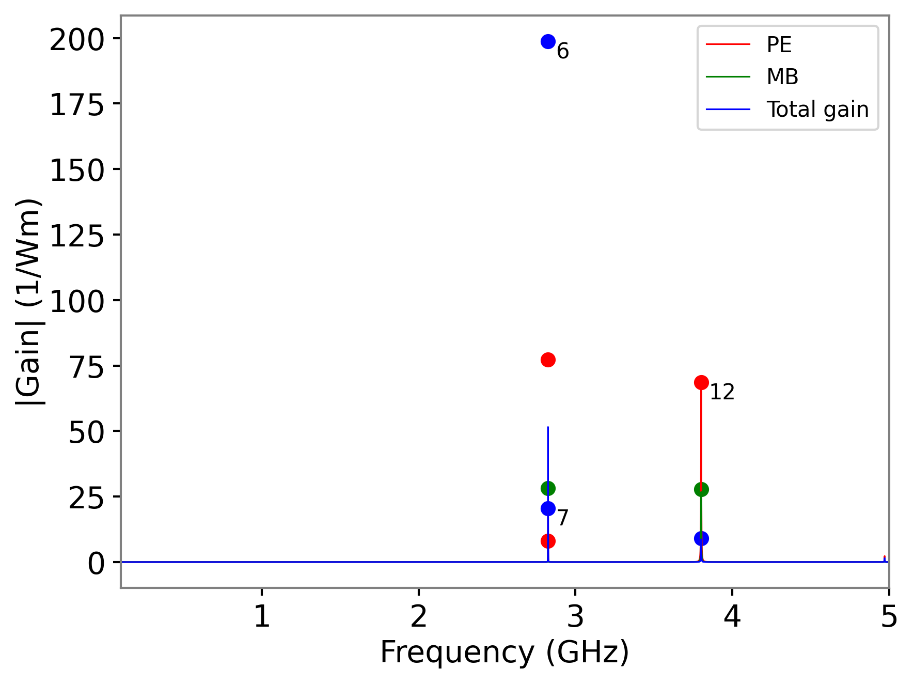

   Gain spectrum for forward SBS of the silica cylinder.

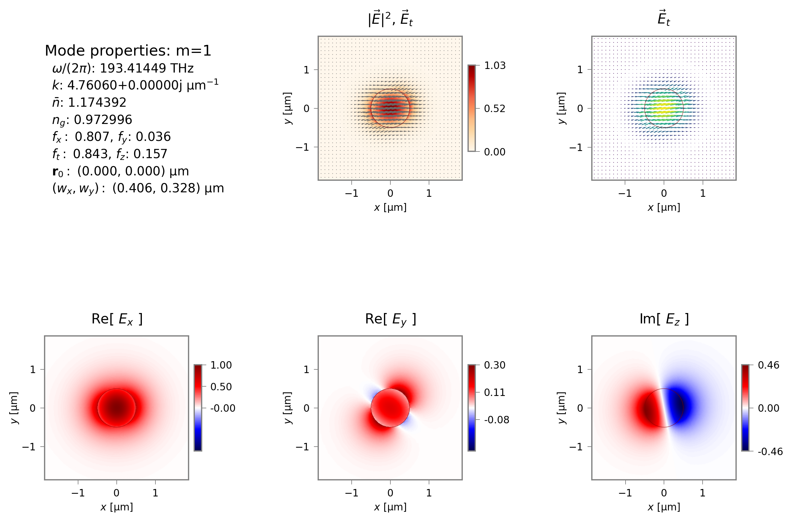

   Fundamental optical mode field.

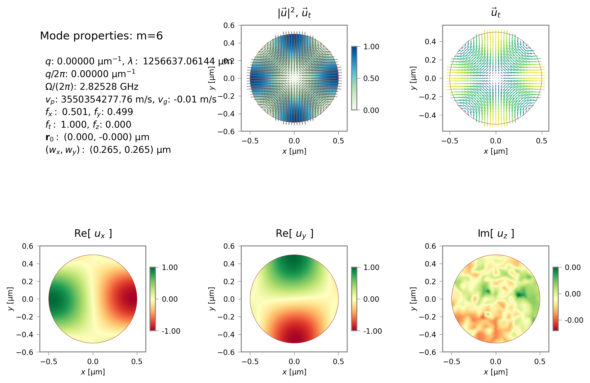

   Elastic mode of maximum gain.

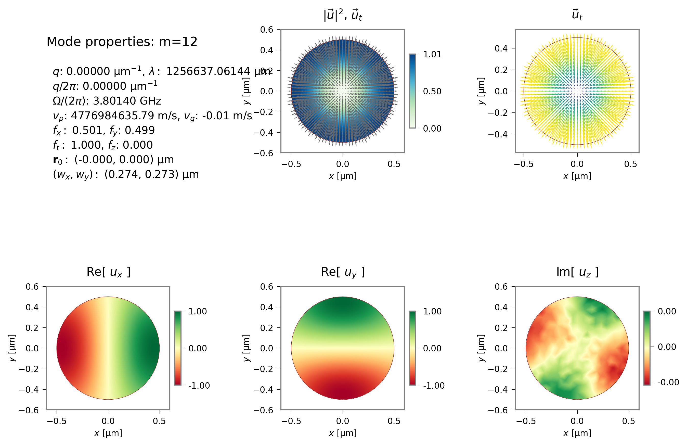

   Elastic mode of second highest gain.

.. raw:: latex

    \clearpage

Example 4 -- Forward Brillouin scattering in a rectangular silicon waveguide
^^^^^^^^^^^^^^^^^^^^^^^^^^^^^^^^^^^^^^^^^^^^^^^^^^^^^^^^^^^^^^^^^^^^^^^^^^^^^^^^
The corresponding results for the silicon waveguide can be generated with ``sim-josab-04.py``:

   Gain spectrum for forward SBS of the silicon waveguide.

.. figure:: ./images/josab_tutorial/josab_04-fields/EM_E_mode_00.png
   :width: 15cm

   Fundamental optical mode field.

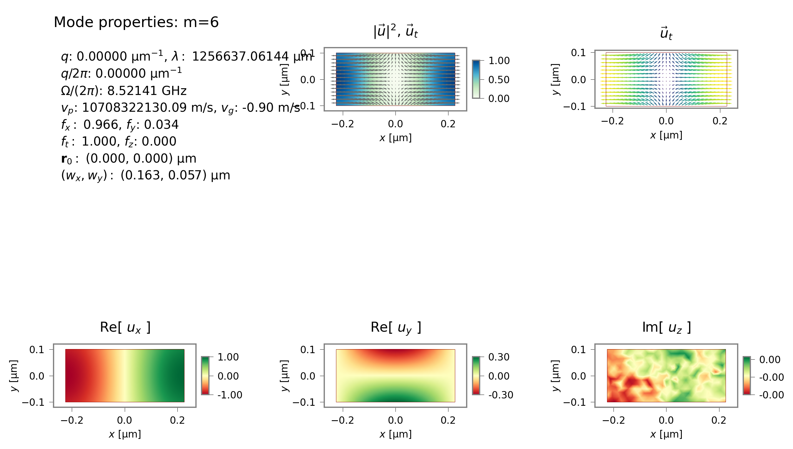

   Elastic mode of maximum gain.

.. raw:: latex

    \clearpage

Example 5 -- Intermodal Forward Brillouin scattering in a circular silica waveguide
^^^^^^^^^^^^^^^^^^^^^^^^^^^^^^^^^^^^^^^^^^^^^^^^^^^^^^^^^^^^^^^^^^^^^^^^^^^^^^^^^^^^

For the problem of intermodal FBS, the paper considers coupling between the two lowest optical modes. The elastic mode of highest gain is actually a degenerate pair:

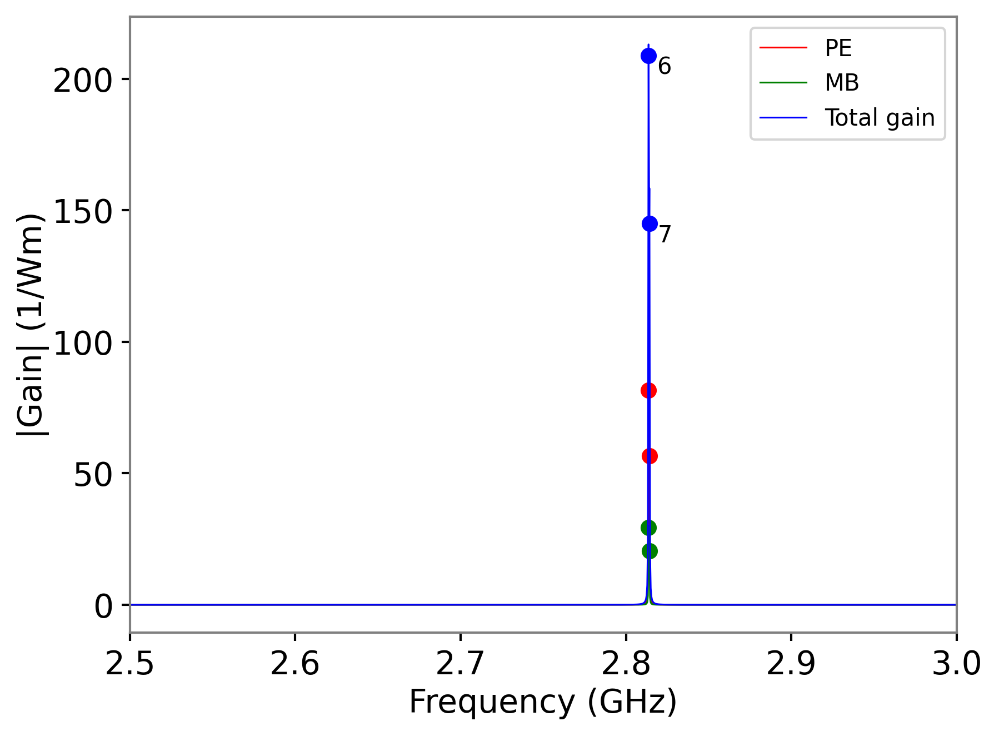

   Gain spectrum for intermodal forward SBS of the silica waveguide.

   Fundamental optical mode field.

   Second order optical mode field.

   Elastic mode field of maximum gain.

.. raw:: latex

    \clearpage

Example 6 -- Intermodal Forward Brillouin scattering in a rectangular silicon waveguide
^^^^^^^^^^^^^^^^^^^^^^^^^^^^^^^^^^^^^^^^^^^^^^^^^^^^^^^^^^^^^^^^^^^^^^^^^^^^^^^^^^^^^^^

Finally, the silicon waveguide generates extraordinarily high gain when operated
in an intermodal configuration:

   Gain spectrum for intermodal forward SBS of the silicon waveguide.

.. figure:: ./images/josab_tutorial/josab_06-fields/EM_E_mode_00.png
   :width: 15cm

   Fundamental optical mode field.

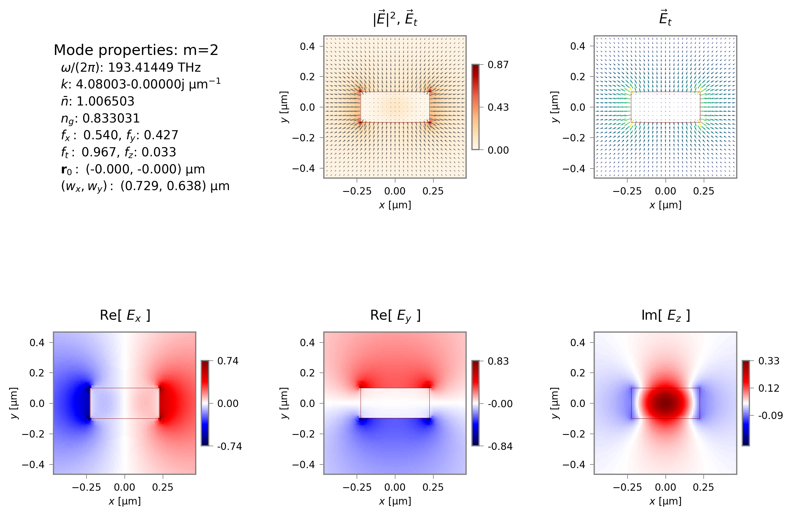

   Second order optical mode field.

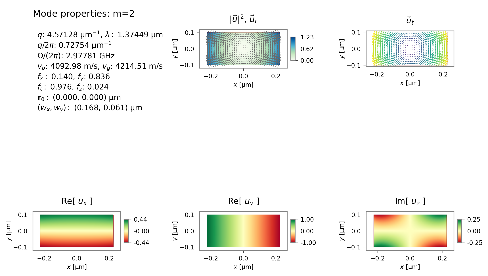

   Elastic mode field of maximum gain.

.. raw:: latex

    \clearpage

