.. include:: numbatdefs.txt

.. _chap-literature-label:

*******************************
Additional Literature Examples
*******************************

Having become somewhat familiar with |NUMBAT|, we now set out to replicate a number of examples
from the recent literature located in the ``lit_examples`` directory.
The examples are presented in chronological order.
We note the particular importance of examples 5-8 which include experimental and numerical results that are in good agreement.

Example 1 -- BSBS in a silica rectangular waveguide
^^^^^^^^^^^^^^^^^^^^^^^^^^^^^^^^^^^^^^^^^^^^^^^^^^^^^^^^^^^^^^^^^^^^^^^^^^^^^^^^^^^^^^^^^^^
This example ``simo-lit_01-Laude-AIPAdv_2013-silica.py``
is based on the calculation of backward SBS
in a small rectangular silica waveguide described in V. Laude and J.-C. Beugnot,
`Generation of phonons from electrostriction in small-core optical waveguides
<http://dx.doi.org/10.1063/1.4801936>`_, *AIP Advances* **3**, 042109 (2013).

Observe in the python simulation file, the use of a material named
``SiO2_2013_Laude`` specifically modelled on the parameters in this paper.
This naming scheme for materials allows several different versions of nominally
the same material to be selected, so that users can easily compare calculations
to other authors' exact parameter choices, without changing their preferred
material values for their own samples and experiments.

In this paper, Laude and Beugnot plot a spectrum of the elastic energy density,
which is not directly measureable. However the spectral peaks show close
alignment with the |NUMBAT| gain spectrum for the same structure, as is
apparent from the first two plots below.  We attribute the remaining difference
in the location of the spectral peaks to the choice of elastic material
properties in the paper.  The paper reports a bulk shear velocity of 3400 m/s,
which is around 8% smaller than the usual value of approximately 3760 m/s, but
the full set of material properties used in the calculations are not provided.
Hence we have used a more standard set of values for silica.

.. raw:: latex

    \clearpage

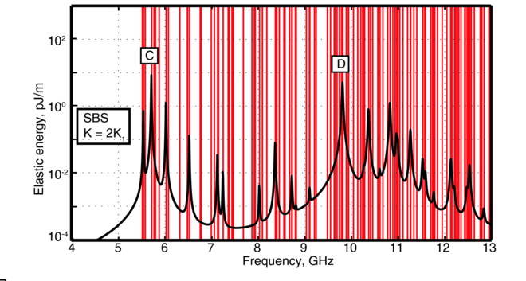

   Spectrum of elastic mode energy  calculated in
   Laude and Beugnot for backward SBS in a silica waveguide.

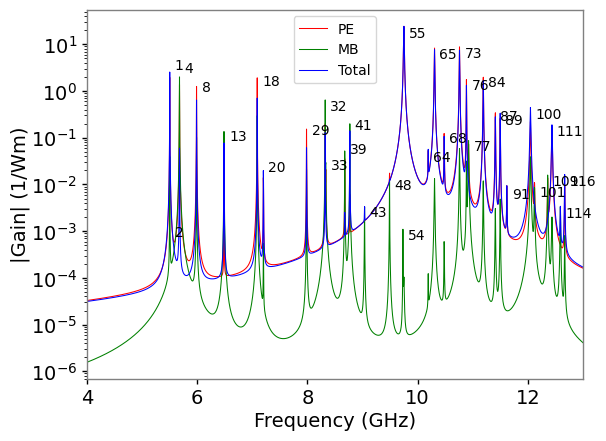

   |NUMBAT| gain spectrum on semilogy axis.

The optical fundamental fields are in close agreement with values for the effective index of :math:`n_\text{eff}=1.2710` (|NUMBAT|) and 1.2748 (paper).

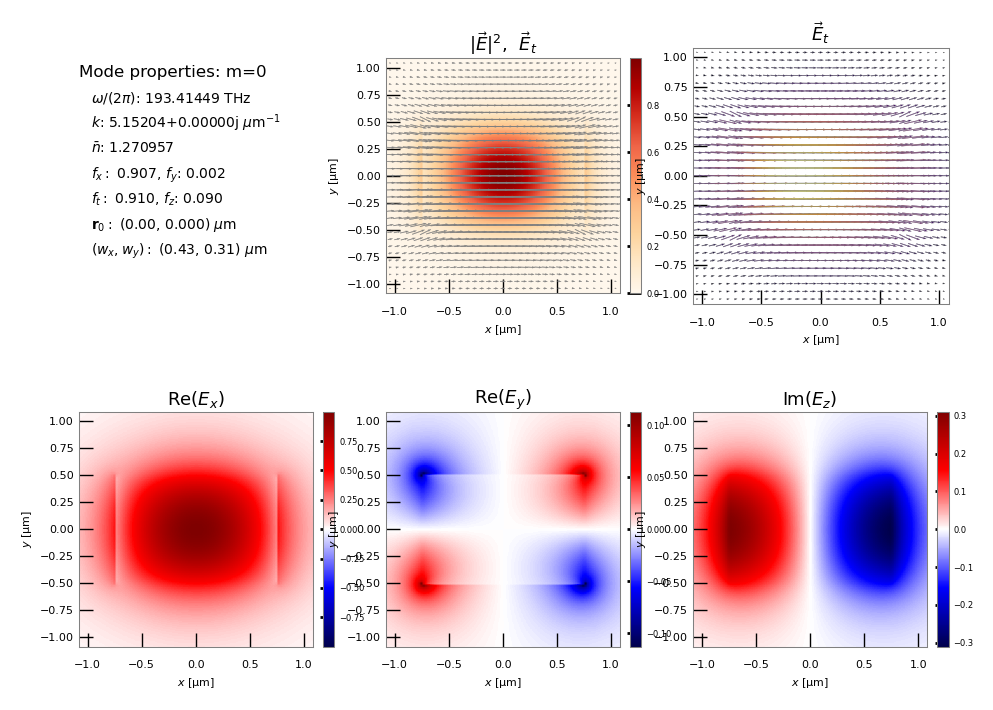

   Fundamental optical mode profiles calculated in |NUMBAT|.

.. raw:: latex

    \clearpage

The next set of plots looks at the modal profiles for the for the peaks marked C and D in the first spectrum above.  The most direct comparison comes from looking at the |NUMBAT| contour plots for the transverse (:math:`u_x` and :math:`u_y`) and axial/longitudinal (:math:`u_z`)
elastic fields. Note that the transverse and axial plots for mode D in the
paper are inconsistent.  The axial plot is the correct one for this mode.

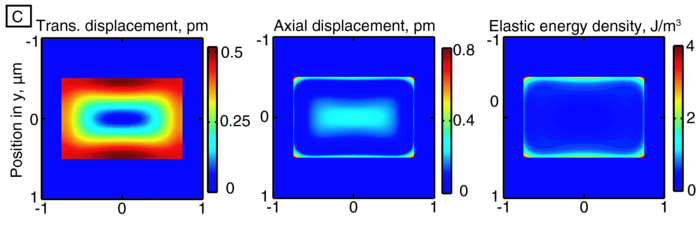

   Elastic mode profiles calculated in
   Laude and Beugnot for backward SBS in a silica waveguide of diameter 1.05 micron. Mode  C  corresponds to the peak marked in the spectrum above.

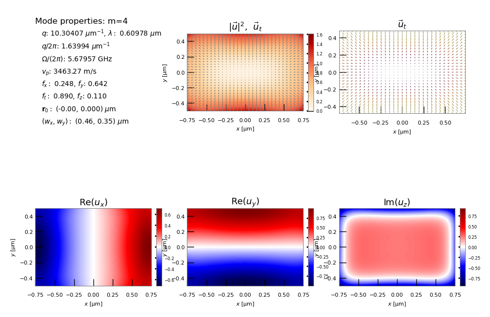

   |NUMBAT| calculation of a high gain elastic mode, marked as C in the paper.

.. raw:: latex

    \clearpage

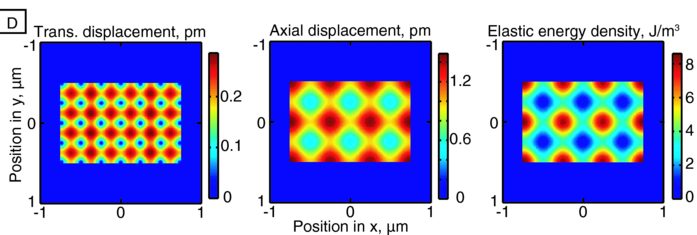

   Elastic mode profiles calculated in
   Laude and Beugnot for backward SBS in a silica waveguide of diameter 1.05 micron.
   Mode D corresponds to the peak marked in the spectrum above.

.. .. figure:: images/lit_examples/lit_01-fields/AC_field_55.png
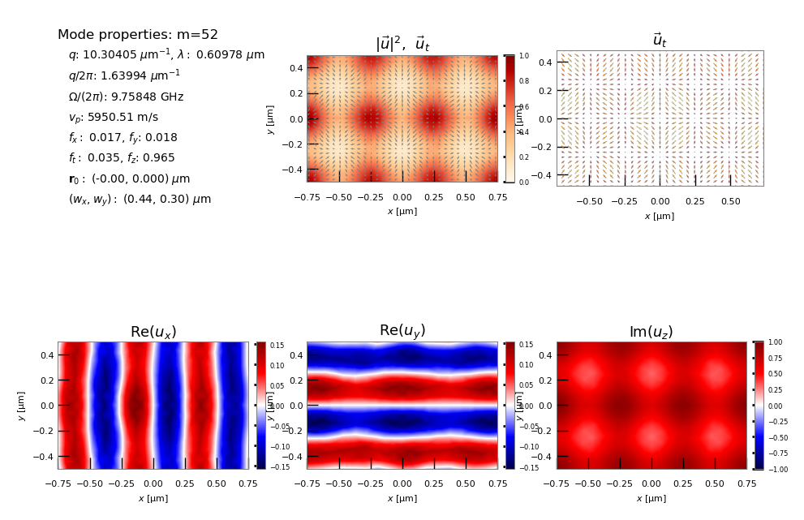

   |NUMBAT| calculation of a high gain elastic mode, marked as D in the paper.

.. raw:: latex

    \clearpage

Example 2 -- BSBS in a rectangular silicon waveguide
^^^^^^^^^^^^^^^^^^^^^^^^^^^^^^^^^^^^^^^^^^^^^^^^^^^^^^^^^^^^^^^^^^^^^^^^^^^^^^^^^^^^^^^^^^^^

This example in ``simo-lit_02-Laude-AIPAdv_2013-silicon.py`` again follows the paper of V. Laude and J.-C. Beugnot,
`Generation of phonons from electrostriction in small-core optical waveguides
<http://dx.doi.org/10.1063/1.4801936>`_, *AIP Advances* **3**, 042109 (2013),
but this time looks at the *silicon* waveguide case.

Once again, the plots from the original paper are shown in the first figure.
In this case, with a very large number of modes of different shear wave order,
the precise mode profile for highest gain depends very sensitively on the
simulation parameters.

In this case the effective index for the optical fundamental mode are :math:`n_\text{eff}=3.3650` (|NUMBAT|) and 3.3729 (paper).

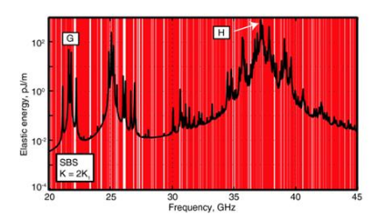

   Spectrum of elastic mode energy  calculated in
   Laude and Beugnot for backward SBS in a silicon waveguide.

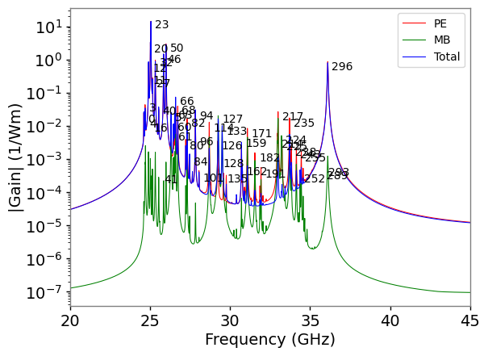

   |NUMBAT| gain spectrum on semilogy axis.

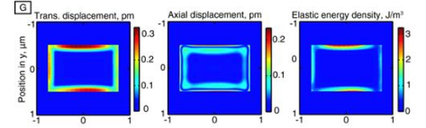

   Field profiles for mode G  calculated in
   Laude and Beugnot for backward SBS in a silicon waveguide.

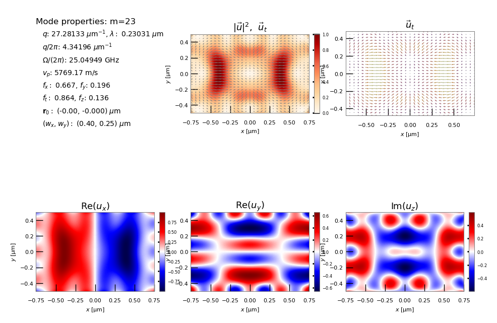

   High gain elastic mode calculated by |NUMBAT|, marked as G in paper.

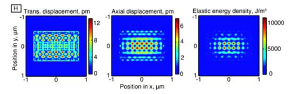

   Field profiles for mode H  calculated in
   Laude and Beugnot for backward SBS in a silicon waveguide.

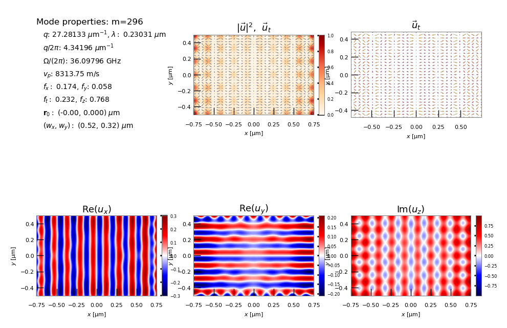

   High gain elastic  mode calculated by |NUMBAT|, marked as H in paper.

.. raw:: latex

    \clearpage

THINGS TO DO

#. explain the narrower acoustic spectrum for the silicon waveguide.

#. Try comsol on the these problems

#. plot full elastic mode dispersion, find actual meaning of the elastic
    energy. why is this not scaled away by mode normalisation?
    is this connected to the losses being included in the FEM calc?

Example 3 -- BSBS in a tapered fibre - scanning widths
^^^^^^^^^^^^^^^^^^^^^^^^^^^^^^^^^^^^^^^^^^^^^^^^^^^^^^^^^^^^^^^^^^^^^^^^^^^^^^^^^^^^^^^^^^^^^^^^^^^^^

This example, in ``simo-lit_03-Beugnot-NatComm_2014.py``,
is based on the calculation of backward SBS
in a micron scale optical fibre described in J.-C. Beugnot *et al.*,
`Brillouin light scattering from surface elastic waves in a subwavelength-diameter optical fibre
<http://dx.doi.org/10.1038/ncomms6242>`_, *Nature Communications* **5**, 5242 (2014).

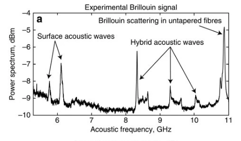

   Measured gain spectrum for a 1.05 micron silica nanowire in J.-C. Beugnot *et al.*

.. .. figure:: images/lit_examples/lit_03-gnarrow_gain_spectra-logy_w1050.png
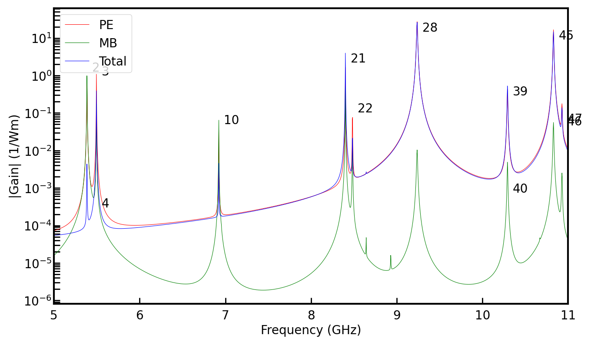

   |NUMBAT| calculated gain spectrum for the 1.05 micron silica nanowire.

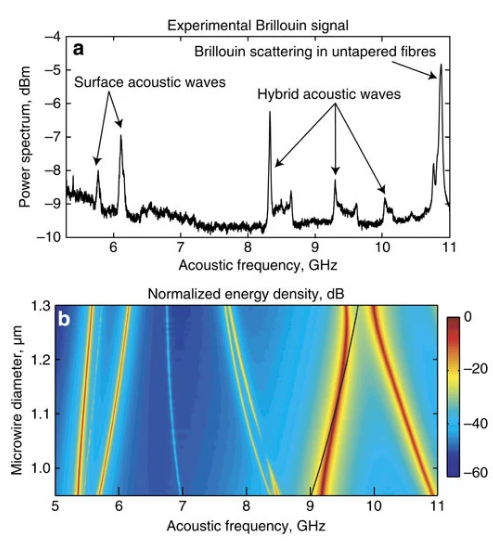

   Calculated dispersion of gain spectrum with nanowire width in J.-C. Beugnot *et al.*

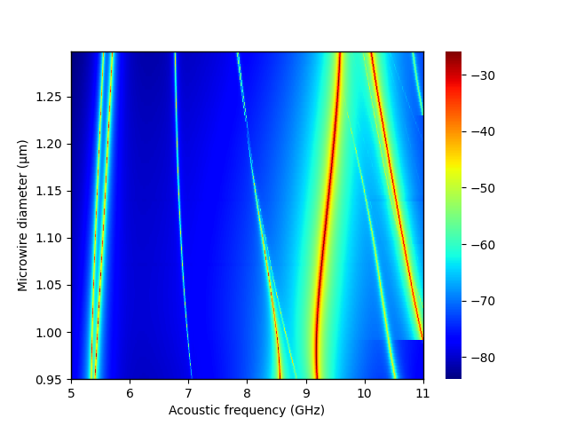

   Full elastic wave spectrum for silica microwire, to be compared with previous plot (Fig. 4a in J.-C. Beugnot *et al.*)

We can now look at the behaviour of some individual modes.

The following table shows the frequency eigenvalues for a number of the modes reported in the paper as calculated by |NUMBAT| and in the article.

.. list-table:: Comparison of modal frequencies:
   :width: 20cm
   :widths: 20 20 20 20 20
   :header-rows: 1

   * - Mode class
     - Elastic mode number
     - Beugnot *et al* [GHz]
     - NumBAT :math:`nu` [GHz]
     - Comsol :math:`nu` [GHz]
   * - Fundamental
     - 0
     - _
     - 5.18347
     - 5.1838
   * - Surface azimuthal
     - 2
     - 5.382
     - 5.38522
     - 5.3855
   * - Surface radial
     - 5
     - 5.772
     - 5.78036
     - 5.7807
   * - Hybrid azimuthal
     - 20
     - 8.37
     - 8.36492
     - 8.3651
   * - Hybrid radial
     - 28
     - 9.235
     - 9.24394
     - 9.2444

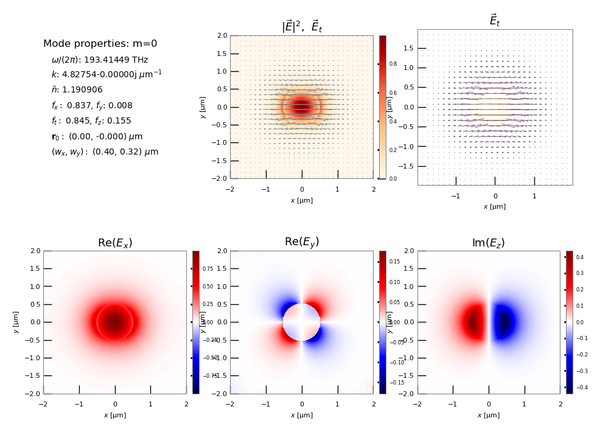

   |NUMBAT| electric field for the fundamental optical mode.

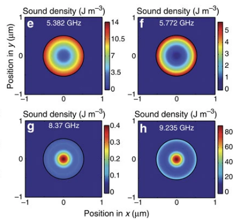

   Calculated elastic mode profiles for the 1.05 micron nanowire in J.-C. Beugnot *et al.* marked in the measured gain spectrum above. The top row are surface modes, the bottom row are hybrid modes.

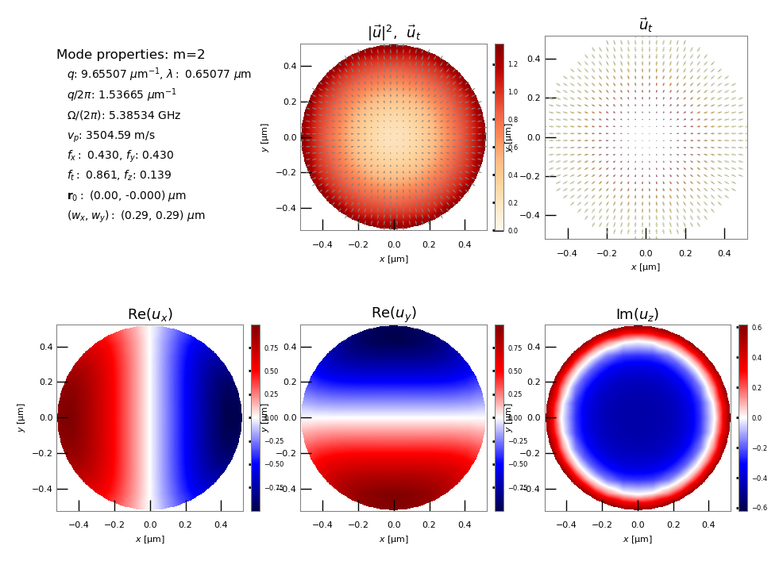

   |NUMBAT| radial shear mode corresponding to the 5.382 GHz surface mode above.

.. figure:: images/lit_examples/lit_03-diam-1050-fields/AC_field_05.png
   :width: 12cm

   |NUMBAT| azimuthal shear mode corresponding to the 5.772 GHz surface mode above.

.. figure:: images/lit_examples/lit_03-diam-1050-fields/AC_field_21.png
   :width: 12cm

   |NUMBAT| radial shear mode corresponding to the 8.40 GHz surface mode above.

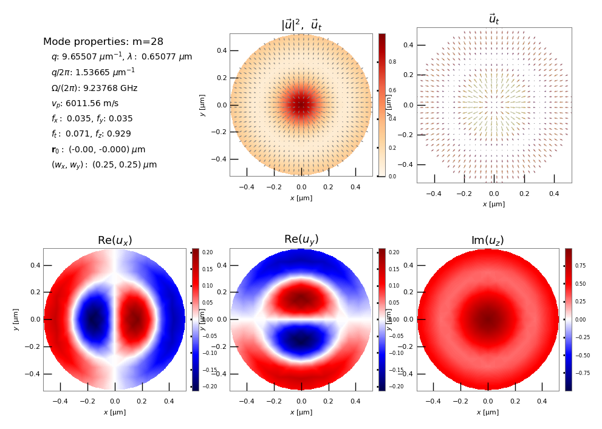

   |NUMBAT| radial shear mode corresponding to the 9.235 GHz surface mode above.

.. raw:: latex

    \clearpage

It is also illuminating to look at the elastic dispersion for a wide range of microwire diameters:

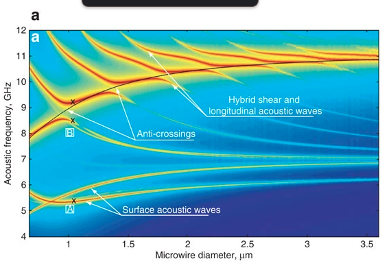

   Elastic wave dispersion over wide range of diameters according to Beugnot *et al.*.

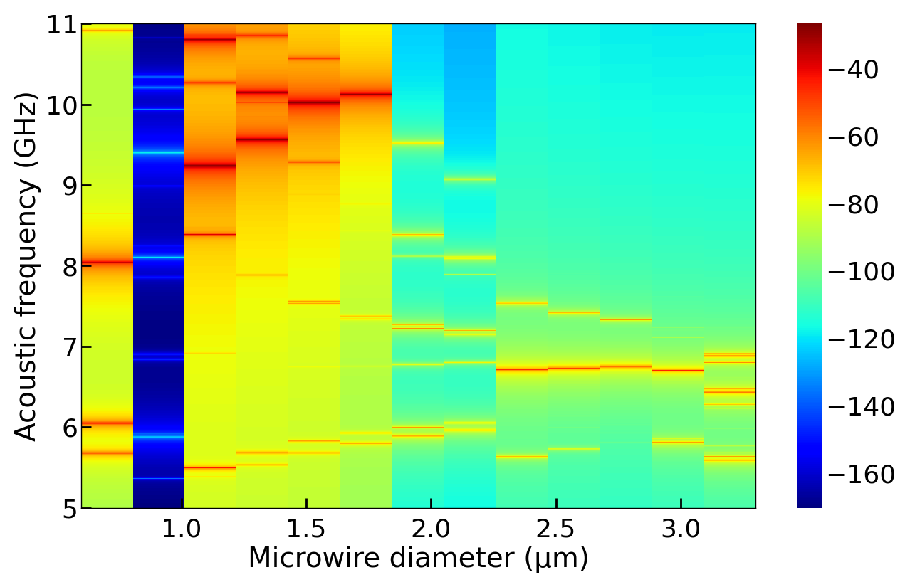

   |NUMBAT| gain spectrum over wide range of diameters. (Note swapped axes for consistency with Beugnot *et al.*.)

.. figure:: images/lit_examples/lit_03-exactdisp_wide-acdisp_qnu_exact.png

   Exact analytic disperion relation for modes of elastic rod in air for comparison with gain spectra.

.. raw:: latex

    \clearpage

Example 4 -- FSBF in a waveguide on a pedestal
^^^^^^^^^^^^^^^^^^^^^^^^^^^^^^^^^^^^^^^^^^^^^^^^^^^^^^^^^^^^^^^^^^^^^^^^^^^^^^^^^^^^^^^^^
This example, in ``simo-lit_04-pillar-Van_Laer-NatPhot_2015.py``,
is based on the calculation of forward SBS
in a pedestal silicon waveguide described in R. Van Laer *et al.*,
`Interaction between light and highly confined hypersound in a silicon photonic nanowire
<http://dx.doi.org/10.1038/ncomms6242>`_, *Nature Photonics* **9**, 199 (2015).

Note that the absence of an absorptive boundary in the elastic model
causes a problem where the slab layer significantly distorting elastic modes.
Adding this feature is a priority for a future release of |NUMBAT|.
The following example shows an approximate way to avoid the problem for now.

.. .. literalinclude:: images/lit_examples/simo-lit_04-pillar-Van_Laer-NP_2015.py
    :lines: 0-

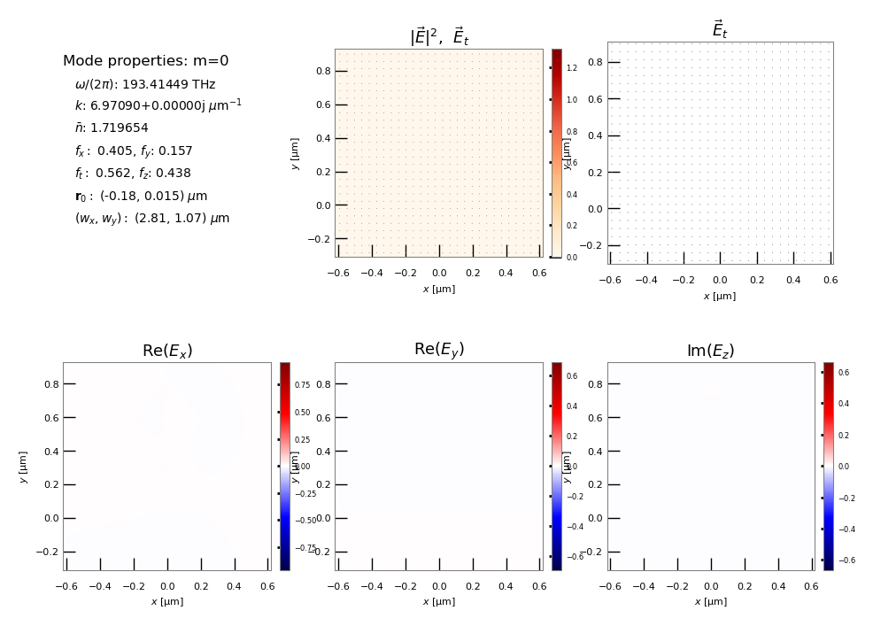

   Fundamental optical mode fields.

.. figure:: images/lit_examples/lit_04b-fields/AC_field_38.png
   :width: 12cm

   Dominant high gain elastic mode.
   Note how the absence of an absorptive boundary on the SiO2 slab causes this layer to significantly distorted the elastic modes.

We may also choose to study the simplified situation where the pedestal is removed,
which gives good agreement for the gain spectrum:

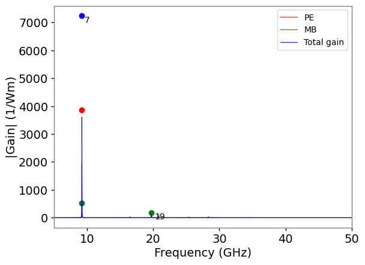

   Gain spectrum for the simplified case of a waveguide surrounded by vacuum.

.. raw:: latex

    \clearpage

Example 5 -- FSBF in a waveguide without a pedestal
^^^^^^^^^^^^^^^^^^^^^^^^^^^^^^^^^^^^^^^^^^^^^^^^^^^^^^^^^^^^^^^^^^^^^^^^^^^^^^^^^^^^^^^^^^^^^^^^^^^^^^^^^^^

This example, in ``simo-lit_05-Van_Laer-NJP_2015.py``, continues
the study of forward SBS
in a pedestal silicon waveguide described in R. Van Laer *et al.*,
`Interaction between light and highly confined hypersound in a silicon photonic nanowire
<http://dx.doi.org/10.1038/ncomms6242>`_, *Nature Photonics* **9**, 199 (2015).

In this case, we simply remove the pedestal and model the main rectangular waveguide.
This makes the elastic loss calculation incorrect but avoids the problem of elastic
energy being excessively concentrated in the substrate.

.. .. literalinclude:: images/lit_examples/simo-lit_05-Van_Laer-NJP_2015.py
    :lines: 0-

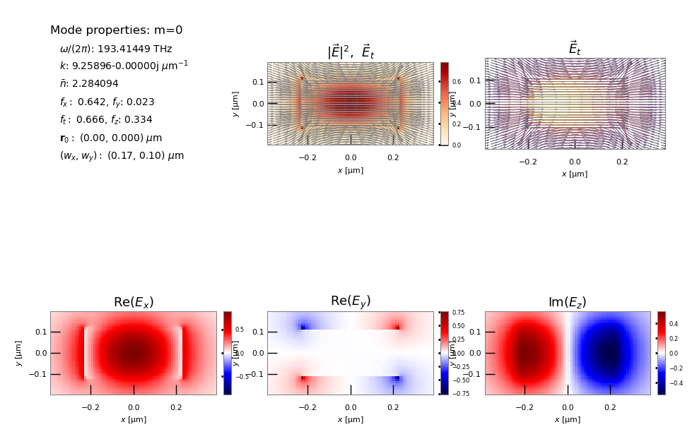

   Fundamental optical mode fields.

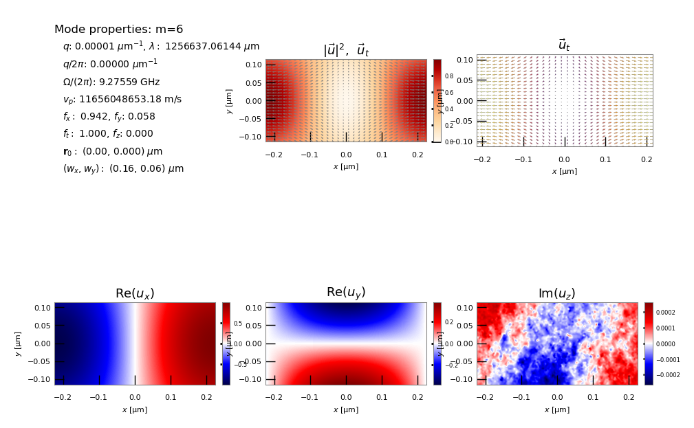

   Dominant high gain elastic mode.

.. raw:: latex

    \clearpage

Example 6 -- BSBS self-cancellation in a tapered fibre (small fibre)
^^^^^^^^^^^^^^^^^^^^^^^^^^^^^^^^^^^^^^^^^^^^^^^^^^^^^^^^^^^^^^^^^^^^^^^^^^^^^^^^^^^^^^^^^^^^^^^^^^^^^^^^^^^^^^^^^^^^^^^^^

This example, in ``simo-lit_06_1-Florez-NatComm_2016-d550nm.py``,
looks at the phenomenon of Brillouin "self-cancellation" due to
the electrostrictive and radiation pressure effects acting with opposite sign.
This was described in O. Florez *et al.*, `Brillouin self-cancellation
<http://dx.doi.org/10.1038/ncomms11759>`_, *Nature Communications* **7**, 11759 (2016).

.. .. literalinclude:: images/lit_examples/simo-lit_06_1-Florez-NatComm_2016-d550nm.py
    :lines: 0-

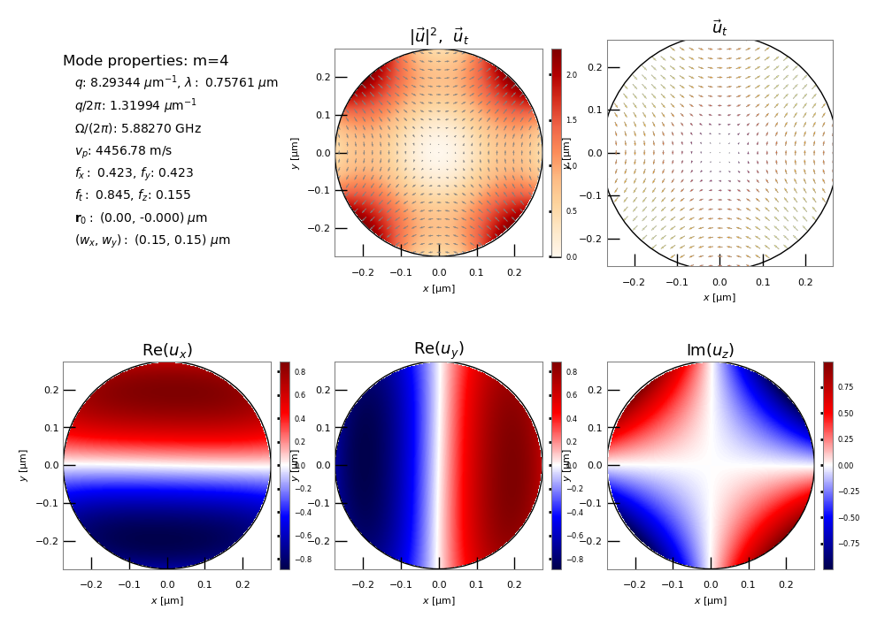

   :math:`TR_{21}` elastic mode fields of a nanowire with diameter 550 nm.

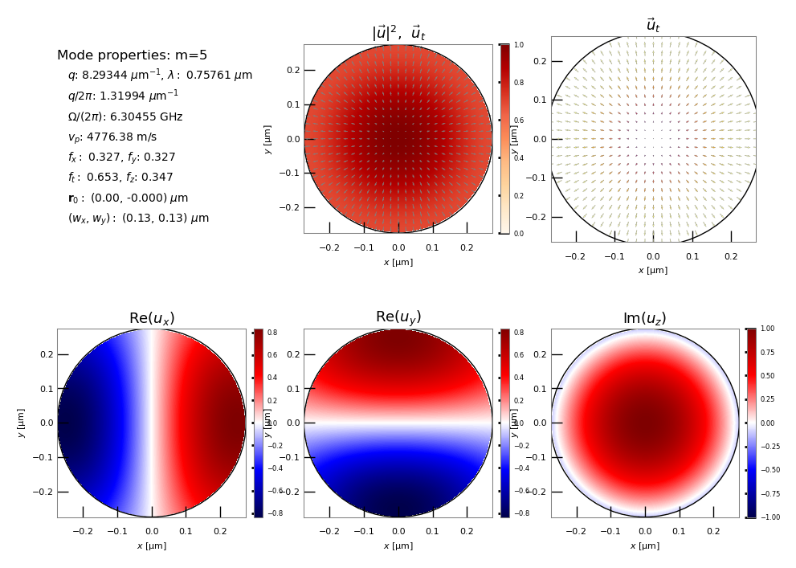

   :math:`R_{01}` elastic mode fields of a nanowire with diameter 550 nm.

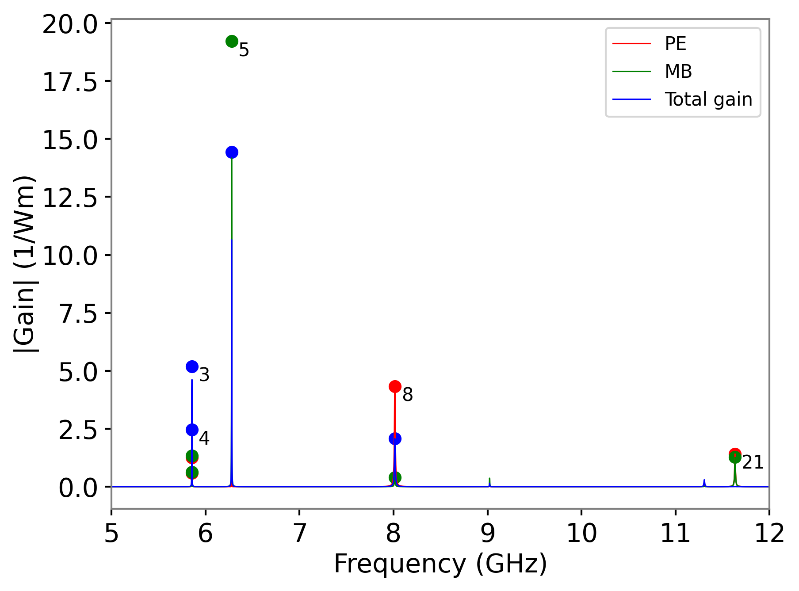

   Gain spectra of a nanowire with diameter 550 nm, matching blue curve of Fig. 3b in paper.

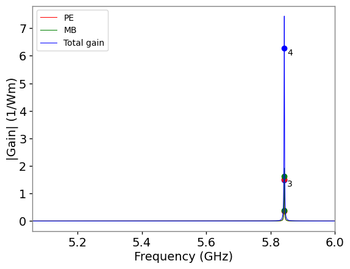

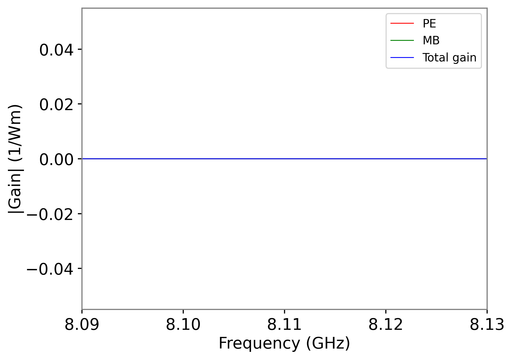

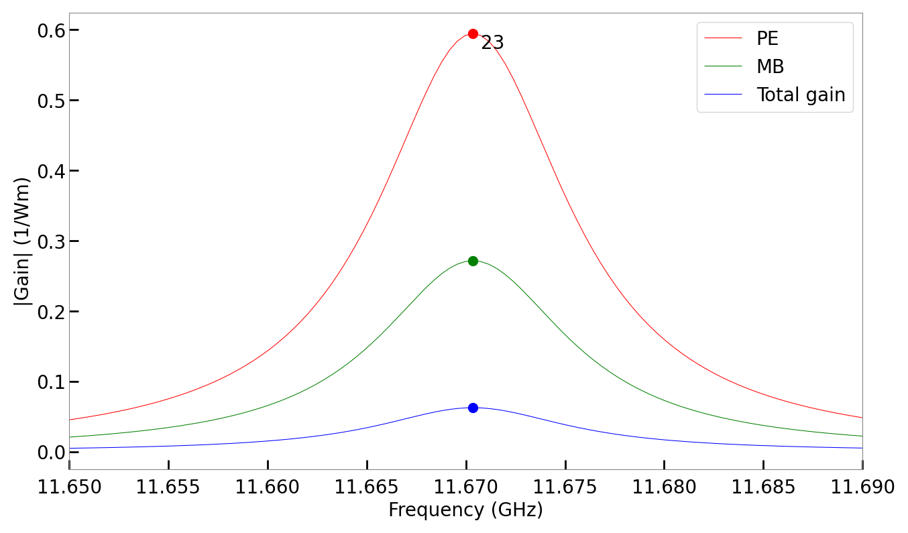

   Zoomed in gain spectra around gain peaks of 550 nm diameter nanowire.

.. raw:: latex

    \clearpage

Example 6b -- BSBS self-cancellation in a tapered fibre (large fibre)
^^^^^^^^^^^^^^^^^^^^^^^^^^^^^^^^^^^^^^^^^^^^^^^^^^^^^^^^^^^^^^^^^^^^^^^^^^^^^^^^^^^^^^^^^^^^^^^^^^^^^^^^^^^^^^^^^^^^^^^^^^^
This example, in ``simo-lit_06_2-Florez-NatComm_2016-1160nm.py``, again looks at the paper
O. Florez *et al.*, `Brillouin self-cancellation <http://dx.doi.org/10.1038/ncomms11759>`_, *Nature Communications* **7**, 11759 (2016),
but now for a wider core.

.. .. literalinclude:: images/lit_examples/simo-lit_06_2-Florez-NatComm_2016-d1160nm.py
    :lines: 0-

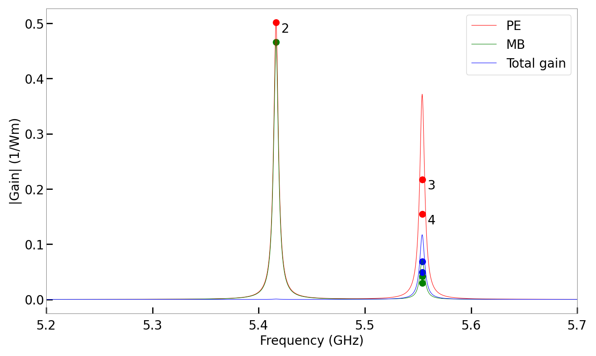

   Gain spectra of a nanowire with diameter 1160 nm, as in Fig. 4 of Florez, showing near perfect cancellation at 5.4 GHz.

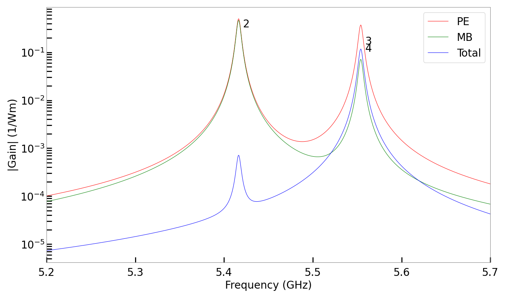

   Gain spectra of a nanowire with diameter 1160 nm, as in Fig. 4 of paper, showing near perfect cancellation at 5.4 GHz.

.. raw:: latex

    \clearpage

Example 7 -- FSBF in a silicon rib waveguide
^^^^^^^^^^^^^^^^^^^^^^^^^^^^^^^^^^^^^^^^^^^^^^^^^^^^^^^^^^^^^^^^^^^^^^^^^^^^^^^^^^^^^^^^

This example, in ``simo-lit_07-Kittlaus-NatPhot_2016.py``,
explores a first geometry showing large forward SBS in silicon
as described in E. Kittlaus *et al.*, `Large Brillouin amplification in silicon
<http://dx.doi.org/10.1038/nphoton.2016.112>`_, *Nature Photonics* **10**, 463 (2016).

.. .. literalinclude:: images/lit_examples/simo-lit_07-Kittlaus-NatPhot_2016.py
    :lines: 0-

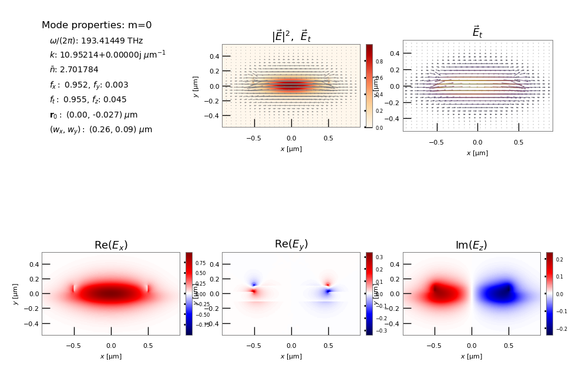

   Fundamental optical mode fields.

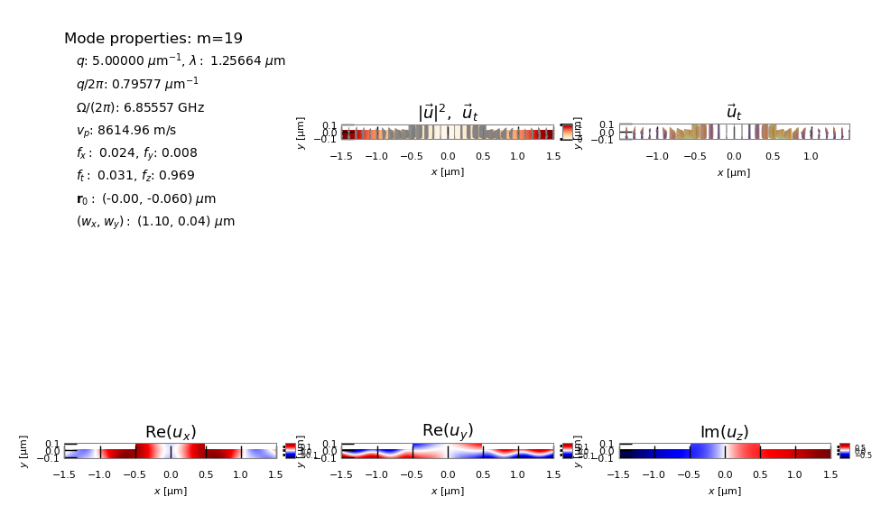

   Dominant high gain elastic mode.

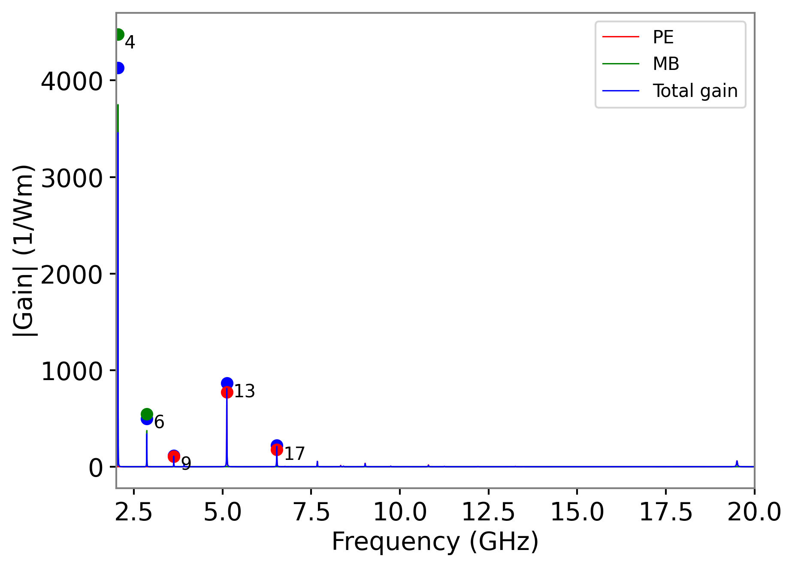

   Gain spectra showing gain due to photoelastic effect, gain due to moving boundary effect, and total gain.

.. raw:: latex

    \clearpage

Example 8 -- Intermodal FSBF in a silicon waveguide
^^^^^^^^^^^^^^^^^^^^^^^^^^^^^^^^^^^^^^^^^^^^^^^^^^^^^^^^^^^^^^^^^^^^^^^^^^^^^^^^^^^^^^^^^^^^^^^^^^^
This example (``simo-lit_08-Kittlaus-NatComm_2017.py``), also from the Yale group,  examines intermode forward Brillouin scattering in silicon.

.. .. literalinclude:: images/lit_examples/simo-lit_08-Kittlaus-NatComm_2017.py
    :lines: 0-

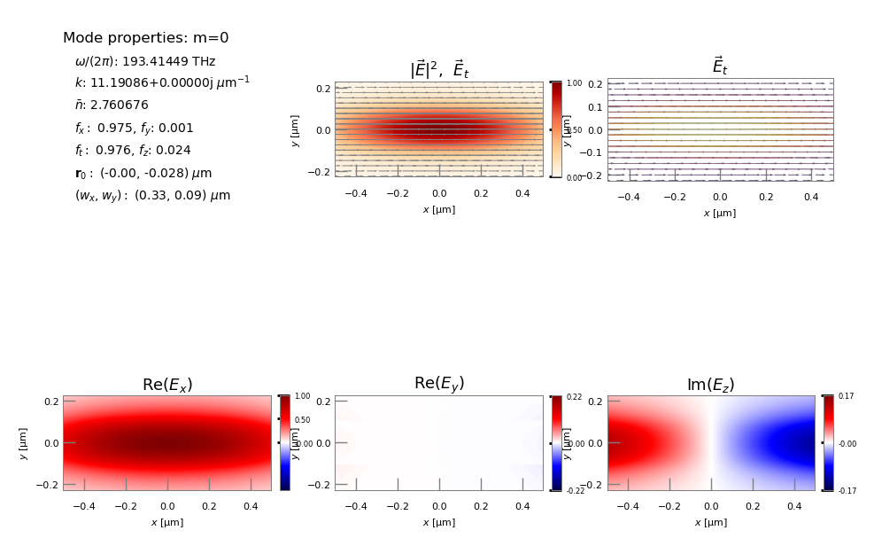

   Fundamental (symmetric TE-like) optical mode fields.

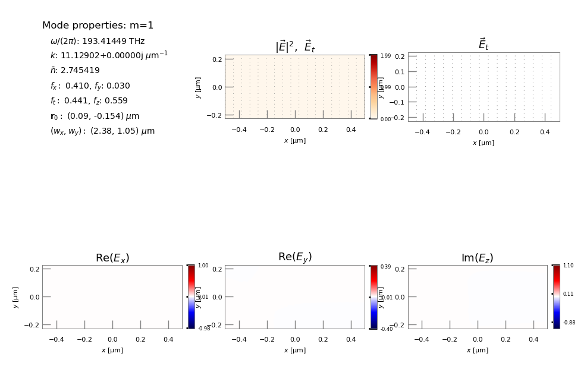

   2nd lowest order (anti-symmetric TE-like) optical mode fields.

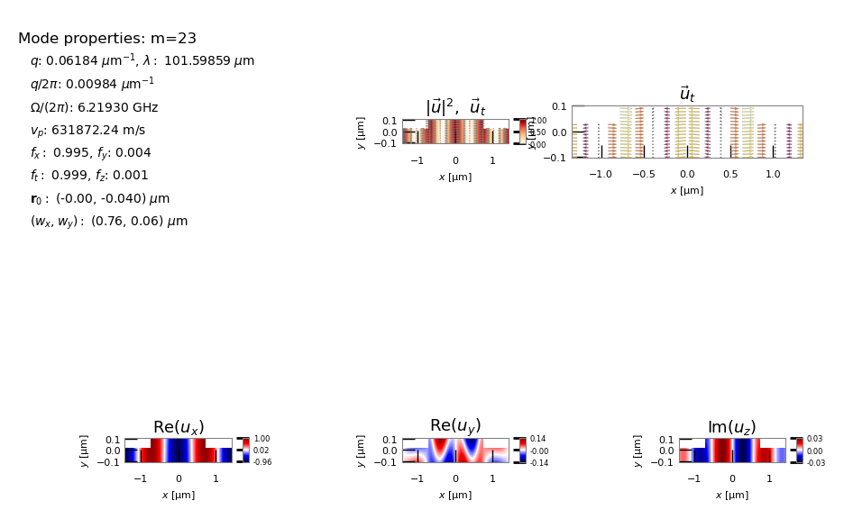

   Dominant high gain elastic mode.

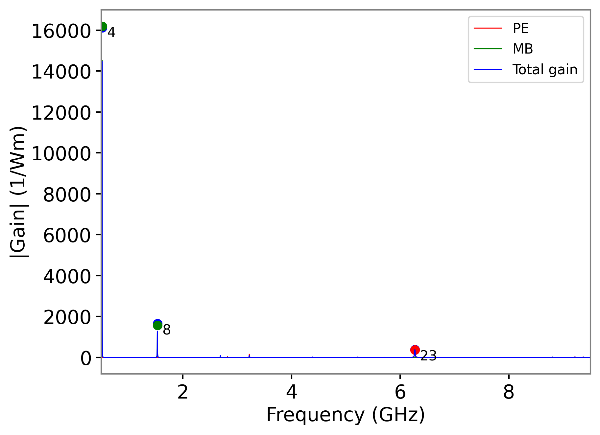

   Gain spectra showing gain due to photoelastic effect, gain due to moving boundary effect, and total gain.

.. raw:: latex

    \clearpage

Example 9 -- BSBS in a chalcogenide rib waveguide
^^^^^^^^^^^^^^^^^^^^^^^^^^^^^^^^^^^^^^^^^^^^^^^^^^^^^^^^^^^^^^^^^^^^^^^^^^^^^^^^^^^
This example, in ``simo-lit_09-Morrison-Optica_2017.py``, from the Sydney group examines backward SBS in a chalcogenide rib waveguide.

.. .. literalinclude:: images/lit_examples/simo-lit_09-Morrison-Optica_2017.py
    :lines: 0-

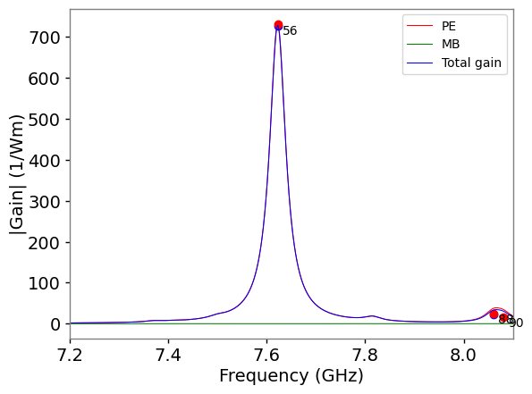

   Gain spectra showing gain due to photoelastic effect, gain due to moving boundary effect, and total gain.

Example 10 -- SBS in the mid-infrared
^^^^^^^^^^^^^^^^^^^^^^^^^^^^^^^^^^^^^^^^^^^^^^^^^^^^^^^^^^^^^^^^^^^^^^^^^^^^^^^^^^^
This example, in ``simo-lit_10-Wolff-OptExpress-2014.py`` and ``simo-lit_10a-Wolff-OptExpress-2014.py``, by C. Wolff and collaborators examines backward SBS in the mid-infrared using germanium
as the core material in a rectangular waveguide with a silicon nitride cladding.

The second of these two files illustrates the rotation of the core material from the [100] orientation to the [110] orientation. The second file prints out the full elastic properties of the germanium material in both orientations which are seen to match the values in the paper by Wolff et al.

.. .. literalinclude:: images/lit_examples/simo-lit_10-Wolff-OptExpress-2014.py
    :lines: 0-

.. .. literalinclude:: images/lit_examples/simo-lit_10a-Wolff-OptExpress-2014.py
    :lines: 0-

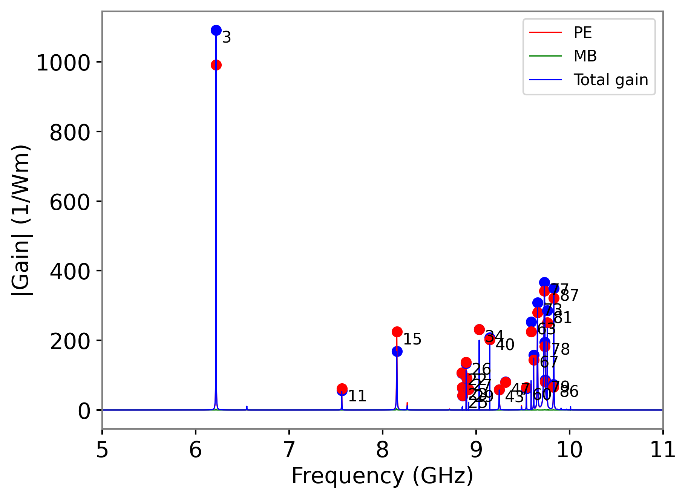

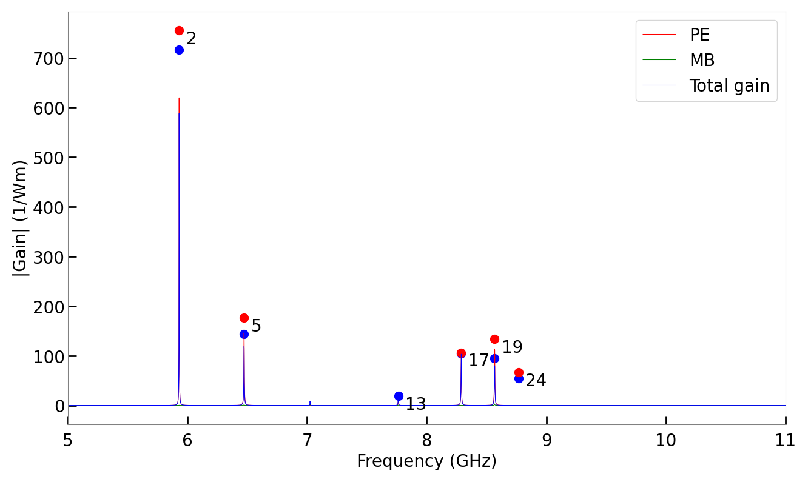
