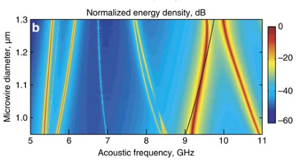

.. include:: numbatdefs.txt

.. _chap-literature-label:

***********************
Literature Examples
***********************

Introduction 
---------------------

Having become somewhat familiar with |NUMBAT|, we now set out to replicate a number of examples 
from the recent literature located in the ``lit_examples`` directory.
The examples are presented in chronological order. 
We note the particular importance of examples 5-8 which include experimental and numerical results that are in good agreement.

Example 1 -- BSBS in a silica rectangular waveguide
^^^^^^^^^^^^^^^^^^^^^^^^^^^^^^^^^^^^^^^^^^^^^^^^^^^^^^^^^^^^^^^^^^^^^^^^^^^^^^^^^^^^^^^^^^^
This example ``simo-lit_01-Laude-AIPAdv_2013-silica.py``
is based on the calculation of backward SBS
in a small rectangular silica waveguide described in V. Laude and J.-C. Beugnot, 
`Generation of phonons from electrostriction in small-core optical waveguides 
<http://dx.doi.org/10.1063/1.4801936>`_, *AIP Advances* **3**, 042109 (2013).

Observe the use of a material named ``SiO2_2013_Laude``
specifically modelled on the parameters in this paper.
This naming scheme for materials allows several different
versions of nominally the same material to be selected,so that users can easily 
compare calculations to other authors's exact parameter choices, without changing their preferred material values for their own samples and experiments.

In this paper, Laude and Beugnot plot a spectrum of the elastic energy density, which is
not directly measureable. However the spectral peaks show close alignment with the |NUMBAT| gain
spectrum for the same structure as is apparent in the second plot.
We attribute the remaining difference in the location of the spectral peaks to 
the choice of elastic material properties in the paper. 
The paper reports a bulk shear velocity of 3400 m/s, which is around 8% smaller than the 
usual value of approximately 3760 m/s, but the full set of material 
properties used in the calculations are not provided.
Hence we have used a more standard set of values.

The modal profiles for the peaks marked C and D can also be compared with those from the paper in the subsequent plots.
The most direct comparison comes from looking at the |NUMBAT| contour plots for the transverse
and longitudinal elastic fields. Note that the transverse and axial plots for mode D in the paper are inconsistent. 
The axial plot is the correct one for this mode.

.. raw:: latex

    \clearpage

.. figure:: images/laude_aip_advances_bsbs_1_spec.png
   :width: 10cm

   Spectrum of elastic mode energy  calculated in 
   Laude and Beugnot for backward SBS in a silica waveguide.

.. figure:: ../../lit_examples/lit_01-gain_spectra-logy.png
   :width: 10cm
   
   |NUMBAT| gain spectrum on semilogy axis.

.. figure:: ../../lit_examples/lit_01-fields/EM_E_field_00.png
   :width: 10cm
   
   Fundamental optical mode profiles calculated in |NUMBAT|.

.. raw:: latex

    \clearpage

.. figure:: images/laude_aip_advances_bsbs_1_modeC.png
   :width: 13cm

   Elastic mode profiles calculated in 
   Laude and Beugnot for backward SBS in a silica waveguide of diameter 1.05 micron. Mode  C  corresponds to the peak marked in the spectrum above.

.. figure:: ../../lit_examples/lit_01-fields/AC_field_04.png
   :width: 13cm
   
   |NUMBAT| calculation of high gain elastic mode, marked as C in paper.

.. raw:: latex

    \clearpage

.. figure:: images/laude_aip_advances_bsbs_1_modeD.png
   :width: 13cm

   Elastic mode profiles calculated in 
   Laude and Beugnot for backward SBS in a silica waveguide of diameter 1.05 micron. 
   Mode D corresponds to the peak marked in the spectrum above.

.. .. figure:: ../../lit_examples/lit_01-fields/AC_field_55.png
.. figure:: ../../lit_examples/lit_01-fields/AC_field_52.png
   :width: 13cm
   
   |NUMBAT| calculation of high gain elastic mode, marked as D in paper.

.. raw:: latex

    \clearpage

Example 2 -- BSBS in a rectangular silicon waveguide 
^^^^^^^^^^^^^^^^^^^^^^^^^^^^^^^^^^^^^^^^^^^^^^^^^^^^^^^^^^^^^^^^^^^^^^^^^^^^^^^^^^^^^^^^^^^^

This example in ``simo-lit_02-Laude-AIPAdv_2013-silicon.py`` again follows the paper of V. Laude and J.-C. Beugnot, 
`Generation of phonons from electrostriction in small-core optical waveguides 
<http://dx.doi.org/10.1063/1.4801936>`_, *AIP Advances* **3**, 042109 (2013),
but this time looks at the *silicon* waveguide case.

Once again, the plots from the orignal paper are shown in the first figure.
In this case, with a very large number of modes of different shear wave order, 
the precise mode profile for highest gain depends very sensitively on the 
simulation parameters.

.. figure:: images/laude_aip_advances_bsbs_2_spec.png
   :width: 12cm

   Spectrum of elastic mode energy  calculated in 
   Laude and Beugnot for backward SBS in a silicon waveguide.

.. figure:: ../../lit_examples/lit_02-gain_spectra-logy.png
   :width: 12cm
   
   |NUMBAT| gain spectrum on semilogy axis.

.. figure:: images/laude_aip_advances_bsbs_2_modeG.png
   :width: 12cm

   Field profiles for mode G  calculated in 
   Laude and Beugnot for backward SBS in a silicon waveguide.

.. figure:: ../../lit_examples/lit_02-fields/AC_field_23.png
   :width: 12cm 
   
   High gain elastic mode calculated by |NUMBAT|, marked as G in paper.

.. figure:: images/laude_aip_advances_bsbs_2_modeH.png
   :width: 12cm

   Field profiles for mode H  calculated in 
   Laude and Beugnot for backward SBS in a silicon waveguide.

.. figure:: ../../lit_examples/lit_02-fields/AC_field_296.png
   :width: 12cm 
   
   High gain elastic  mode calculated by |NUMBAT|, marked as H in paper.

.. raw:: latex

    \clearpage

Example 3 -- BSBS in a tapered fibre - scanning widths
^^^^^^^^^^^^^^^^^^^^^^^^^^^^^^^^^^^^^^^^^^^^^^^^^^^^^^^^^^^^^^^^^^^^^^^^^^^^^^^^^^^^^^^^^^^^^^^^^^^^^

This example, in ``simo-lit_03-Beugnot-NatComm_2014.py``,
is based on the calculation of backward SBS
in a micron scale optical fibre described in J.-C. Beugnot *et al.*, 
`Brillouin light scattering from surface elastic waves in a subwavelength-diameter optical fibre
<http://dx.doi.org/10.1038/ncomms6242>`_, *Nature Communications* **5**, 5242 (2014).

.. .. literalinclude:: ../../lit_examples/simo-lit_03-Beugnot-NatComm_2014.py
    :lines: 0-

   Measured gain spectrum for a 1 micron silica nanowire in J.-C. Beugnot *et al.*
   
.. figure:: ../../lit_examples/lit_03-gain_spectra-logy_w1000.png
   :width: 12cm

   |NUMBAT| calculated gain spectrum for the 1 micron silica nanowire.

   Calculated dispersion of gain spectrum with nanowire width in J.-C. Beugnot *et al.*

.. figure:: ../../lit_examples/lit_03-gain_tot-diam_scan.png
   :width: 12cm
   
   Full elastic wave spectrum for silica microwire, as per Fig. 4a in paper.

   Calculated elastic mode profiles for the 1 micron nanowire in J.-C. Beugnot *et al.*

.. figure:: ../../lit_examples/lit_03-diam-1000-fields/EM_E_field_00.png

.. figure:: ../../lit_examples/lit_03-diam-1000-fields/AC_field_02.png
   :width: 12cm
   Radial shear mode.

.. figure:: ../../lit_examples/lit_03-diam-1000-fields/AC_field_05.png
   :width: 12cm

   Azimuthal shear mode.

.. figure:: ../../lit_examples/lit_03-diam-1000-fields/AC_field_21.png
   :width: 12cm

   Azimuthal shear mode.

.. figure:: ../../lit_examples/lit_03-diam-1000-fields/AC_field_28.png
   :width: 12cm

   Azimuthal shear mode.

.. raw:: latex

    \clearpage

Example 4 -- FSBF in a waveguide on a pedestal
^^^^^^^^^^^^^^^^^^^^^^^^^^^^^^^^^^^^^^^^^^^^^^^^^^^^^^^^^^^^^^^^^^^^^^^^^^^^^^^^^^^^^^^^^
This example, in ``simo-lit_04-pillar-Van_Laer-NatPhot_2015.py``, 
is based on the calculation of forward SBS
in a pedestal silicon waveguide described in R. Van Laer *et al.*, 
`Interaction between light and highly confined hypersound in a silicon photonic nanowire 
<http://dx.doi.org/10.1038/ncomms6242>`_, *Nature Photonics* **9**, 199 (2015).

Note that the absence of an absorptive boundary in the elastic model 
causes a problem where the slab layer significantly distorting elastic modes.
Adding this feature is a priority for a future release of |NUMBAT|.
The following example shows an approximate way to avoid the problem for now.

.. .. literalinclude:: ../../lit_examples/simo-lit_04-pillar-Van_Laer-NP_2015.py
    :lines: 0-

.. figure:: ../../lit_examples/lit_04b-fields/EM_E_field_00.png
   :width: 12cm %
   
   Fundamental optical mode fields.

.. figure:: ../../lit_examples/lit_04b-fields/AC_field_38.png
   :width: 12cm %
   
   Dominant high gain elastic mode.
   Note how the absence of an absorptive boundary on the SiO2 slab causes this layer to significantly distorted the elastic modes.

We may also choose to study the simplified situation where the pedestal is removed,
which gives good agreement for the gain spectrum:

.. figure:: ../../lit_examples/lit_04a-gain_spectra.png
   :width: 12cm %
   
   Gain spectrum for the simplified case of a waveguide surrounded by vacuum.

.. raw:: latex

    \clearpage

Example 5 -- FSBF in a waveguide without a pedestal
^^^^^^^^^^^^^^^^^^^^^^^^^^^^^^^^^^^^^^^^^^^^^^^^^^^^^^^^^^^^^^^^^^^^^^^^^^^^^^^^^^^^^^^^^^^^^^^^^^^^^^^^^^^

This example, in ``simo-lit_05-Van_Laer-NJP_2015.py``, continues  
the study of forward SBS
in a pedestal silicon waveguide described in R. Van Laer *et al.*, 
`Interaction between light and highly confined hypersound in a silicon photonic nanowire 
<http://dx.doi.org/10.1038/ncomms6242>`_, *Nature Photonics* **9**, 199 (2015).

In this case, we simply remove the pedestal and model the main rectangular waveguide.
This makes the elastic loss calculation incorrect but avoids the problem of elastic
energy being excessively concentrated in the substrate.

.. .. literalinclude:: ../../lit_examples/simo-lit_05-Van_Laer-NJP_2015.py
    :lines: 0-

.. figure:: ../../lit_examples/lit_05-fields/EM_E_field_00.png
   :width: 12cm %
   
   Fundamental optical mode fields.

.. figure:: ../../lit_examples/lit_05-fields/AC_field_06.png
   :width: 12cm %
   
   Dominant high gain elastic mode.

.. raw:: latex

    \clearpage

Example 6 -- BSBS self-cancellation in a tapered fibre (small fibre)
^^^^^^^^^^^^^^^^^^^^^^^^^^^^^^^^^^^^^^^^^^^^^^^^^^^^^^^^^^^^^^^^^^^^^^^^^^^^^^^^^^^^^^^^^^^^^^^^^^^^^^^^^^^^^^^^^^^^^^^^^

This example, in ``simo-lit_06_1-Florez-NatComm_2016-d550nm.py``,
looks at the phenomenon of Brillouin "self-cancellation" due to 
the electrostrictive and radiation pressure effects acting with opposite sign. 
This was described in O. Florez *et al.*, `Brillouin self-cancellation 
<http://dx.doi.org/10.1038/ncomms11759>`_, *Nature Communications* **7**, 11759 (2016).

.. .. literalinclude:: ../../lit_examples/simo-lit_06_1-Florez-NatComm_2016-d550nm.py
    :lines: 0-

.. figure:: ../../lit_examples/lit_06a-fields/AC_field_04.png
   :width: 12cm %
   
   :math:`TR_{21}` elastic mode fields of a nanowire with diameter 550 nm.

.. figure:: ../../lit_examples/lit_06a-fields/AC_field_05.png
   :width: 12cm %
   
   :math:`R_{01}` elastic mode fields of a nanowire with diameter 550 nm.

.. figure:: ../../lit_examples/lit_06a-gain_spectra.png
   :width: 12cm %
   
   Gain spectra of a nanowire with diameter 550 nm, matching blue curve of Fig. 3b in paper.

.. figure:: ../../lit_examples/lit_06a-gain_spectra-5.png
   :width: 12cm %

.. figure:: ../../lit_examples/lit_06a-gain_spectra-6.png
   :width: 12cm %

.. figure:: ../../lit_examples/lit_06a-gain_spectra-8.png
   :width: 12cm %

.. figure:: ../../lit_examples/lit_06a-gain_spectra-11.png
   :width: 12cm %
   
   Zoomed in gain spectra around gain peaks of 550 nm diameter nanowire.

.. raw:: latex

    \clearpage

Example 6b -- BSBS self-cancellation in a tapered fibre (large fibre)
^^^^^^^^^^^^^^^^^^^^^^^^^^^^^^^^^^^^^^^^^^^^^^^^^^^^^^^^^^^^^^^^^^^^^^^^^^^^^^^^^^^^^^^^^^^^^^^^^^^^^^^^^^^^^^^^^^^^^^^^^^^
This example, in ``simo-lit_06_2-Florez-NatComm_2016-1160nm.py``, again looks at the paper 
O. Florez *et al.*, `Brillouin self-cancellation <http://dx.doi.org/10.1038/ncomms11759>`_, *Nature Communications* **7**, 11759 (2016),
but now for a wider core.

.. .. literalinclude:: ../../lit_examples/simo-lit_06_2-Florez-NatComm_2016-d1160nm.py
    :lines: 0-

.. figure:: ../../lit_examples/lit_06b-gain_spectra.png
   :width: 12cm %
   
   Gain spectra of a nanowire with diameter 1160 nm, as in Fig. 4 of Florez, showing near perfect cancellation at 5.4 GHz.

.. figure:: ../../lit_examples/lit_06b-gain_spectra-logy.png
   :width: 12cm %
   
   Gain spectra of a nanowire with diameter 1160 nm, as in Fig. 4 of paper, showing near perfect cancellation at 5.4 GHz.

.. raw:: latex

    \clearpage

Example 7 -- FSBF in a silicon rib waveguide
^^^^^^^^^^^^^^^^^^^^^^^^^^^^^^^^^^^^^^^^^^^^^^^^^^^^^^^^^^^^^^^^^^^^^^^^^^^^^^^^^^^^^^^^

This example, in ``simo-lit_07-Kittlaus-NatPhot_2016.py``,
explores a first geometry showing large forward SBS in silicon
as described in E. Kittlaus *et al.*, `Large Brillouin amplification in silicon 
<http://dx.doi.org/10.1038/nphoton.2016.112>`_, *Nature Photonics* **10**, 463 (2016).

.. .. literalinclude:: ../../lit_examples/simo-lit_07-Kittlaus-NatPhot_2016.py
    :lines: 0-

.. figure:: ../../lit_examples/lit_07-fields/EM_E_field_00.png
   :width: 12cm %
   
   Fundamental optical mode fields.

.. figure:: ../../lit_examples/lit_07-fields/AC_field_19.png
   :width: 12cm %
   
   Dominant high gain elastic mode.

.. figure:: ../../lit_examples/lit_07-gain_spectra.png
   :width: 12cm %
   
   Gain spectra showing gain due to photoelastic effect, gain due to moving boundary effect, and total gain.

.. raw:: latex

    \clearpage

Example 8 -- Intermodal FSBF in a silicon waveguide 
^^^^^^^^^^^^^^^^^^^^^^^^^^^^^^^^^^^^^^^^^^^^^^^^^^^^^^^^^^^^^^^^^^^^^^^^^^^^^^^^^^^^^^^^^^^^^^^^^^^
This example (``simo-lit_08-Kittlaus-NatComm_2017.py``), also from the Yale group,  examines intermode forward Brillouin scattering in silicon.

.. .. literalinclude:: ../../lit_examples/simo-lit_08-Kittlaus-NatComm_2017.py
    :lines: 0-

.. figure:: ../../lit_examples/lit_08-fields/EM_E_field_00.png
   :width: 12cm %
   
   Fundamental (symmetric TE-like) optical mode fields.

.. figure:: ../../lit_examples/lit_08-fields/EM_E_field_01.png
   :width: 12cm %
   
   2nd lowest order (anti-symmetric TE-like) optical mode fields.

.. figure:: ../../lit_examples/lit_08-fields/AC_field_23.png
   :width: 12cm %
   
   Dominant high gain elastic mode.

.. figure:: ../../lit_examples/lit_08-gain_spectra.png
   :width: 12cm %
   
   Gain spectra showing gain due to photoelastic effect, gain due to moving boundary effect, and total gain.

.. raw:: latex

    \clearpage

Example 9 -- BSBS in a chalcogenide rib waveguide
^^^^^^^^^^^^^^^^^^^^^^^^^^^^^^^^^^^^^^^^^^^^^^^^^^^^^^^^^^^^^^^^^^^^^^^^^^^^^^^^^^^
This example, in ``simo-lit_09-Morrison-Optica_2017.py``, from the Sydney group examines backward SBS in a chalcogenide rib waveguide.

.. .. literalinclude:: ../../lit_examples/simo-lit_09-Morrison-Optica_2017.py
    :lines: 0-

.. figure:: ../../lit_examples/lit_09-gain_spectra.png
   :width: 12cm %
   
   Gain spectra showing gain due to photoelastic effect, gain due to moving boundary effect, and total gain.

Example 10 -- SBS in the mid-infrared
^^^^^^^^^^^^^^^^^^^^^^^^^^^^^^^^^^^^^^^^^^^^^^^^^^^^^^^^^^^^^^^^^^^^^^^^^^^^^^^^^^^
This example, in ``simo-lit_10-Wolff-OptExpress-2014.py`` and ``simo-lit_10a-Wolff-OptExpress-2014.py``, by C. Wolff and collaborators examines backward SBS in the mid-infrared using germanium 
as the core material in a rectangular waveguide with a silicon nitride cladding.

The second of these two files illustrates the rotation of the core material from the [100] orientation to the [110] orientation. The second file prints out the full elastic properties of the germanium material in both orientations which are seen to match the values in the paper by Wolff et al.

.. .. literalinclude:: ../../lit_examples/simo-lit_10-Wolff-OptExpress-2014.py
    :lines: 0-

.. .. literalinclude:: ../../lit_examples/simo-lit_10a-Wolff-OptExpress-2014.py
    :lines: 0-

.. figure:: ../../lit_examples/lit_10a-gain_spectra.png
   :width: 12cm %

.. figure:: ../../lit_examples/lit_10b-gain_spectra.png
   :width: 12cm %
