.. include:: numbatdefs.txt

Tutorial 2 -- SBS Gain Spectra
----------------------------------
The first example we met in the previous chapter only printed numerical data to the screen with no graphical output.
This example, contained in ``<NUMBAT>/tutorials/sim-tut_02-gain_spectra-npsave.py`` considers the same silicon-in-air structure but adds plotting of fields, gain spectra and techniques for saving and reusing data from earlier calculations.

As before, move to the ``<NUMBAT>/tutorials`` directory, and then run the calculation by entering::

    $ python3 sim-tut_02-gain_spectra-npsave.py

Or you can take advantage of the ``Makefile`` provided in the directory and just type::

    $ make tut02

Some of the tutorial problems can take a little while to run, especially if your computer
is not especially fast. To save time, you can run most
problems with a coarser mesh at the cost of somewhat reduced accuracy,  by adding the flag ``fast=1`` to the command line::

    $ python3 sim-tut_02-gain_spectra-npsave.py fast=1

Or using the makefile technique, simply ::

    $ make ftut02

The calculation should complete in a minute or so.
You will find a number of new files  in the ``tutorials`` directory beginning
with the prefix ``tut_02`` (or ``ftut_02`` if you ran in fast mode).

Gain Spectra
^^^^^^^^^^^^

The Brillouin gain spectra and plotted using the functions
``integration.gain_and_qs()`` and ``plotting.plot_gain_spectra()``.
The results are contained in the file ``tut_02-gain_spectra.png`` which can be viewed in any image viewer. On Linux, for instance you can use ::

     $ eog tut_02_gain_spectra.png

to see this image:

.. _fig-gainspec1-label:

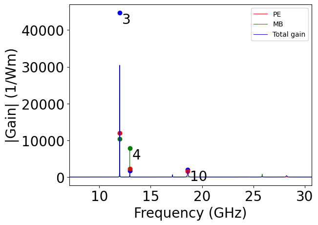

   Gain spectrum in ``tut_02-gain_spectra.png`` showing gain due to the photoelastic effect, gain due to moving boundary effect, and the total gain. The numbers near the main peaks identify the acoustic mode associated with the resonance.

Note how the different contributions from the photoelastic and moving-boundary effects
are visible. In some cases, the total gain (blue) may be less than one or both of
the separate effects if the two components act with opposite sign.
:ref:`chap-josab-label` and :ref:`chap-literature-label`.
(See Literature example 1 in the chapter :ref:`chap-literature-label`
for an interesting cexample of this phenomenon.)

Note also that prominent resonance peaks in the gain spectrum are labelled with the
mode number :math:`m` of the associated acoustic mode. This makes it easy
to find the spatial profile of the most relevant modes (see below).

Mode Profiles
^^^^^^^^^^^^^

The choice of parameters for ``plot_gain_spectra()`` has caused several other  files
to be generated showing a zoomed-in version near the main peak, and the whole spectrum
on :math:`\log` and dB scales:

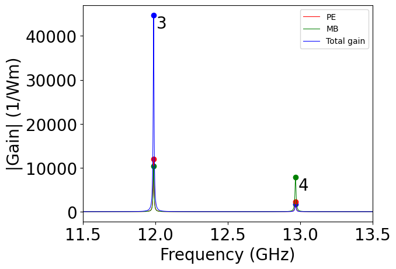

   Zoom-in of the gain spectrum in the previous figure in the file ``tut_02-gain_spectra_zoom.png`` .

.. figure:: ./images/tutorial/tut_02-gain_spectra-logy.png
   :width: 10cm

   Gain spectrum viewed on a log scale in the field ``tut_02-gain_spectra-logy.png`` .

This example has also generated plots of some of the electromagnetic and acoustic modes
that were found in solving the eigenproblems. These are created using
the calls to ``plotting.plot_modes()`` and stored in the sub-directory ``tut_02-fields``.

Note that
a number of useful parameters are also displayed at the top-left of each mode
profile. These parameters can also be extracted using a range of function calls on a
``Mode`` object (see the API docs).

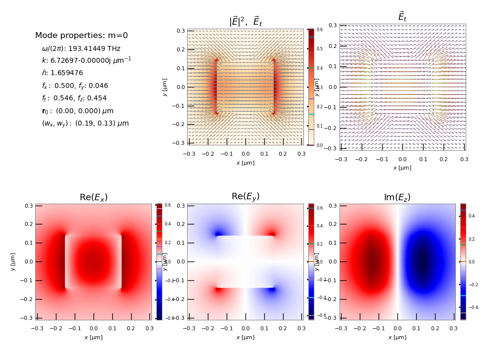

   Electric field profile of the fundamental (:math:`m=0`) optical mode profile stored in ``tut_02-fields/EM_E_field_00.png``. The figures shows the modulus of the whole electric field :math:`|{\vec E}|^2`, a vector plot of the transverse field :math:`{\vec E}_t=(E_x,E_y)`, and the three components of the electric field.  |NUMBAT| chooses the phase of the
   mode profile such that the transverse components are real. Note that the :math:`E_z` component is :math:`\pi/2` out of phase with the transverse components. (Since the structure is lossless, the imaginary parts of the transverse field, and the real part of :math:`E_z` are zero).

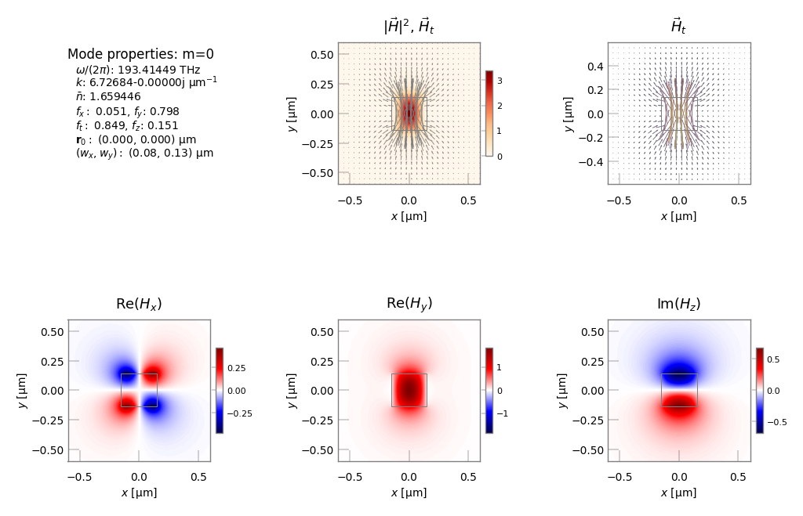

   Magnetic field profile of the fundamental (:math:`m=0`) optical mode profile showing modulus of the whole magnetic field :math:`|{\vec H}|^2`, vector plot of the transverse field :math:`{\vec H}_t=(H_x,H_y)`, and the three components of the magnetic field.  Note that the :math:`H_z` component is :math:`\pi/2` out of phase with the transverse components.

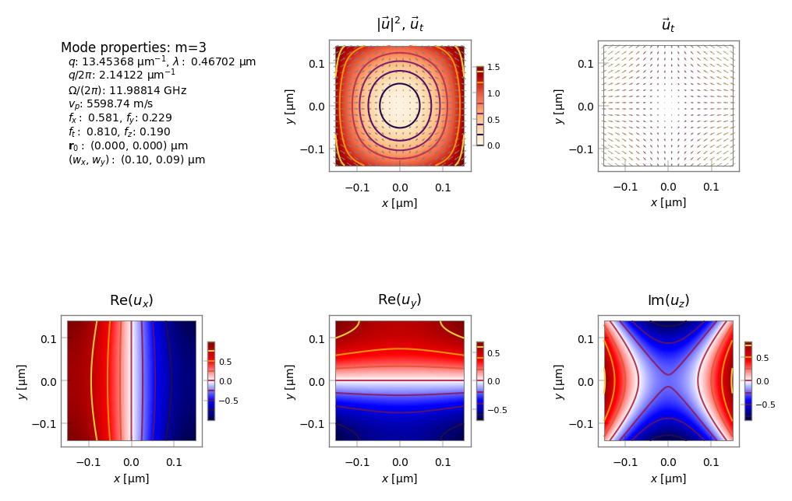

   Displacement field :math:`\vec u(\vec r)` of the :math:`m=3` acoustic mode with gain
   dominated by the moving boundary effect (green curve in gain spectra).
   Note that the frequency of :math:`\Omega/(2\pi)=11.99` GHz
   (listed in the upper-left corner) corresponds to the first peak in the gain spectrum.

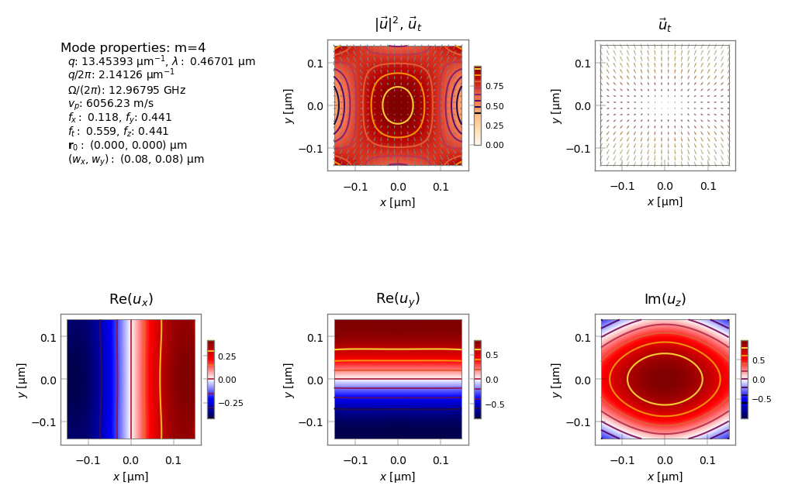

   Displacement field :math:`\vec u(\vec r)` of the :math:`m=4` acoustic mode with gain dominated by the photo-elastic effect (red curve in gain spectra).
   Note that the frequency of :math:`\Omega/(2\pi)=13.45` GHz corresponds to the second peak in the gain spectrum.

Miscellaneous comments
^^^^^^^^^^^^^^^^^^^^^^^^^^

Here are some further elements to note about this example:

  #.  When using the ``fast=`` mode, the output data and fields directory begin with ``ftut_02`` rather than ``tut_02``.
  #. It is frequently useful to be able to save and load the results of simulations to adjust plots without having to repeat the entire calculation. Here the flag ``recalc_fields`` determines whether the calculation should be done afresh and use previously saved data. This is performed using the ``save_simulation()`` and ``load_simulation()`` calls.
  #. Plots of the modal field profiles are obtained using ``plotting.plot_modes``. Both electric and magnetic fields can be selected using ``EM_E`` or ``EM_H`` as the value of the ``EM_AC`` argument. The mode numbers to be plotted is specified by ``ivals``.  These fields are stored in a folder ``tut_02-fields/`` within the tutorial folder.
     Later we will see how an alternative approach in which we extract a ``Mode`` object from a ``Simulation`` which represent a single mode that is able to plot itself. This can be more convenient.
  #. The overall amplitude of the modal fields is arbitrary.
     In |NUMBAT|, the maximum value of the electric field is set to be 1.0, and this may be interpreted as a quantity in units of V/m, :math:`\sqrt{\mathrm{W}}` or other units as desired.
     Importantly, the plotted *magnetic* field :math:`\vec H(\vec r)` is multiplied by the impedance of free space :math:`Z_0=\sqrt{\mu_0/\epsilon_0}` so that :math:`Z_0 \vec H(\vec r)` and :math:`\vec E(\vec r)` *have the same units*, and the relative amplitudes between the electric and magnetic field plots are meaningful.
  #. The ``suppress_imimre`` option suppresses plotting of the :math:`\text{Im}[x]`, :math:`\text{Im}[y]` and :math:`\text{Re}[z]` components of the fields which in a lossless non-leaky problem should normally be zero at all points and therefore not useful to plot.
  #. By default, plots are exported as ``png`` format. Pass the option ``pdf_png=pdf`` to plot functions to generate a ``pdf`` output.
  #. Plots of both spectra and modes are generated with a best attempt at font sizes, line widths etc, but the range of potential cases make it impossible to find a selection that works in all cases. Most plot functions therefore support the passing of a ``plotting.Decorator`` object that can vary the settings of these parameters and also pass additional commands to write on the plot axes. See the plotting API for details. This should be regarded as a relatively advanced |NUMBAT| feature.
  #. Vector field plots often require tweaking to get an attractive set of vector arrows.  The ``quiver_points`` option controls the number of arrows drawn along each direction.
  #. The plot functions and the ``Decorator`` class support many options. Consult the API chapter for details on how to fine tune your plots.

The full code for this simulation is as follows:

.. literalinclude:: ../../tutorials/sim-tut_02-gain_spectra-npsave.py
    :lines: 0-

.. raw:: latex

    \clearpage

Tutorial 3a -- Investigating Dispersion and np.save/np.load
------------------------------------------------------------
This example, contained in ``tutorials/sim-tut_03_1-dispersion-npload.py`` calculates the elastic dispersion diagram -- the relation between the acoustic wave number :math:`q`
and frequency :math:`\Omega`-- for the problem in the previous tutorial.
This is done by scanning over the elastic wavenumber ``q_AC`` and finding the
eigenfrequencies for each value.

As discussed in  *Formal selection rules for Brillouin scattering in integrated waveguides and structured fibers* by C. Wolff, M. J. Steel, and C. G. Poulton `DOI:/10.1364/OE.22.032489 <https://dx.doi.org/10.1364/OE.22.032489>`_, the elastic modes of any waveguide may be classified according to their representation of the point group symmetry class  corresponding to the waveguide
profile. For this problem, the waveguide is rectangular with symmetry group :math:`C_{2v}`
which  has four symmetry classes, which are marked in the dispersion diagram.

This example also takes advantage of the ability to load and save simulation results
to save repeated calculation.
using the ``save_simulation`` and ``load_simulation`` methods defined
in the ``mode_calcs`` module.
The previous tutorial saved its electromagnetic
results in the file ``tut02_wguide_data.npz``
using the ``Simulation.save_simulation()`` method, while these tutorial
has recovered those results using ``mode_calc.load_simulation()``.
This can be a very useful technique when trying to adjust the appearance
of plots without having to repeat the whole calculation effort.

*Note*: from now on, we do not include the code for each tutorial and refer the reader
to the relevant files in the ``<NumBAT>/tutorials`` directory.

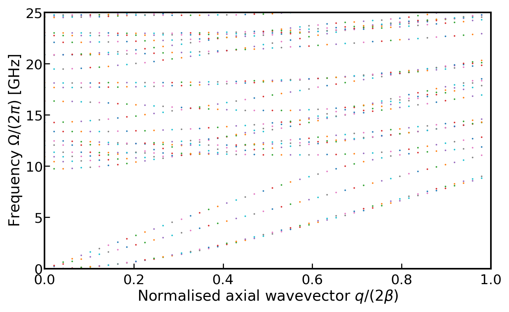

   Acoustic dispersion diagram with modes categorised by symmetry as in Table 1 of Wolff et al.
   *Opt. Express.* **22**, 32489 (2014).

.. raw:: latex

    \clearpage

Tutorial 3b -- Investigating Dispersion and Multiprocessing
------------------------------------------------------------
This tutorial, contained in ``sim-tut_03_2-dispersion-multicore.py`` continues the study of acoustic dispersion and demonstrates the use of Python multiprocessor calls using the ``multiprocessing`` library to increase speed of execution.

In this code as in the previous example, the acoustic modal problem is
repeatedly solved at a range of different :math:`q` values to build up a set of
dispersion curves :math:`\nu_m(q)`. Due to the large number of avoided and
non-avoided crossings, it is usually best to plot dispersion curves like this
with dots rather than joined lines. The plot generated below can be improved by
increasing the number of :math:`q` points sampled through the value of the
variable ``n_qs``, limited only by your patience.

The multiprocessing library runs each task as a completely separate process on the computer.
Depending on the nature and number of your CPU, this may improve the performance considerably.
This can also be easily extended to multiple node systems which will certainly improve performance.
A very similar procedure using the ``threading``  library allows the different tasks
to run as separate threads within the one process. However, due to the existence of the Python Global Interpreter Lock (GIL) which constrains what kinds of operations may run in parallel within Python , multiple threads will typically not improve the performance of |NUMBAT|.

This tutorial also  shows an example of saving data, in this case the array
of acoustic wavenumbers and frequencies, to a text file using the ``numpy`` routine
``np.savetxt`` for later analysis.

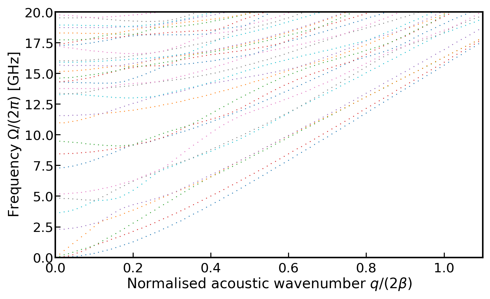

   Acoustic dispersion diagram. The elastic wave number :math:`q` is scaled by the phase-matched SBS wavenumber :math:`2\beta` where :math:`\beta` is the propagation constant of the optical pump mode.

.. raw:: latex

    \clearpage

Tutorial 4 -- Parameter Scan of Widths
----------------------------------------
This tutorial, contained in ``sim-tut_04_scan_widths.py`` demonstrates the use of a
parameter scan of a waveguide property, in this case over the width of the silicon rectangular waveguide, to characterise the behaviour of the Brillouin gain.

The results are displayed in a 3D plot. This may not be the most effective
approach for this small data set but gives a sense of what is possible graphically.
For a more effective plot, you might like to try the same calculation with around 30 values for the
width rather than just 6.

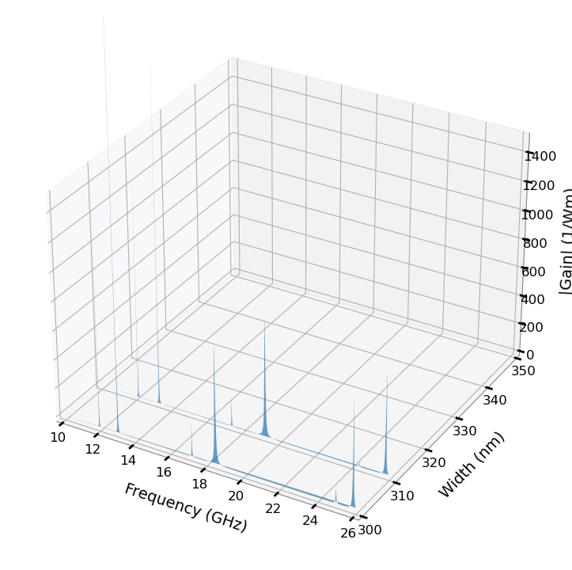

   Gain spectra as function of waveguide width.

.. raw:: latex

    \clearpage

Tutorial 5 -- Convergence Study
----------------------------------------
This tutorial, contained in ``sim-tut_05_convergence_study.py`` demonstrates a scan of numerical parameters for our by now familiar silicon-in-air problem to test the convergence of the calculation results.
This is done by scanning the value of the ``lc_refine`` parameters.
The number of mesh elements (and simulation time) increases with roughly the square of the
mesh refinement factor.

For the purpose of convergence estimates, the values calculated at the finest mesh (the rightmost
values) are taken as the ``exact`` values, notated with the subscript 0,
eg. :math:`\beta_0`.
The graphs below show both relative errors and absolute values for each  quantity.

Once the convergence properties for a particular problem have been established, it can
be useful to do exploratory work more quickly by adopting a somewhat coarser mesh,
and then increase the resolution once again towards the end of the project to validate
results before reporting them.

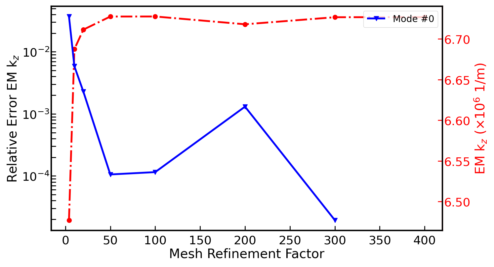

   Convergence of relative (blue) and absolute (red) optical wavenumbers :math:`k_{z,i}`.
   The left axis displays the relative error :math:`(k_{z,i}-k_{z,0})/k_{z,0}`.
   The right axis shows the absolute values of :math:`k_{z,i}`.

.. figure:: ./images/tutorial/tut_05-convergence-freq_AC.png
   :width: 10cm

   Convergence of relative (solid, left) and absolute (chain, right)
   elastic mode frequencies :math:`\nu_{i}`.

.. figure:: ./images/tutorial/tut_05-convergence-gain_PE.png
   :width: 10cm

   Convergence of photoelastic gain :math:`G^\text{PE}`. The absolute gain on the right hand side
   increases  down the page because of the convention that |NUMBAT| associates backward SBS
   with negative gain.

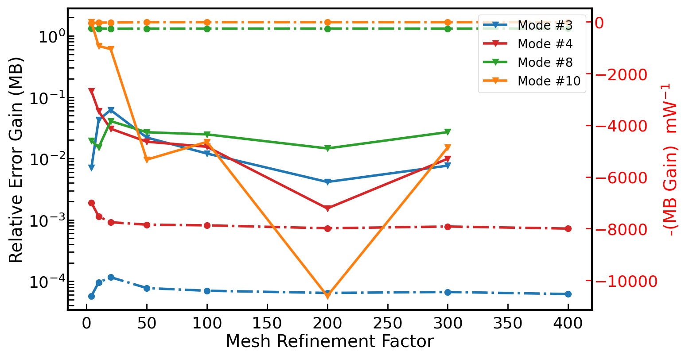

   Absolute and relative convergence of moving boundary gain :math:`G^\text{MB}`.

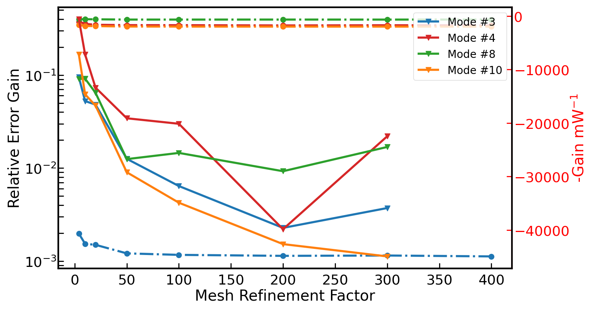

   Absolute and relative convergence of total gain :math:`G`.

.. raw:: latex

    \clearpage

Tutorial 6 -- Silica Nanowire
----------------------------------------
In this tutorial, contained in ``sim-tut_06_silica_nanowire.py`` we start
to explore the Brillouin gain properties in a range of different structures,
in this case a silica nanowire surrounded by vacuum.

The ``gain-spectra`` plot below shows the Brillouin gain as a function of
Stokes shift.  Each resonance peak is marked with the number of the acoustic
mode associated with the resonance.  This is very helpful in identifying which
acoustic mode profiles to examine more closely.  In this case, modes 5, 8 and
23 give the most significant Brillouin gain.  The number of modes labelled in the gain spectrum can
be controlled using the parameter ``mark_mode_thresh`` in the function
``plotting.plot_gain_spectra`` to avoid many labels from modes giving
negligible gain.
Other parameters allow selecting only one type of gain (PE or MB), changing the frequency range, and plotting on log or dB scales.

It is important to remember that the total gain is not the simple sum of the photoelastic
(PE) and moving boundary (MB) gains. Rather it is the coupling terms :math:`Q_\text{PE}` and :math:`Q_\text{MB}` which are added before squaring to give the total gain.  Indeed the two effects may have opposite sign giving net gains smaller than either contribution.

.. figure:: ./images/tutorial/tut_06-gain_spectra.png
   :width: 10cm

   Gain spectrum showing the gain due to the photoelastic effect (PE), the moving
   boundary effect (PB), and the net gain (Total).

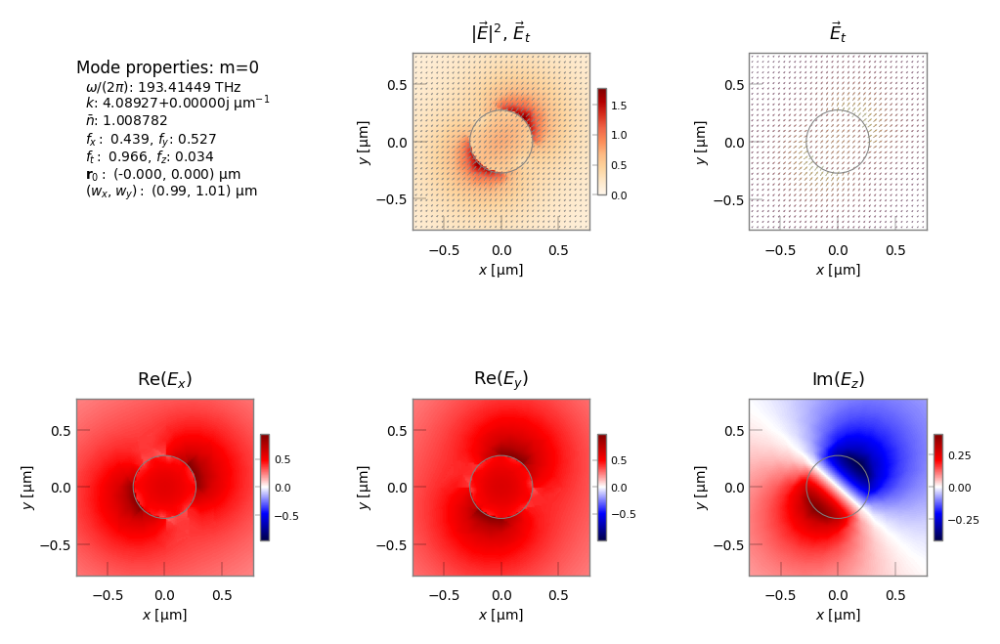

   Electromagnetic mode profile of the pump and Stokes field in the :math:`x`-polarised
   fundamental mode of the waveguide.

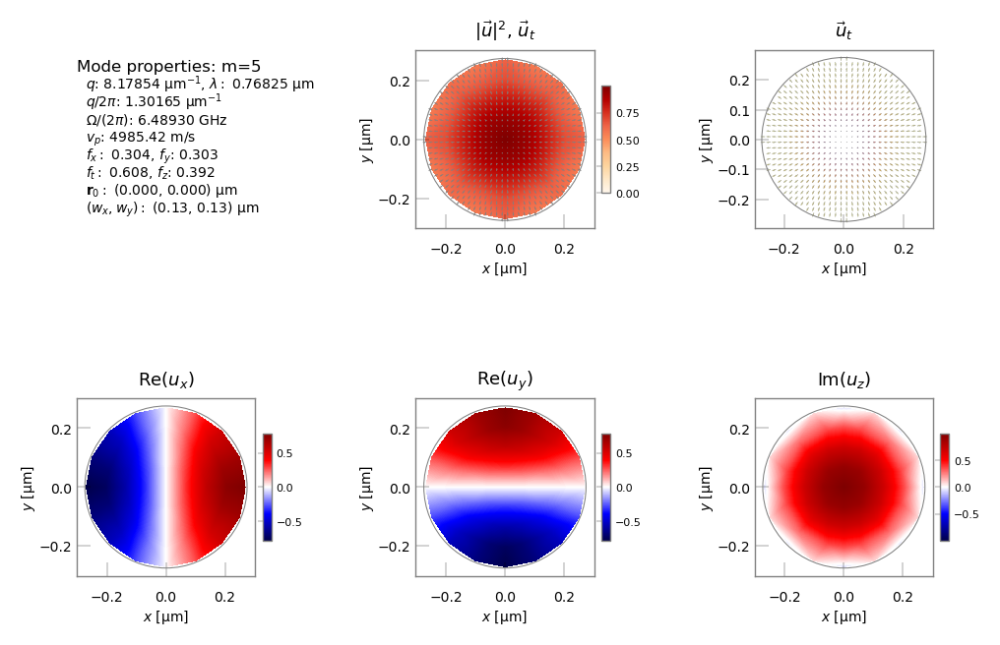

   Mode profiles for acoustic mode 5 which is visible as a MB-dominated peak in the gain spectrum.

.. figure:: ./images/tutorial/tut_06-fields/AC_field_08.png
   :width: 10cm

   Mode profiles for acoustic mode 8 which is visible as a PE-dominated peak in the gain spectrum.

.. raw:: latex

    \clearpage

Tutorial 7 -- Slot Waveguide
----------------------------------------
This tutorial, contained in ``sim-tut_07-slot.py`` examines backward SBS in a more complex structure: chalcogenide soft glass (:math:`\text{As}_2\text{S}_3`) embedded in a silicon slot waveguide on a silica slab. This structure takes advantage of the
slot effect which expels the optical field into the lower index medium, enhancing the fraction of the EM field inside the soft chalcogenide glass which guides the acoustic mode
and increasing the gain.

Comparing the :math:`m=2` and :math:`m=5` acoustic mode profiles with the
pump EM profile, it is apparent that the field overlap is favourable, where as
the :math:`m=1` mode gives zero gain due to its anti-symmetry relative to the pump field.

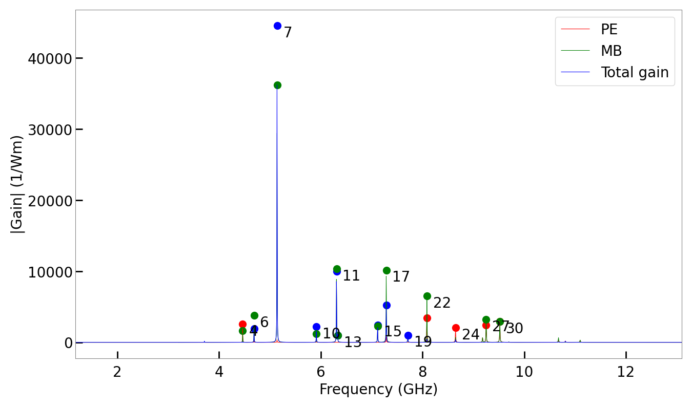

   Gain spectrum showing the gain due to the photoelastic effect (PE), the moving
   boundary effect (PB), and the net gain (Total).

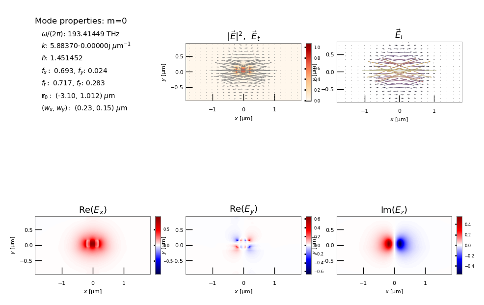

   Electromagnetic mode profile of the pump and Stokes field.

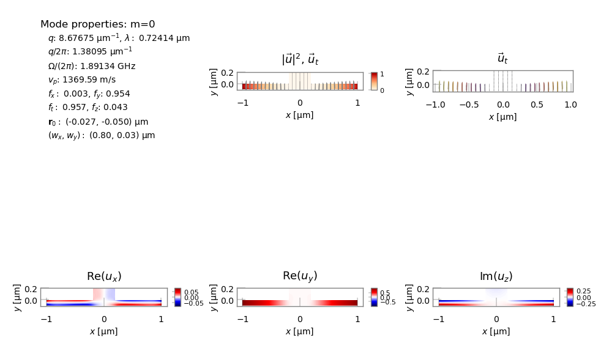

   Acoustic mode profiles for mode 0.

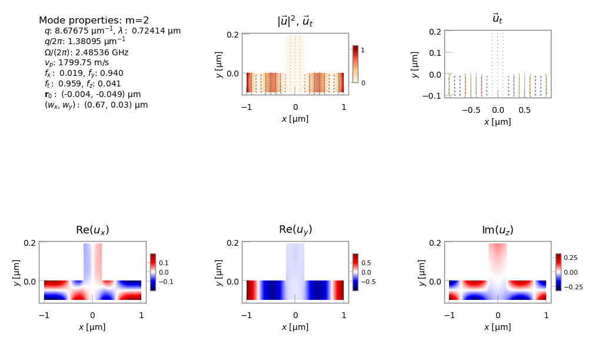

   Acoustic mode profiles for mode 2.

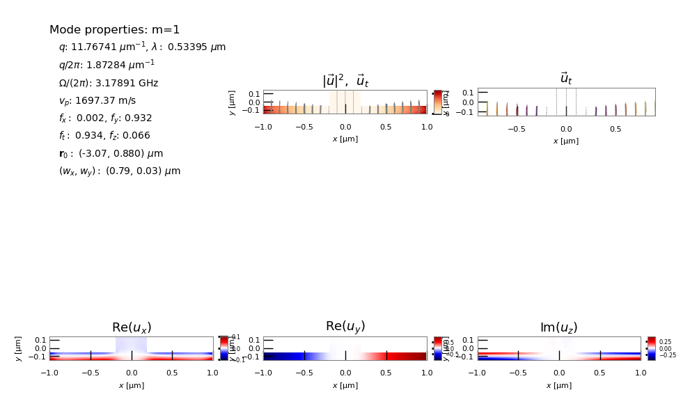

   Acoustic mode profiles for mode 1.

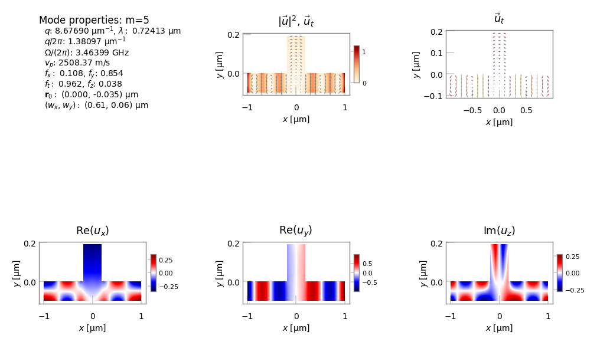

   Acoustic mode profiles for mode 5.

.. raw:: latex

    \clearpage

Tutorial 8 -- Slot Waveguide Cover Width Scan
----------------------------------------------
This tutorial, contained in ``sim-tut_08-slot_coated-scan.py`` continues the study of the previous slot waveguide, by examining the dependence of the acoustic spectrum on the thickness of a silica capping layer.  As before, this parameter scan is accelerated by the use
of multi-processing.

It is interesting to look at different mode profiles and try to understand why
the eigenfrequency of some modes are more affected  by the capping layer.
The lowest mode, for instance, is noticeably unaffected.

.. figure:: ./images/tutorial/tut_08-acdisp_coating.png
   :width: 10cm

   Acoustic frequencies as function of covering layer thickness.

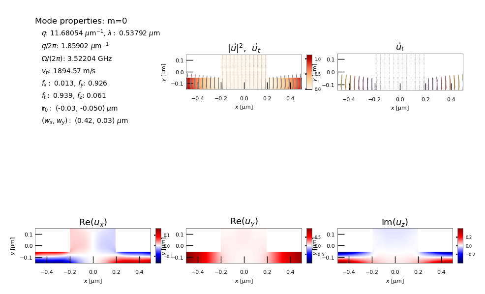

   Modal profiles of lowest acoustic mode.

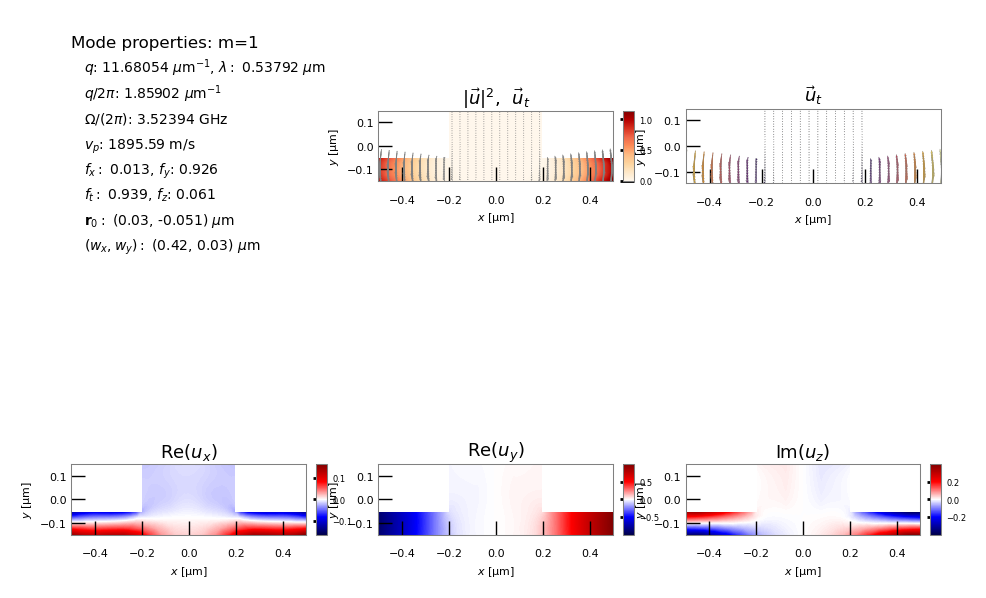

   Modal profiles of second acoustic mode.

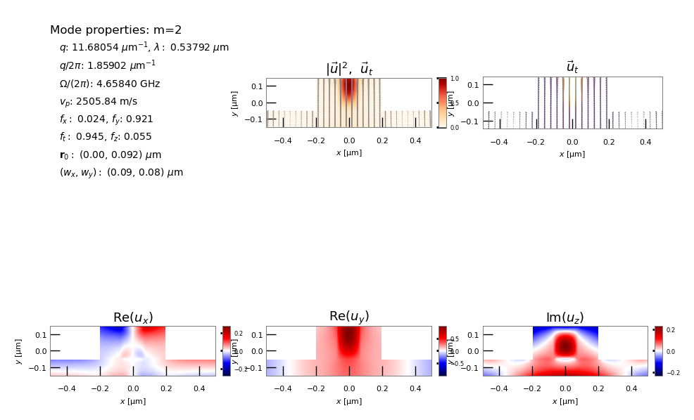

   Modal profiles of third acoustic mode.

.. raw:: latex

    \clearpage
