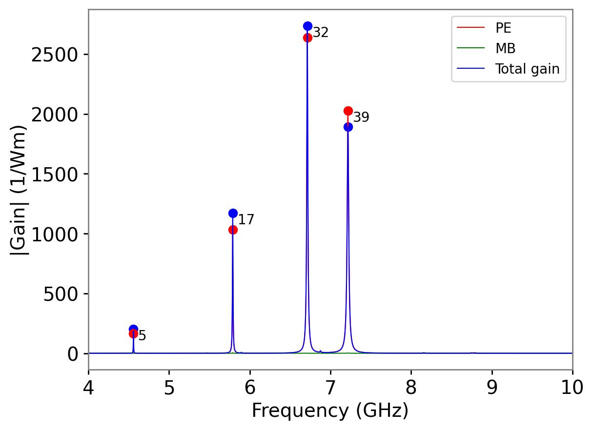
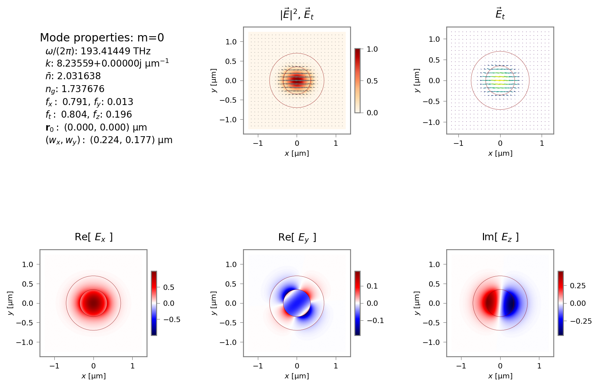
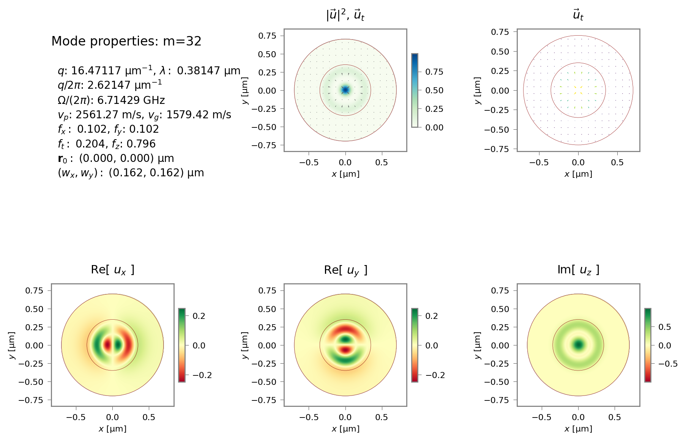
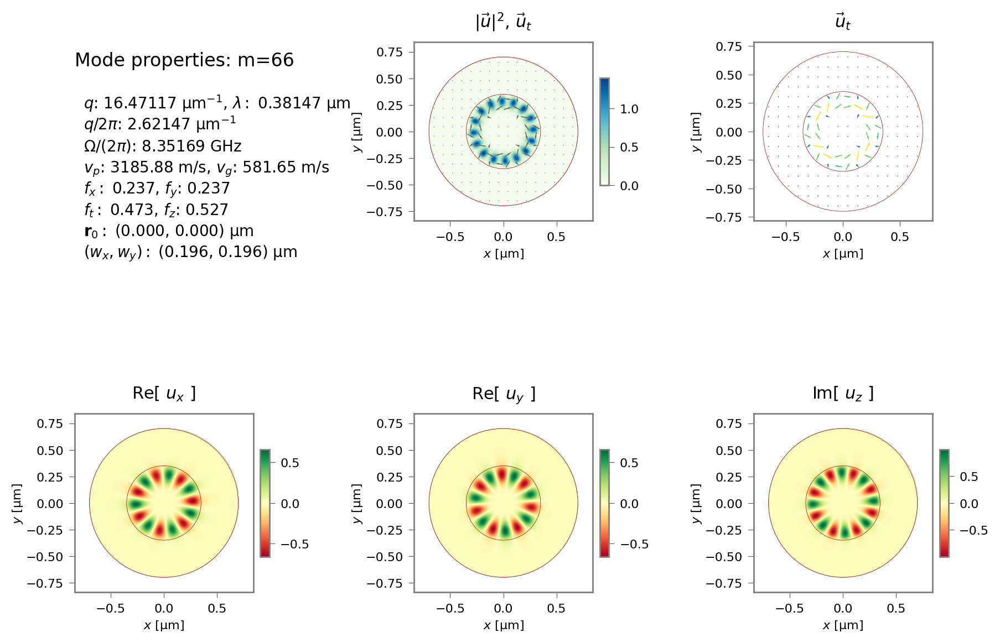

.. include:: numbatdefs.txt

Tutorial 11 -- Two-layered 'Onion'
----------------------------------------
This tutorial, contained in ``sim-tut_11a-onion2.py`` demonstrates use of a two-layer ``onion`` structure for a backward intra-modal SBS configuration.
Note that with the inclusion of the background layer, the two-layer onion effectively creates a three-layer geometry with  core, cladding, and background surroundings. This is the ideal structure for investigating the cladding modes of an optical fibre. It can be seen by looking through the optical mode profiles in ``tut_11a-fields/EM*.png``
that this particular structure supports five cladding modes in addition to the three guided modes (the :math:`\mbox{TM}_0` mode is very close to cutoff).

Next, the gain spectrum and the mode profiles of the main peaks indicate as expected,
that the gain is optimal for modes that are predominantly longitudinal in character.

The accompanying tutorial ``sim-tut_11b-onion3.py`` introduces one additional layer and would be suitable for studying the influence of the outer polymer coating of an optical fibre or depressed cladding W fibre.

.. .. literalinclude:: ./images/tutorial/sim-tut_11a-onion2.py

   Gain spectrum for the two-layer structure in ``tut_11a``.

   Mode profile for fundamental optical mode.

.. figure:: ./images/tutorial/tut_11a-fields/AC_mode_17.png
   :width: 10cm

   Mode profile for acoustic mode 17.

   Mode profile for acoustic mode 32.

   Mode profile for acoustic mode 39.

.. figure:: ./images/tutorial/tut_11b-gain_spectra.png
   :width: 10cm

   Gain spectrum for the three-layer structure in ``tut_11b``.

   Mode profile for acoustic mode 44.

   Mode profile for acoustic mode 66.

   Mode profile for acoustic mode 66.

.. raw:: latex

    \clearpage

Tutorial 12 -- Validating the calculation of the EM dispersion of a two-layer fibre
------------------------------------------------------------------------------------

How can we be confident that |NUMBAT|'s calculations are actually correct?
This tutorial and the next one look at rigorously validating some of the modal
calculations produced by |NUMBAT|.

This tutorial, contained in ``sim-tut_12.py``,
compares analytic and numerical calculations for the dispersion relation of the electromagnetic
modes of a cylindrical waveguide.
This can be done in both a low-index contrast (SMF-28 fibre) and high-index contrast (silicon rod in silica) context. We calculate the effective index :math:`\bar{n}` and normalised
waveguide parameter :math:`b=(\bar{n}^2-n_\text{cl}^2)/(n_\text{co}^2-n_\text{cl}^2)`
as a function of the normalised freqency :math:`V=k a \sqrt{n_\text{co}^2-n_\text{cl}^2}`
for radius :math:`a` and wavenumber :math:`k=2\pi/\lambda`. As in several previous examples, this is accomplished by a scan over the wavenumber :math:`k`.

The numerical results (marked with crosses) are compared to the modes found from the
roots of the rigorous
analytic dispersion relation (solid lines). We also show the predictions for the group
index :math:`n_g=\bar{n} + V \frac{d\bar{n}}{dV}`.
The only noticeable departures are right at the low :math:`V`-number regime where the
fields become very extended into the cladding and interact
significantly with the boundary.
The results could be improved in this regime by choosing a larger domain at the expense of a longer calculation.

As this example involves the same calculation at many values of the wavenumber :math:`k`, we again
use parallel processing techniques. However, in this case we demonstrate the use of *threads* (multiple simultaneous strands of execution within the same process) rather than a pool of separate processes.
Threads are light-weight and can be started more efficiently than separate processes. However, as all threads share the same memory space, some care is needed to prevent two threads reading or writing to the same data structure simultaneously. This is dealt with using the helper functions and class in the `numbattools.py` module.

.. figure:: ./images/tutorial/tut_12-smf28-emdisp_Vneff.png
   :width: 10cm

   Optical effective index as a function of normalised frequency for SMF-28 fibre.

.. figure:: ./images/tutorial/tut_12-smf28-emdisp_Vb.png
   :width: 10cm

   Optical normalised waveguide parameter as a function of normalised frequency for SMF-28 fibre.

.. figure:: ./images/tutorial/tut_12-smf28-emdisp_ng.png
   :width: 10cm

   Optical group index :math:`n_g=\bar{n} + V \frac{d\bar{n}}{dV}` as a function of normalised frequency for SMF-28 fibre.

.. figure:: ./images/tutorial/tut_12-sil-emdisp_Vneff.png
   :width: 10cm

   Optical effective index as a function of normalised frequency for silicon rod in silica.

.. figure:: ./images/tutorial/tut_12-sil-emdisp_Vb.png
   :width: 10cm

   Optical normalised waveguide parameter as a function of normalised frequency for silicon rod in silica.

.. figure:: ./images/tutorial/tut_12-sil-emdisp_ng.png
   :width: 10cm

   Optical group index :math:`n_g=\bar{n} + V \frac{d\bar{n}}{dV}` as a function of normalised frequency for silicon rod in silica.

.. raw:: latex

    \clearpage

Tutorial 13 -- Validating the calculation of the dispersion of an elastic rod in vacuum
-------------------------------------------------------------------------------------------------

The tutorial ``sim-tut_13.py`` performs the same kind of calculation as in the previous
tutorial for the acoustic problem.
In this case there is no simple analytic solution possible for the two-layer cylinder.
Instead we create a structure of a single elastic rod surrounded by vacuum.
|NUMBAT| removes the vacuum region and imposes a free boundary condition at the boundary
of the rod. The modes found are then compared to the analytic solution
of a free homogeneous cylindrical rod in vacuum.

We find excellent agreement between the analytical (coloured lines) and numerical (crosses) results.
Observe the existence of two classes of modes with azimuthal index :math:`p=0`, corresponding to the pure torsional modes, which for the lowest band propagate at the bulk shear velocity,
and the so-called Pochammer hybrid modes, which are predominantly longitudinal,
but must necessarily involve some shear motion to satisfy mass conservation.

It is instructive to examine the mode profiles in ``tut_13-fields`` and track the different
field profiles and degeneracies found for each value of :math:`p`.
By basic group theory arguments, we know that every mode with :math:`p\ne 0` must
come as a degenerate pair and this is satisfied to around 5 significant figures in the calculated results.  It is interesting to repeat the calculation with a silicon (cubic symmetry) rod rather
than chalcogenide (isotropic).
In that case, the lower symmetry of silicon causes splitting of a number of modes,
so that a larger number of modes are found to be singly degenerate, though invariably with a
partner state at a nearby frequency.

   Elastic frequency as a function of normalised wavenumber for a chalcogenide rod
   in vacuum.

   Elastic "effective index" defined as the ratio of the bulk shear velocity to the phase velocity
   :math:`n_\text{eff}=V_s/V`,
   for a chalcogenide rod in vacuum.

.. raw:: latex

    \clearpage

Tutorial 14 -- Multilayered 'Onion'
----------------------------------------

** This tutorial is under development. Expect it to fail.**

This tutorial, contained in ``sim-tut_14-multilayer-fibre.py`` shows how one can create
a circular waveguide with many concentric layers of different thickness.
In this case, the layers are chosen to create a concentric Bragg grating of alternating
high and low index layers. As shown in C. M. de Sterke, I. M. Bassett and A. G. Street, `"Differential losses in Bragg fibers" <https://doi.org/10.1063/1.357811>`_,
J. Appl. Phys. **76**, 680 (1994), the fundamental mode of such a fibre is the fully
azimuthally symmetric :math:`\mathrm{TE}_0` mode rather than the usual
:math:`\mathrm{HE}_{11}` quasi-linearly polarised mode that is found in standard
two-layer fibres.

.. .. figure:: ./images/tutorial/tut_14_0-fields/EM_E_mode_00.png
   :width: 10cm

   Fundamental electromagnetic mode profile for the concentric Bragg fibre.

.. .. figure:: ./images/tutorial/tut_14-fields/AC_mode_00.png
   :width: 10cm

   Fundamental acoustic mode profile for the concentric Bragg fibre.

.. .. figure:: ./images/tutorial/tut_14-gain_spectra.png
   :width: 10cm

   Gain spectrum for the concentric Bragg fibre.

.. raw:: latex

    \clearpage

Tutorial 15 -- Coupled waveguides
----------------------------------
This tutorial, contained in ``tutorials/sim-tut_14-coupled-wg.py`` demonstrates the supermode behaviour
of both electromagnetic and elastic modes in a pair of closely adjacent waveguides.

