.. include:: numbatdefs.txt

.. _chap-tutorial-label:

***********
Tutorial
***********

Introduction 
========================

This chapter provides a sequence of graded tutorials for learning |NUMBAT|,
exploring its applications and validating it against literature results and
analytic solutions where possible. Before attempting your own calculations with
|NUMBAT|, we strongly advise working through the sequence of tutorial exercises
which are largely based on literature results. 

You may then choose to explore relevant examples drawn from a recent
tutorial paper by Dr Mike Smith and colleagues, and a range of other literature
studies,  which are provided in the following two chapters,
:ref:`chap-josab-label` and :ref:`chap-literature-label`. 

Some Key Symbols
=====================
As far as practical we use consisent notation and symbols in the tutorial
files. The following list introduces a few commonly encountered ones. Note that
with the exception of the free-space wavelength :math:`\lambda` and the spatial
dimensions of waveguide structures, which are both specified in nanometres
(nm), all quantities in |NUMBAT| should be expressed in the standard SI units.
For example, elastic freqencies :math:`\nu` are expressed in Hz, not GHz.

``lambda_nm`` 
    This is the *free-space* optical wavelength :math:`\lambda` satisfying 
    :math:`\lambda = 2\pi c/\omega`, where :math:`c` is the speed of light and :math:`\omega` is the 
    angular frequency. **For convenience, this parameter is specified in nm.**

    For most examples, we use the conventional value :math:`\lambda` =1550 nm.

``omega, omega_EM, om_EM``  
    This is the electromagnetic *angular* frequency :math:`\omega = 2 \pi c/\lambda`  specified in 
    :math:`\mathrm{rad.s}^{-1}`.

``k, beta, k_EM``  
    This is the electromagnetic *wavenumber* or *propagation constant* :math:`k` 
    or :math:`\beta`, specified in :math:`\mathrm{m}^{-1}`.

``neff, n_eff``
    This is the electromagnetic modal *effective index* :math:`\bar{n}=ck/\omega`, which is dimensionless.

``nu, nu_AC`` 
    This is the acoustic frequency :math:`\nu` specified in Hz.

``Omega, Omega_AC, Om_AC``  
    This is the acoustic *angular* frequency :math:`\Omega = 2 \pi \nu`  specified in :math:`\mathrm{rad.s}^{-1}`.

``q, q_AC``  
    This is the acoustic *wavenumber* or *propagation constant* :math:`q=v_{ac} \Omega`,
    where :math:`v_{ac}` is the phase speed of the wave.
    The acoustic wavenumber is specified in :math:`\mathrm{m}^{-1}`.

``m``  
    This is an integer corresponding to the mode number :math:`m` of an electromagnetic 
    mode :math:`\vec E_m(\vec r)` or an acoustic mode :math:`\vec u_m(\vec r)`.

    For both electromagnetic and acoustic modes, counting of modes begins with ``m=0`` 
    and are ordered by decreasing effective index and increasing frequency respectively.

    For the electromagnetic problem in which frequency/free-space wavelength is the 
    independent variable, the :math:`m=0` mode has the *highest* effective index
    :math:`\bar{n}` and *highest* wavenumber :math:`k` of any mode for a given angular frequency 
    :math:`\omega`.

    For the acoustic problem, the wavenumber :math:`q` is the
    independent variable and we solve for frequency :math:`\nu=\Omega/(2\pi)`. 
    The :math:`m=0` mode has the *lowest* frequency 
    :math:`\nu` of any mode for a given wavenumber :math:`q`.

    The integer :math:`m` therefore has no particular correspondence to 
    the conventional two index mode indices for fibre or rectangular waveguides.

``inc_a_x, inc_a_y, inc_b_x, inc_b_y, slab_a_x, slab_a_y,``  ...  etc
   These are dimensional parameters specifying the lengths of different aspects
   of a given structure: rib height, fibre radius etc.  
   **For convenience, these parameters are specified in nm.**

.. raw:: latex

    \clearpage

Tutorials
=====================

We now walk through a number of simple simulations that demonstrate the basic use of |NUMBAT| located in the ``<NumBAT>/tutorials`` directory.

We will meet a significant number of |NUMBAT| functions in these tutorials, though certainly not all.  The full Python interface is documented in the section :ref:`_chap-pythonapi-label`.

Tutorial 2 -- SBS Gain Spectra
----------------------------------
The first example we met in the previous chapter only printed numerical data to the screen with no graphical output. 
This example, contained in ``<NUMBAT>/tutorials/simo-tut_02-gain_spectra-npsave.py`` considers the same silicon-in-air structure but adds plotting of fields, gain spectra and techniques for saving and reusing data from earlier calculations. 

As before, move to the ``<NUMBAT>/tutorials`` directory, and then run the calculation by entering::

    $ python3 simo-tut_02-gain_spectra-npsave.py

Or you can take advantage of the ``Makefile`` provided in the directory and just type::

    $ make tut02

Some of the tutorial problems can take a little while to run, especially if your computer
is not especially fast. To save time, you can run most 
problems with a coarser mesh at the cost of somewhat reduced accuracy,  by adding the flag ``fast=1`` to the command line::

    $ python3 simo-tut_02-gain_spectra-npsave.py fast=1

Or using the makefile technique, simply ::

    $ make ftut02

The calculation should complete in a minute or so.
You will find a number of new files  in the ``tutorials`` directory beginning
with the prefix ``tut_02`` (or ``ftut_02`` if you ran in fast mode).

Gain Spectra
^^^^^^^^^^^^

The Brillouin gain spectra and plotted using the functions
``integration.gain_and_qs()`` and ``plotting.plot_gain_spectra()``. 
The results are contained in the file ``tut_02-gain_spectra.png`` which can be viewed in any image viewer. On Linux, for instance you can use ::

     $ eog tut_02_gain_spectra.png

to see this image:

.. _fig-gainspec1-label:

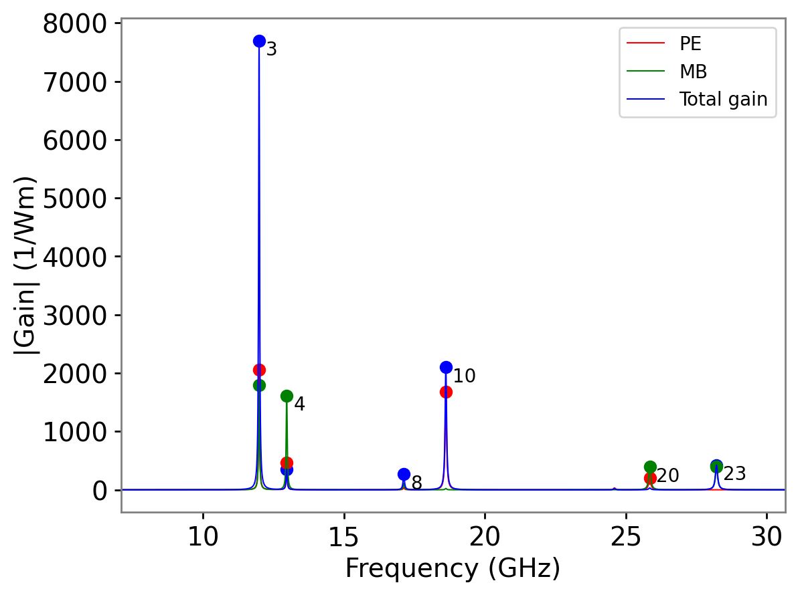
   
   Gain spectrum in ``tut_02-gain_spectra.png`` showing gain due to the photoelastic effect, gain due to moving boundary effect, and the total gain. The numbers near the main peaks identify the acoustic mode associated with the resonance.

Note how the different contributions from the photoelastic and moving-boundary effects
are visible. In some cases, the total gain (blue) may be less than one or both of 
the separate effects if the two components act with opposite sign.
:ref:`chap-josab-label` and :ref:`chap-literature-label`. 
(See Literature example 1 in the chapter :ref:`chap-literature-label`
for an interesting cexample of this phenomenon.)

Note also that prominent resonance peaks in the gain spectrum are labelled with the 
mode number :math:`m` of the associated acoustic mode. This makes it easy
to find the spatial profile of the most relevant modes (see below).

Mode Profiles
^^^^^^^^^^^^^

The choice of parameters for ``plot_gain_spectra()`` has caused several other  files 
to be generated showing a zoomed-in version near the main peak, and the whole spectrum
on :math:`\log` and dB scales:

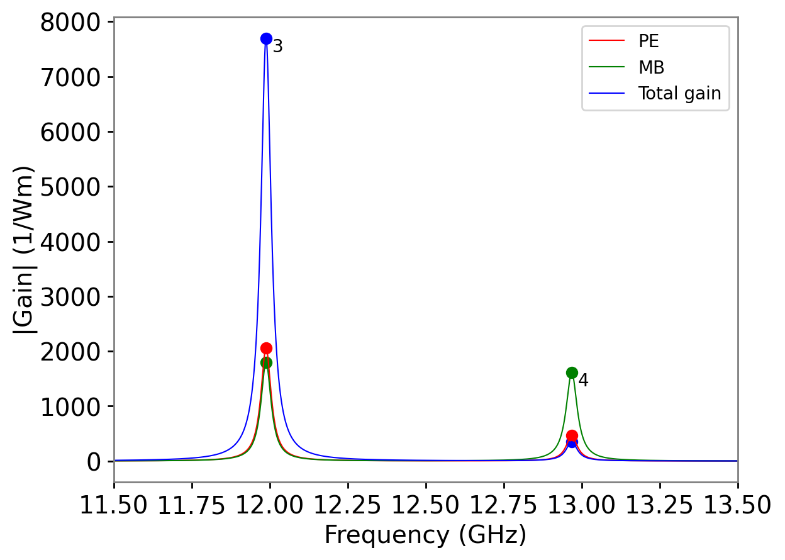
   
   Zoom-in of the gain spectrum in the previous figure in the file ``tut_02-gain_spectra_zoom.png`` .

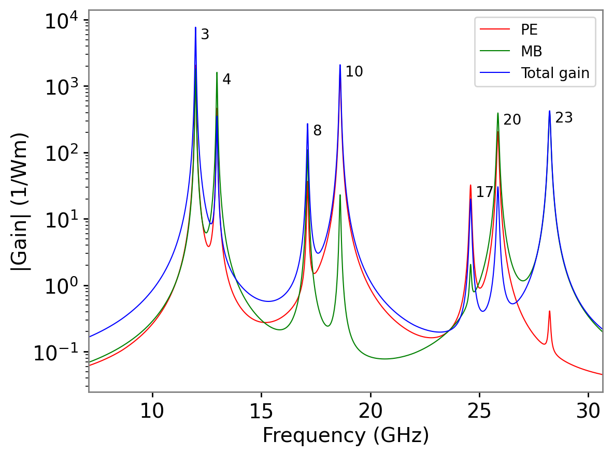
   
   Gain spectrum viewed on a log scale in the field ``tut_02-gain_spectra-logy.png`` .

This example has also generated plots of some of the electromagnetic and acoustic modes
that were found in solving the eigenproblems. These are created using
the calls to ``plotting.plot_mode_fields()`` and stored in the sub-directory ``tut_02-fields``.

Note that
a number of useful parameters are also displayed at the top-left of each mode
profile. These parameters can also be extracted using a range of function calls on a
``Mode`` object (see the API docs).

.. figure:: ./images/tutorial/tut_02-fields/EM_E_field_00.png
   :width: 10cm
   
   Electric field profile of the fundamental (:math:`m=0`) optical mode profile stored in ``tut_02-fields/EM_E_field_00.png``. The figures shows the modulus of the whole electric field :math:`|{\vec E}|^2`, a vector plot of the transverse field :math:`{\vec E}_t=(E_x,E_y)`, and the three components of the electric field.  |NUMBAT| chooses the phase of the
   mode profile such that the transverse components are real. Note that the :math:`E_z` component is :math:`\pi/2` out of phase with the transverse components. (Since the structure is lossless, the imaginary parts of the transverse field, and the real part of :math:`E_z` are zero).

.. figure:: ./images/tutorial/tut_02-fields/EM_H_field_00.png
   :width: 10cm
   
   Magnetic field profile of the fundamental (:math:`m=0`) optical mode profile showing modulus of the whole magnetic field :math:`|{\vec H}|^2`, vector plot of the transverse field :math:`{\vec H}_t=(H_x,H_y)`, and the three components of the magnetic field.  Note that the :math:`H_z` component is :math:`\pi/2` out of phase with the transverse components. 

.. figure:: ./images/tutorial/tut_02-fields/AC_field_03.png
   :width: 10cm
   
   Displacement field :math:`\vec u(\vec r)` of the :math:`m=3` acoustic mode with gain 
   dominated by the moving boundary effect (green curve in gain spectra). 
   Note that the frequency of :math:`\Omega/(2\pi)=11.99` GHz 
   (listed in the upper-left corner) corresponds to the first peak in the gain spectrum.

.. figure:: ./images/tutorial/tut_02-fields/AC_field_04.png
   :width: 10cm
   
   Displacement field :math:`\vec u(\vec r)` of the :math:`m=4` acoustic mode with gain dominated by the photo-elastic effect (red curve in gain spectra).
   Note that the frequency of :math:`\Omega/(2\pi)=13.45` GHz corresponds to the second peak in the gain spectrum.

Miscellaneous comments 
^^^^^^^^^^^^^^^^^^^^^^^^^^

Here are some further elements to note about this example:

  #.  When using the ``fast=`` mode, the output data and fields directory begin with ``ftut_02`` rather than ``tut_02``.
  #. It is frequently useful to be able to save and load the results of simulations to adjust plots without having to repeat the entire calculation. Here the flag ``recalc_fields`` determines whether the calculation should be done afresh and use previously saved data. This is performed using the ``save_simulation()`` and ``load_simulation()`` calls.
  #. Plots of the modal field profiles are obtained using ``plotting.plot_mode_fields``. Both electric and magnetic fields can be selected using ``EM_E`` or ``EM_H`` as the value of the ``EM_AC`` argument. The mode numbers to be plotted is specified by ``ivals``.  These fields are stored in a folder ``tut_02-fields/`` within the tutorial folder.  
     Later we will see how an alternative approach in which we extract a ``Mode`` object from a ``Simulation`` which represent a single mode that is able to plot itself. This can be more convenient.
  #. The overall amplitude of the modal fields is arbitrary.
     In |NUMBAT|, the maximum value of the electric field is set to be 1.0, and this may be interpreted as a quantity in units of V/m, :math:`\sqrt{\mathrm{W}}` or other units as desired.
     Importantly, the plotted *magnetic* field :math:`\vec H(\vec r)` is multiplied by the impedance of free space :math:`Z_0=\sqrt{\mu_0/\epsilon_0}` so that :math:`Z_0 \vec H(\vec r)` and :math:`\vec E(\vec r)` *have the same units*, and the relative amplitudes between the electric and magnetic field plots are meaningful.
  #. The ``suppress_imimre`` option suppresses plotting of the :math:`\text{Im}[x]`, :math:`\text{Im}[y]` and :math:`\text{Re}[z]` components of the fields which in a lossless non-leaky problem should normally be zero at all points and therefore not useful to plot.
  #. By default, plots are exported as ``png`` format. Pass the option ``pdf_png=pdf`` to plot functions to generate a ``pdf`` output.
  #. Plots of both spectra and modes are generated with a best attempt at font sizes, line widths etc, but the range of potential cases make it impossible to find a selection that works in all cases. Most plot functions therefore support the passing of a ``plotting.Decorator`` object that can vary the settings of these parameters and also pass additional commands to write on the plot axes. See the plotting API for details. This should be regarded as a relatively advanced |NUMBAT| feature.
  #. Vector field plots often require tweaking to get an attractive set of vector arrows.  The ``quiver_points`` option controls the number of arrows drawn along each direction.
  #. The plot functions and the ``Decorator`` class support many options. Consult the API chapter for details on how to fine tune your plots.

The full code for this simulation is as follows:

.. literalinclude:: ../../tutorials/simo-tut_02-gain_spectra-npsave.py
    :lines: 0-

.. raw:: latex

    \clearpage

Tutorial 3a -- Investigating Dispersion and np.save/np.load
------------------------------------------------------------
This example, contained in ``tutorials/simo-tut_03_1-dispersion-npload.py`` calculates the elastic dispersion diagram -- the relation between the acoustic wave number :math:`q` 
and frequency :math:`\Omega`-- for the problem in the previous tutorial. 
This is done by scanning over the elastic wavenumber ``q_AC`` and finding the 
eigenfrequencies for each value.

As discussed in  *Formal selection rules for Brillouin scattering in integrated waveguides and structured fibers* by C. Wolff, M. J. Steel, and C. G. Poulton `DOI:/10.1364/OE.22.032489 <https://dx.doi.org/10.1364/OE.22.032489>`_, the elastic modes of any waveguide may be classified according to their representation of the point group symmetry class  corresponding to the waveguide
profile. For this problem, the waveguide is rectangular with symmetry group :math:`C_{2v}` 
which  has four symmetry classes, which are marked in the dispersion diagram.

This example also takes advantage of the ability to load and save simulation results
to save repeated calculation.
using the ``save_simulation`` and ``load_simulation`` methods defined
in the ``mode_calcs`` module. 
The previous tutorial saved its electromagnetic
results in the file ``tut02_wguide_data.npz`` 
using the ``Simulation.save_simulation()`` method, while these tutorial
has recovered those results using ``mode_calc.load_simulation()``.
This can be a very useful technique when trying to adjust the appearance
of plots without having to repeat the whole calculation effort.

*Note*: from now on, we do not include the code for each tutorial and refer the reader
to the relevant files in the ``<NumBAT>/tutorials`` directory.

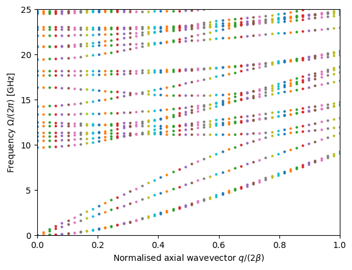
   
   Acoustic dispersion diagram with modes categorised by symmetry as in Table 1 of Wolff et al. 
   *Opt. Express.* **22**, 32489 (2014).

.. raw:: latex

    \clearpage

Tutorial 3b -- Investigating Dispersion and Multiprocessing
------------------------------------------------------------
This tutorial, contained in ``simo-tut_03_2-dispersion-multicore.py`` continues the study of acoustic dispersion and demonstrates the use of Python multiprocessor calls using the ``multiprocessing`` library to increase speed of execution.

In this code as in the previous example, the acoustic modal problem is
repeatedly solved at a range of different :math:`q` values to build up a set of
dispersion curves :math:`\nu_m(q)`. Due to the large number of avoided and
non-avoided crossings, it is usually best to plot dispersion curves like this
with dots rather than joined lines. The plot generated below can be improved by
increasing the number of :math:`q` points sampled through the value of the
variable ``n_qs``, limited only by your patience.

The multiprocessing library runs each task as a completely separate process on the computer. 
Depending on the nature and number of your CPU, this may improve the performance considerably.
This can also be easily extended to multiple node systems which will certainly improve performance.
A very similar procedure using the ``threading``  library allows the different tasks
to run as separate threads within the one process. However, due to the existence of the Python Global Interpreter Lock (GIL) which constrains what kinds of operations may run in parallel within Python , multiple threads will typically not improve the performance of |NUMBAT|.

This tutorial also  shows an example of saving data, in this case the array
of acoustic wavenumbers and frequencies, to a text file using the ``numpy`` routine 
``np.savetxt`` for later analysis.

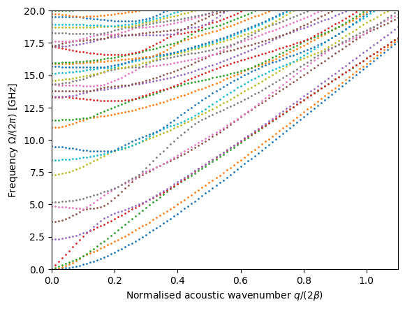
   
   Acoustic dispersion diagram. The elastic wave number :math:`q` is scaled by the phase-matched SBS wavenumber :math:`2\beta` where :math:`\beta` is the propagation constant of the optical pump mode.

.. raw:: latex

    \clearpage

Tutorial 4 -- Parameter Scan of Widths
----------------------------------------
This tutorial, contained in ``simo-tut_04_scan_widths.py`` demonstrates the use of a 
parameter scan of a waveguide property, in this case over the width of the silicon rectangular waveguide, to characterise the behaviour of the Brillouin gain. 

The results are displayed in a 3D plot. This may not be the most effective
approach for this small data set but gives a sense of what is possible graphically.
For a more effective plot, you might like to try the same calculation with around 30 values for the 
width rather than just 6.

.. figure:: ./images/tutorial/tut_04-gain_spectra-waterfall.png
   :width: 10cm
   
   Gain spectra as function of waveguide width.

.. raw:: latex

    \clearpage

Tutorial 5 -- Convergence Study
----------------------------------------
This tutorial, contained in ``simo-tut_05_convergence_study.py`` demonstrates a scan of numerical parameters for our by now familiar silicon-in-air problem to test the convergence of the calculation results.
This is done by scanning the value of the ``lc_refine`` parameters. 
The number of mesh elements (and simulation time) increases with roughly the square of the 
mesh refinement factor. 

For the purpose of convergence estimates, the values calculated at the finest mesh (the rightmost
values) are taken as the ``exact`` values, notated with the subscript 0, 
eg. :math:`\beta_0`. 
The graphs below show both relative errors and absolute values for each  quantity.

Once the convergence properties for a particular problem have been established, it can
be useful to do exploratory work more quickly by adopting a somewhat coarser mesh, 
and then increase the resolution once again towards the end of the project to validate 
results before reporting them.

.. figure:: ./images/tutorial/tut_05-convergence-freq_EM.png
   :width: 10cm
   
   Convergence of relative (blue) and absolute (red) optical wavenumbers :math:`k_{z,i}`.
   The left axis displays the relative error :math:`(k_{z,i}-k_{z,0})/k_{z,0}`.
   The right axis shows the absolute values of :math:`k_{z,i}`.

.. figure:: ./images/tutorial/tut_05-convergence-freq_AC.png
   :width: 10cm
   
   Convergence of relative (solid, left) and absolute (chain, right) 
   elastic mode frequencies :math:`\nu_{i}`.

.. figure:: ./images/tutorial/tut_05-convergence-gain_PE.png
   :width: 10cm
   
   Convergence of photoelastic gain :math:`G^\text{PE}`. The absolute gain on the right hand side 
   increases  down the page because of the convention that |NUMBAT| associates backward SBS 
   with negative gain.

.. figure:: ./images/tutorial/tut_05-convergence-gain_MB.png
   :width: 10cm
   
   Absolute and relative convergence of moving boundary gain :math:`G^\text{MB}`.

.. figure:: ./images/tutorial/tut_05-convergence-gain.png
   :width: 10cm
   
   Absolute and relative convergence of total gain :math:`G`.

.. raw:: latex

    \clearpage

Tutorial 6 -- Silica Nanowire 
----------------------------------------
In this tutorial, contained in ``simo-tut_06_silica_nanowire.py`` we start 
to explore the Brillouin gain properties in a range of different structures, 
in this case a silica nanowire surrounded by vacuum.

The ``gain-spectra`` plot below shows the Brillouin gain as a function of
Stokes shift.  Each resonance peak is marked with the number of the acoustic
mode associated with the resonance.  This is very helpful in identifying which
acoustic mode profiles to examine more closely.  In this case, modes 5, 8 and
23 give the most signifcant Brillouin gain.  The number of modes labelled in the gain spectrum can
be controlled using the parameter ``mark_mode_thresh`` in the function
``plotting.plot_gain_spectra`` to avoid many labels from modes giving
negligible gain.
Other parameters allow selecting only one type of gain (PE or MB), changing the frequency range, and plotting on log or dB scales.

It is important to remember that the total gain is not the simple sum of the photoelastic
(PE) and moving boundary (MB) gains. Rather it is the coupling terms :math:`Q_\text{PE}` and :math:`Q_\text{MB}` which are added before squaring to give the total gain.  Indeed the two effects may have opposite sign giving net gains smaller than either contribution.

.. figure:: ./images/tutorial/tut_06-gain_spectra.png
   :width: 10cm
   
   Gain spectrum showing the gain due to the photoelastic effect (PE), the moving 
   boundary effect (PB), and the net gain (Total).

.. figure:: ./images/tutorial/tut_06-fields/EM_E_field_00.png
   :width: 10cm
   
   Electromagnetic mode profile of the pump and Stokes field in the :math:`x`-polarised 
   fundamental mode of the waveguide.

.. figure:: ./images/tutorial/tut_06-fields/AC_field_05.png
   :width: 10cm
   
   Mode profiles for acoustic mode 5 which is visible as a MB-dominated peak in the gain spectrum.
  
.. figure:: ./images/tutorial/tut_06-fields/AC_field_08.png
   :width: 10cm
  
   Mode profiles for acoustic mode 8 which is visible as a PE-dominated peak in the gain spectrum.

.. raw:: latex

    \clearpage

Tutorial 7 -- Slot Waveguide
----------------------------------------
This tutorial, contained in ``simo-tut_07-slot.py`` examines backward SBS in a more complex structure: chalcogenide soft glass (:math:`\text{As}_2\text{S}_3`) embedded in a silicon slot waveguide on a silica slab. This structure takes advantage of the 
slot effect which expels the optical field into the lower index medium, enhancing the fraction of the EM field inside the soft chalcogenide glass which guides the acoustic mode 
and increasing the gain.

Comparing the :math:`m=2` and :math:`m=5` acoustic mode profiles with the 
pump EM profile, it is apparent that the field overlap is favourable, where as
the :math:`m=1` mode gives zero gain due to its anti-symmetry relative to the pump field.

.. figure:: ./images/tutorial/tut_07-gain_spectra.png
   :width: 10cm
   
   Gain spectrum showing the gain due to the photoelastic effect (PE), the moving 
   boundary effect (PB), and the net gain (Total).

.. figure:: ./images/tutorial/tut_07-fields/EM_E_field_00.png
   :width: 10cm
   
   Electromagnetic mode profile of the pump and Stokes field.

.. figure:: ./images/tutorial/tut_07-fields/AC_field_00.png
   :width: 10cm
   
   Acoustic mode profiles for mode 0.

.. figure:: ./images/tutorial/tut_07-fields/AC_field_02.png
   :width: 10cm

   Acoustic mode profiles for mode 2.
  
.. figure:: ./images/tutorial/tut_07-fields/AC_field_01.png
   :width: 10cm
  
   Acoustic mode profiles for mode 1.

.. figure:: ./images/tutorial/tut_07-fields/AC_field_05.png
   :width: 10cm
  
   Acoustic mode profiles for mode 5.

.. raw:: latex

    \clearpage

Tutorial 8 -- Slot Waveguide Cover Width Scan
----------------------------------------------
This tutorial, contained in ``simo-tut_08-slot_coated-scan.py`` continues the study of the previous slot waveguide, by examining the dependence of the acoustic spectrum on the thickness of a silica capping layer.  As before, this parameter scan is accelerated by the use
of multi-processing.

It is interesting to look at different mode profiles and try to understand why 
the eigenfrequency of some modes are more affected  by the capping layer.
The lowest mode, for instance, is noticeably unaffected.

.. figure:: ./images/tutorial/tut_08-acdisp_coating.png
   :width: 10cm
   
   Acoustic frequencies as function of covering layer thickness.

   
.. figure:: ./images/tutorial/tut_08-fields/AC_field_00_20.png
   :width: 10cm

   Modal profiles of lowest acoustic mode.

.. figure:: ./images/tutorial/tut_08-fields/AC_field_01_20.png
   :width: 10cm

   Modal profiles of second acoustic mode.

.. figure:: ./images/tutorial/tut_08-fields/AC_field_02_20.png
   :width: 10cm

   Modal profiles of third acoustic mode.

.. raw:: latex

    \clearpage

Tutorial 9 -- Anisotropic Elastic Materials 
--------------------------------------------
This tutorial, contained in ``simo-tut_09-anisotropy.py`` improves the treatment of the silicon rectangular waveguide by accounting for the anisotropic elastic properties of silicon (simply by referencing a different material file for silicon).

The data below compares the gain spectrum compared to that found with the simpler 
isotropic stiffness model used in Tutorial 2.
The results are very similar but the isotropic model shows two smaller peaks at high 
frequency.

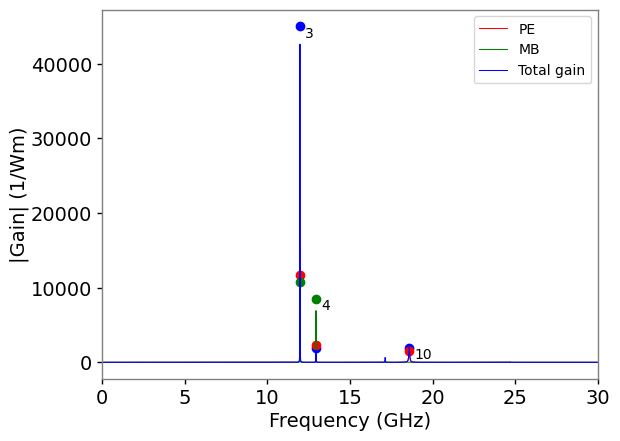
   
   Gain spectrum with anisotropic stiffness model of silicon.

   
   Gain spectrum from Tutorial 2 with  isotropic stiffness model of silicon.

.. raw:: latex

    \clearpage

Tutorial 11 -- Two-layered 'Onion'
----------------------------------------
This tutorial, contained in ``simo-tut_11a-onion2.py`` demonstrates use of a two-layer ``onion`` structure for a backward intra-modal SBS configuration.
Note that with the inclusion of the background layer, the two-layer onion effectively creates a three-layer geometry with  core, cladding, and background surroundings. This is the ideal structure for investigating the cladding modes of an optical fibre. It can be seen by looking through the optical mode profiles in ``tut_11a-fields/EM*.png``
that this particular structure supports five cladding modes in addition to the three guided modes (the :math:`\mbox{TM}_0` mode is very close to cutoff).

Next, the gain spectrum and the mode profiles of the main peaks indicate as expected, 
that the gain is optimal for modes that are predominantly longitudinal in character.

The accompanying tutorial ``simo-tut_11b-onion3.py`` introduces one additional layer and would be suitable for studying the influence of the outer polymer coating of an optical fibre or depressed cladding W fibre.

.. .. literalinclude:: ./images/tutorial/simo-tut_11a-onion2.py

.. figure:: ./images/tutorial/tut_11a-gain_spectra.png
   :width: 10cm

   Gain spectrum for the two-layer structure in ``tut_11a``.

.. figure:: ./images/tutorial/tut_11a-fields/EM_E_field_00.png
   :width: 10cm

   Mode profile for fundamental optical mode.

.. figure:: ./images/tutorial/tut_11a-fields/AC_field_17.png
   :width: 10cm

   Mode profile for acoustic mode 17.

.. figure:: ./images/tutorial/tut_11a-fields/AC_field_32.png
   :width: 10cm

   Mode profile for acoustic mode 32.

.. figure:: ./images/tutorial/tut_11a-fields/AC_field_39.png
   :width: 10cm

   Mode profile for acoustic mode 39.

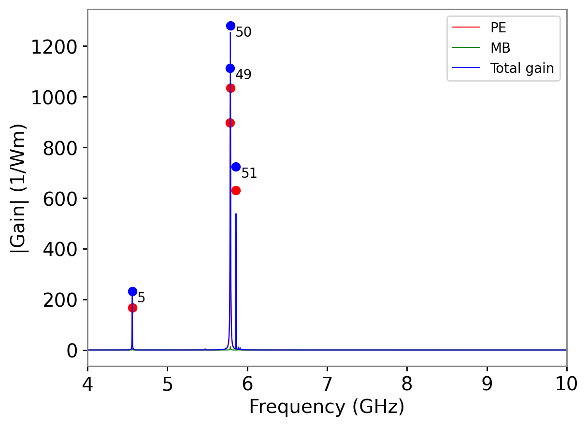

   Gain spectrum for the three-layer structure in ``tut_11b``.

.. figure:: ./images/tutorial/tut_11a-fields/AC_field_44.png
   :width: 10cm

   Mode profile for acoustic mode 44.

.. figure:: ./images/tutorial/tut_11a-fields/AC_field_66.png
   :width: 10cm

   Mode profile for acoustic mode 66.

.. figure:: ./images/tutorial/tut_11a-fields/AC_field_69.png
   :width: 10cm

   Mode profile for acoustic mode 66.

.. raw:: latex

    \clearpage

Tutorial 12 -- Valdiating the calculation of the EM dispersion of a two-layer fibre
------------------------------------------------------------------------------------

How can we be confident that |NUMBAT|'s calculations are actually correct?
This tutorial and the next one look at rigorously validating some of the modal 
calculations produced by |NUMBAT|.

This tutorial, contained in ``simo-tut_12.py``, 
compares analytic and numerical calculations for the dispersion relation of the electromagnetic 
modes of a cylindrical waveguide. 
This can be done in both a low-index contrast (SMF-28 fibre) and high-index contrast (silicon rod in silica) context. We calculate the effective index :math:`\bar{n}` and normalised 
waveguide parameter :math:`b=(\bar{n}^2-n_\text{cl}^2)/(n_\text{co}^2-n_\text{cl}^2)` 
as a function of the normalised freqency :math:`V=k a \sqrt{n_\text{co}^2-n_\text{cl}^2}` 
for radius :math:`a` and wavenumber :math:`k=2\pi/\lambda`. As in several previous examples, this is accomplished by a scan over the wavenumber :math:`k`.

The numerical results (marked with crosses) are compared to the modes found from the 
roots of the rigorous  
analytic dispersion relation (solid lines). We also show the predictions for the group 
index :math:`n_g=\bar{n} + V \frac{d\bar{n}}{dV}`.
The only noticeable departures are right at the low :math:`V`-number regime where the 
fields become very extended into the cladding and interact 
significantly with the boundary.
The results could be improved in this regime by choosing a larger domain at the expense of a longer calculation.

As this example involves the same calculation at many values of the wavenumber :math:`k`, we again
use parallel processing techniques. However, in this case we demonstrate the use of *threads* (multiple simultaneous strands of execution within the same process) rather than a pool of separate processes.
Threads are light-weight and can be started more efficiently than separate processes. However, as all threads share the same memory space, some care is needed to prevent two threads reading or writing to the same data structure simultaneously. This is dealt with using the helper functions and class in the `numbattools.py` module.

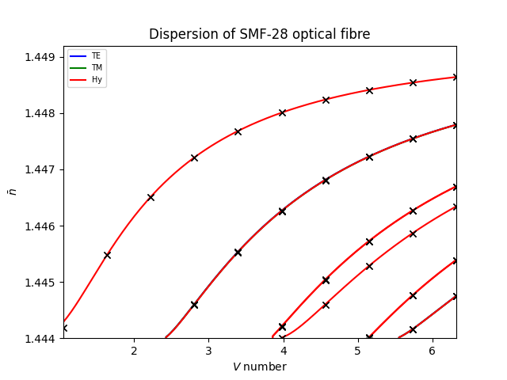

   Optical effective index as a function of normalised frequency for SMF-28 fibre.

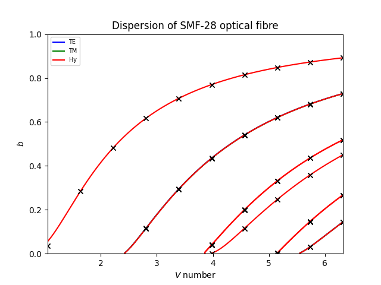

   Optical normalised waveguide parameter as a function of normalised frequency for SMF-28 fibre.

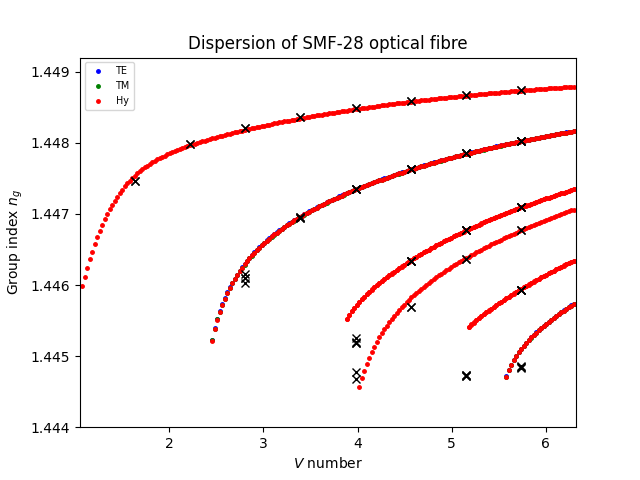

   Optical group index :math:`n_g=\bar{n} + V \frac{d\bar{n}}{dV}` as a function of normalised frequency for SMF-28 fibre.

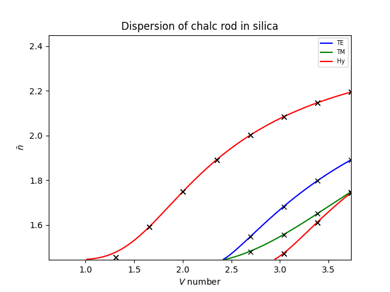

   Optical effective index as a function of normalised frequency for silicon rod in silica.

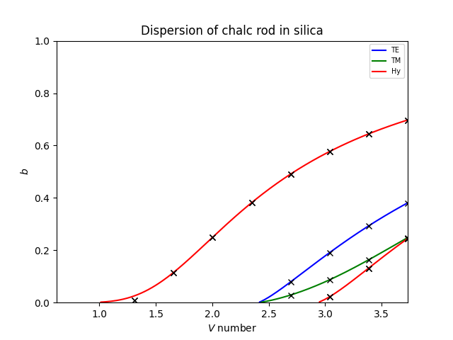

   Optical normalised waveguide parameter as a function of normalised frequency for silicon rod in silica.

   Optical group index :math:`n_g=\bar{n} + V \frac{d\bar{n}}{dV}` as a function of normalised frequency for silicon rod in silica.

.. raw:: latex

    \clearpage

Tutorial 13 -- Valdiating the calculation of the dispersion of an elastic rod in vacuum 
-------------------------------------------------------------------------------------------------

The tutorial ``simo-tut_13.py`` performs the same kind of calculation as in the previous
tutorial for the acoustic problem. 
In this case there is no simple analytic solution possible for the two-layer cylinder.
Instead we create a structure of a single elastic rod surrounded by vacuum.
|NUMBAT| removes the vacuum region and imposes a free boundary condition at the boundary 
of the rod. The modes found are then compared to the analytic solution
of a free homonegenous cylindrical rod in vacuum. 

We find excellent agreement between the analytical (coloured lines) and numerical (crosses) results.
Observe the existence of two classes of modes with azimuthal index :math:`p=0`, corresponding to the pure torsional modes, which for the lowest band propagate at the bulk shear velocity,
and the so-called Pochammer hybrid modes, which are predominantly longitudinal, 
but must necessarily involve some shear motion to satisfy mass conservation.

It is instructive to examine the mode profiles in ``tut_13-fields`` and track the different
field profiles and degeneracies found for each value of :math:`p`. 
By basic group theory arguments, we know that every mode with :math:`p\ne 0` must 
come as a degenerate pair and this is satisfied to around 5 significant figures in the calculated results.  It is interesting to repeat the calculation with a silicon (cubic symmetry) rod rather 
than chalcogenide (isotropic).  
In that case, the lower symmetry of silicon causes splitting of a number of modes,
so that a larger number of modes are found to be singly degenerate, though invariably with a
partner state at a nearby frequency.

.. figure:: ./images/tutorial/tut_13-acdisp_qnu.png
   :width: 10cm

   Elastic frequency as a function of normalised wavenumber for a chalcogenide rod 
   in vacuum.

.. figure:: ./images/tutorial/tut_13-acdisp_qneff.png
   :width: 10cm

   Elastic "effective index" defined as the ratio of the bulk shear velocity to the phase velocity 
   :math:`n_\text{eff}=V_s/V`,
   for a chalcogenide rod in vacuum.

.. raw:: latex

    \clearpage

Tutorial 14 -- Multilayered 'Onion'
----------------------------------------
This tutorial, contained in ``simo-tut_14-multilayer-fibre.py`` shows how one can create 
a circular waveguide with many concentric layers of different thickness.
In this case, the layers are chosen to create a concentric Bragg grating of alternating
high and low index layers. As shown in C. M. de Sterke, I. M. Bassett and A. G. Street, `"Differential losses in Bragg fibers" <https://doi.org/10.1063/1.357811>`_, 
J. Appl. Phys. **76**, 680 (1994), the fundamental mode of such a fibre is the fully
azimuthally symmetric :math:`\mathrm{TE}_0` mode rather than the usual 
:math:`\mathrm{HE}_{11}` quasi-linearly polarised mode that is found in standard
two-layer fibres.

.. .. literalinclude:: ./images/tutorial/simo-tut_10-onion.py

.. figure:: ./images/tutorial/tut_14_0-fields/EM_E_field_00.png
   :width: 10cm

   Fundamental electromagnetic mode profile for the concentric Bragg fibre.

.. .. figure:: ./images/tutorial/tut_14-fields/AC_field_00.png
   :width: 10cm

   Fundamental acoustic mode profile for the concentric Bragg fibre.

.. .. figure:: ./images/tutorial/tut_14-gain_spectra.png
   :width: 10cm

   Gain spectrum for the concentric Bragg fibre.

.. raw:: latex

    \clearpage

Tutorial 15 -- Coupled waveguides 
----------------------------------
This tutorial, contained in ``tutorials/simo-tut_14-coupled-wg.py`` demonstrates the supermode behaviour
of both electromagnetic and elastic modes in a pair of closely adjacent waveguides.

Tutorial 16 -- Using NumBAT in a Jupyter notebook 
--------------------------------------------------
For those who like to work in an interactive fashion,
|NUMBAT| works perfectly well inside a Jupyter notebook. 
This is demonstrated in the file ``jup_16_smf28.ipynb`` using the standard
SMF-28 fibre problem as an example.

On a Linux system, you can open this at the command line with::

  $ jupyter-notebook ``jup_16_smf28.ipynb``

or else load it directly in an already open Jupyter environment.

The notebook demonstrates how to run standard |NUMBAT| routines step by step.
The output is still written to disk, so the notebook includes some simple techniques for 
efficiently displaying mode profiles and spectra inside the notebook. 

.. figure:: images/jupyter_ss.png
   :scale: 100 %

   |NUMBAT| calculation of SMF-28 modes within a Jupyter notebook.

