.. include:: numbatdefs.txt

.. _chap-usage-label:

**************
Basic Usage
**************

A First Calculation
------------------------------------------------
We're now ready to start using |NUMBAT|.

Let's jump straight in and run a simple calculation. Later in the chapter, we go deeper
into some of the details that we will encounter in this first example.

Tutorial 1 -- Basic SBS Gain Calculation
^^^^^^^^^^^^^^^^^^^^^^^^^^^^^^^^^^^^^^^^

Simulations with |NUMBAT| are generally carried out using a python script file.

This example, contained in ``<NumBAT>tutorials/simo-tut_01-first_calc.py`` calculates the backward SBS gain for a rectangular silicon waveguide surrounded by air.

Move into the tutorials directory and then run the script by entering::

    $ python3 simo-tut_01-first_calc.py

After a short while, you should see some values for the SBS gain printed to the screen. 
In many more tutorials in the subsequent chapters, we will meet much more convenient forms of output, but for now let's focus on the steps involved in this basic calculation.

The sequence of operations (annotated in the source code below as Step 1, Step 2, etc) is:

  #. Add the |NUMBAT| install directory to Python's module search path and then import 
       the |NUMBAT| python modules.
  #. Set parameters to define the structure shape and dimensions.
  #. Set parameters determining the range of electromagnetic and elastic modes to be solved.
  #. Construct the waveguide with ``objects.Structure`` out of a number of ``materials.Material`` objects. The generated mesh  is shown in the figure below.

  #. Solve the electromagnetic problem at a given *free space* wavelength :math:`\lambda`. The function ``mode_calcs.calc_EM_modes()`` returns an object containing electromagnetic mode profiles, propagation constants, and potentially other data which can be accessed through various methods.
  #. Display the propagation constants in units of :math:`\text{m}^{-1}` of the EM modes using ``mode_calcs.kz_EM_all()``
  #. Obtain the effective index of the fundamental mode using ``mode_calcs.neff()``
  #. Identify the desired elastic wavenumber from the difference of the pump and Stokes propagation constants and solve the elastic problem.  ``mode_calcs.calc_AC_modes()`` returns an object containing the elastic mode profiles, frequencies and potentially other data at the specified propagation constant ``k_AC``.
  #. Display the elastic frequencies in Hz using ``mode_calcs.nu_AC_all()``.
  #. Calculate the total SBS gain, contributions from photoelasticity and moving boundary effects, and the elastic loss using ``integration.gain_and_qs()``, and print them to the screen.

Note from this description that the eigenproblems for the
electromagnetic and acoustic problems are framed in opposite senses. The
electromagnetic problem finds the wavenumbers :math:`k_{z,n}(\omega)` (or
equivalently the effective indices) of the modes at a given free space
wavelength (ie. at a specified frequency :math:`\omega=2\pi c/\lambda`). The
elastic solver, however, works in the opposite direction, finding the elastic modal
frequencies :math:`\nu_n(q_0)` at a given elastic propagation constant
:math:`q_0`. While this might seem odd at first, it is actually the natural way to frame SBS
calculations. 

We emphasise again, that for convenience, the physical dimensions of waveguides are 
specified in nanometres.  All other quantities in |NUMBAT| are expressed 
in the standard SI base units.

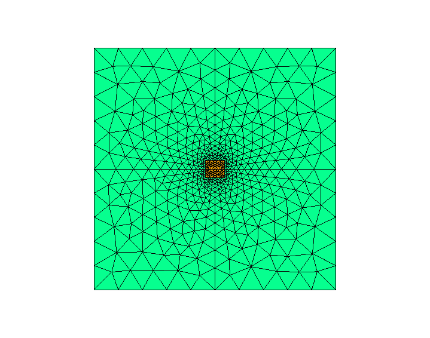

   Generated mesh for this example as displayed by ``guide.check_mesh()``.

Here's the full source code for this tutorial:

.. literalinclude:: ../../tutorials/simo-tut_01-first_calc.py
    :lines: 0-

In the next three chapters, we meet many more examples that show the different
capabilities of |NUMBAT| and provided comparisons against analytic and
experimental results from the literature. 

For the remainder of this chapter, we will explore some of the details involved
in specifying a wide range of waveguide structures.

General Simulation Procedures
------------------------------------------------

Simulations with |NUMBAT| are generally carried out using a python script file.
This file is kept in its own directory which may or may not be within your |NUMBAT| tree.
All results of the simulation are automatically created within this directory. This directory then serves as a complete record of the calculation. Often, we will also save the simulation objects within this directory for future inspection, manipulation, plotting, etc.

These files can be edited using your choice of text editor (for instance ``nano`` or ``vim``) or an IDE (for instance MS Visual Code or ``pycharm``) which allow you to run and debug code within the IDE.

To save the results from a simulation that are displayed upon execution (the print statements in your script) use::

    $ python3 ./simo-tut_01-first_calc.py | tee log-simo.log

To have direct access to the simulation objects upon the completion of a script use::

    $ python3 -i simo.py

This will execute the ``simo.py`` script and then return you into an interactive python session within the terminal. This terminal session provides the user experience of an ipython type shell where the python environment and all the simulation objects are as in the simo.py script. In this session you can access the docstrings of objects, classes and methods. For example::

    >>> from pydoc import help
    >>> help(objects.Struct)

where we have accessed the docstring of the Struct class from ``objects.py``.

Script Structure
----------------------------

As with our first example above, most |NUMBAT| scripts proceed with a standard structure: 
 * importing |NUMBAT| modules
 * defining materials
 * defining waveguide geometries and associating them with material properties
 * solving electromagnetic and acoustic modes 
 * calculating gain and other derived quantities

The following section provides some information about specifying material properties and waveguide structures, as well as the key parameters for controlling the finite-element meshing.  Information on how to add new structures to |NUMBAT| is provided in :ref:`sec-newmesh-label`.

Materials
----------------------

In order to calculate the modes of a structure we must specify the acoustic and optical properties of all constituent materials.

In |NUMBAT|, this data is read in from human-readable ``.json`` files, which are stored in the directory ``<NumBAT>/backend/material_data``.

These files not only provide the numerical values for optical and acoustic variables, but provide links to the origin of the data. Often they are taken from the literature and the naming convention allows users to select from different parameter values chosen by different authors for the same nominal material.

The intention of this arrangement is to create a library of materials that can we hope can form a standard amongst the research community. 
They also allow users to check the sensitivity of their results on particular parameters for a given material.

At present, the library contains the following materials:
  - Vacuum (or air)
      - ``Vacuum``
  - The chalcogenide glass Arsenic tri-sulfide 
      - ``As2S3_2016_Smith``
      - ``As2S3_2017_Morrison``
      - ``As2S3_2021_Poulton``
  - Fused silica 
      - ``SiO2_2013_Laude``
      - ``SiO2_2015_Van_Laer``
      - ``SiO2_2016_Smith``
      - ``SiO2_2021_Smith``
      - ``SiO2_smf28.json``
      - ``SiO2GeO2_smf28.json``
  - Silicon 
      - ``Si_2012_Rakich``
      - ``Si_2013_Laude``
      - ``Si_2015_Van_Laer``
      - ``Si_2016_Smith``
      - ``Si_2021_Poulton``
      - ``Si_test_anisotropic``
  - Silicon nitride
      - ``Si3N4_2014_Wolff``
      - ``Si3N4_2021_Steel``
  - Gallium arsenide
      - ``GaAs_2016_Smith``
  - Germanium 
      - ``Ge_cubic_2014_Wolff``
  - Lithium niobate 
      - ``LiNbO3_2021_Steel``
      - ``LiNbO3aniso_2021_Steel``

Materials can easily be added to this library by copying any of these files as a template and 
modifying the properties to suit. The ``Si_test_anisotropic`` file contains all the variables
that |NUMBAT| is setup to read. We ask that stable parameters (particularly those used
for published results) be added to the |NUMBAT| git repository using the same naming convention.

Waveguide Geometries
----------------------

|NUMBAT| encodes different waveguide structures through finite element meshes constructed using
the ``.geo`` language used by the open source tool ``Gmsh``. Most users will find they can construct all waveguides of interest using the existing templates. However, new templates can be added by adding a new ``.geo`` file to the ``<NumBAT>/backend/fortran/msh`` directory and adding a small quantity of python code to ``<NumBAT>/backend/objects.py``. Interested users can get in touch with <michael.steel@mq.edu.au>.

The following figures give some examples of how material types and physical
dimensions are represented in the mesh geometries. In particular, for each
structure template, they identify the interpretation of the dimensional
parameters (``inc_a_x``, ``slab_b_y``, etc), material labels (``material_a``,
``material_b`` etc), and the grid refinement parameters (``lc_bkg``,
``lc_refine_1``, ``lc_refine_2``, etc).  The captions for each structure also
identify the mesh geometry template files in the directory
``<NumBAT>/backend/fortran/msh`` with filenames of the form
``<prefix>_msh_template.geo`` which define the structures and can give ideas
for developing new structure files.

The |NUMBAT| code for creating all these structures can be found  in ``<NumBAT>/docs/source/images/make_meshfigs.py``.

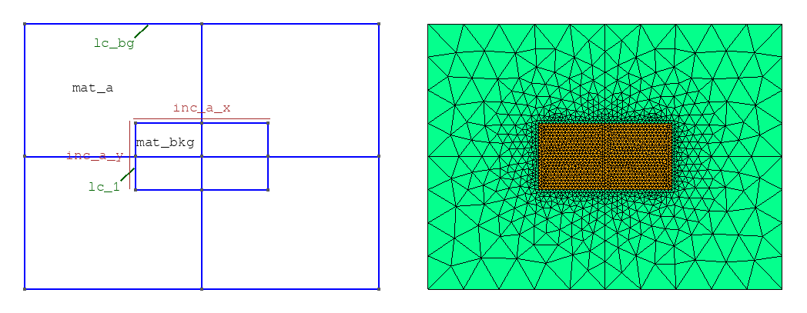

   Rectangular waveguide using shape ``rectangular`` (template ``oneincl_msh``).

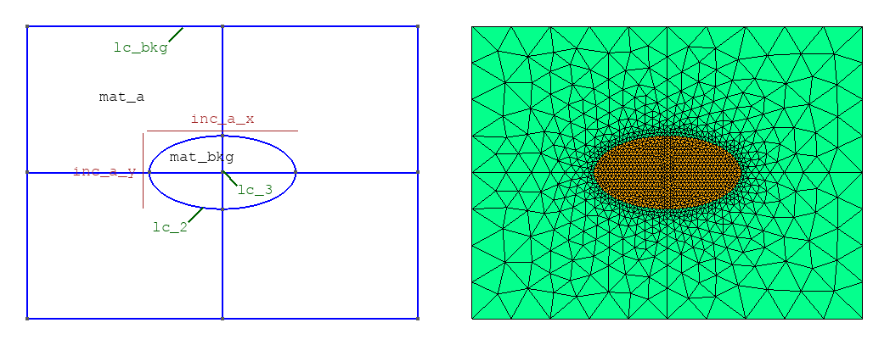

   Elliptical waveguide using shape ``circular`` (template ``oneincl_msh``).

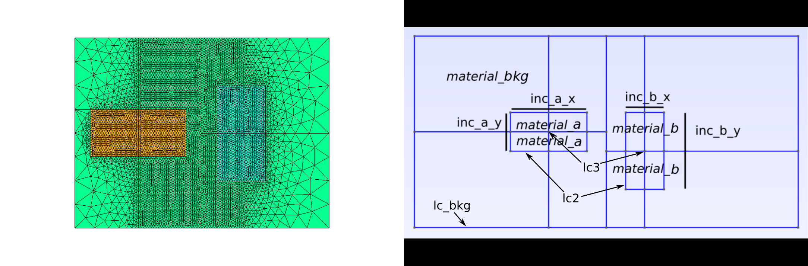

   Coupled rectangular waveguides using shape ``rectangular`` (template ``twoincl_msh``).

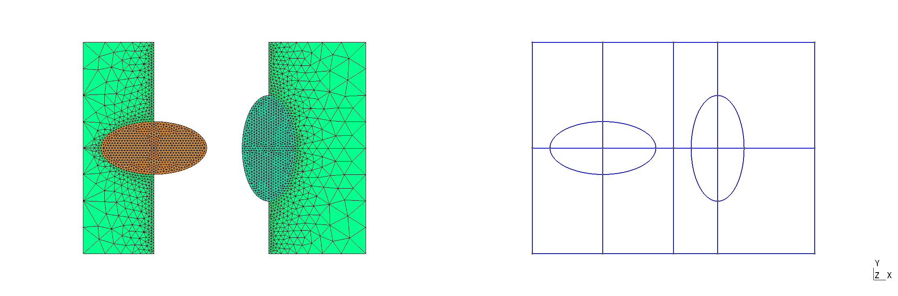

   Coupled circular waveguides using shape ``circular`` (template ``twoincl_msh``).
   There appers to be a bug here!

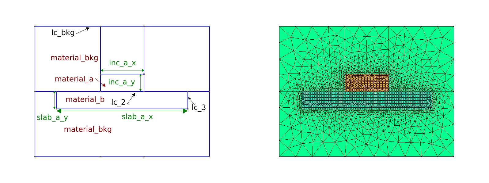

   A conventional rib waveguide using shape ``rib`` (template ``rib``).

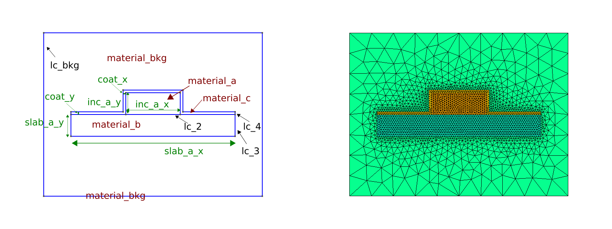

   A coated rib waveguide using shape ``rib_coated`` (template ``rib_coated``).

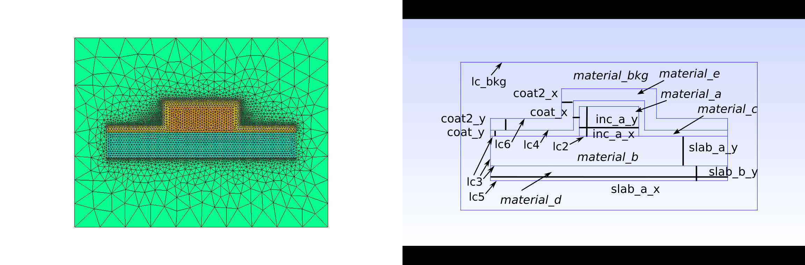

   A rib waveguide on two substrates using shape ``rib_double_coated`` (template ``rib_double_coated``).

.. .. figure:: images/meshes/slot_wg-mesh-annotated.png
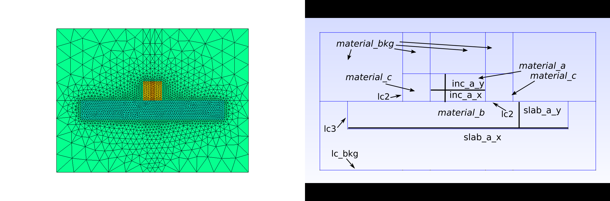

   A slot waveguide using shape ``slot`` (``material_a`` is low index) (template ``slot``).

.. .. figure:: images/meshes/slot_coated_wg-mesh-annotated.png
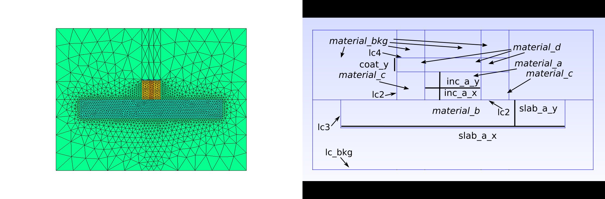

   A coated slot waveguide using shape ``slot_coated`` (``material_a`` is low index) (template ``slot_coated``).

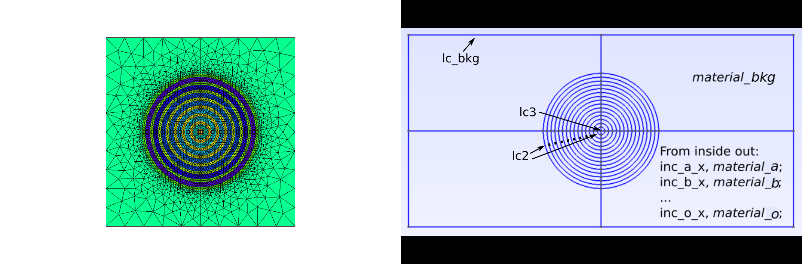

   A many-layered concentric structure using shape ``onion`` (template ``onion``).

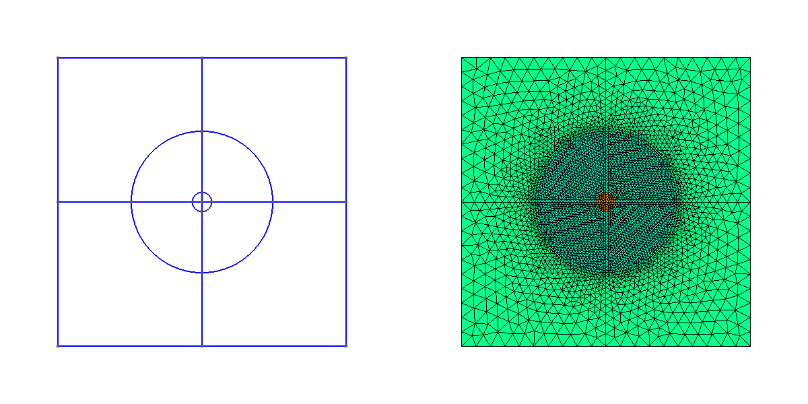

   A two-layered concentric structure with background using shape ``onion2`` (template ``onion2``).

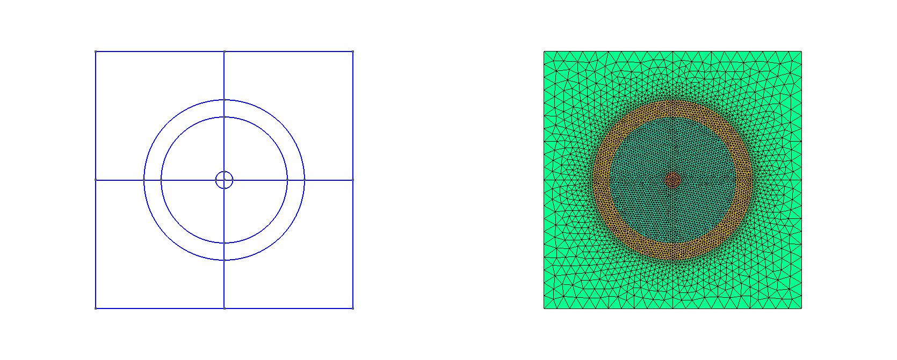

   A three-layered concentric structure with background using shape ``onion3`` (template ``onion3``).

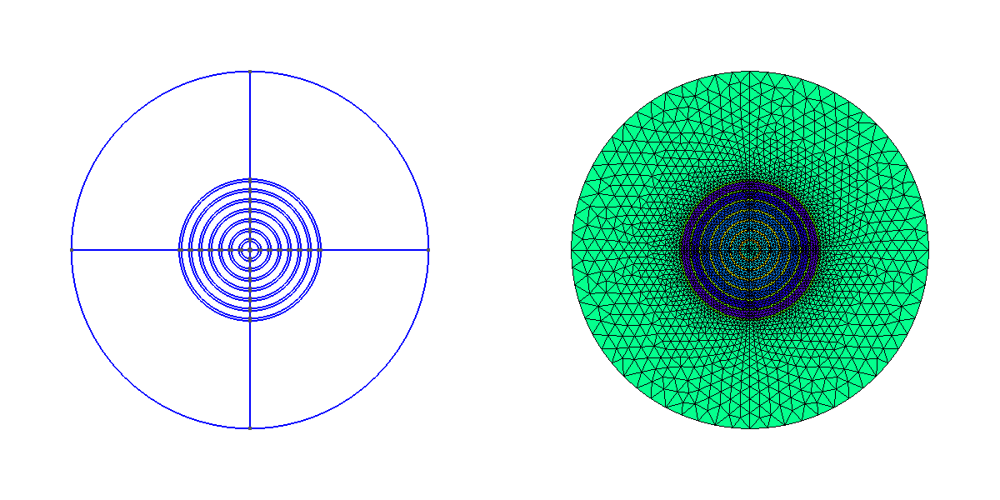

   A many-layered concentric structure with a circular outer boundary using shape ``circ_onion`` (template ``circ_onion``).
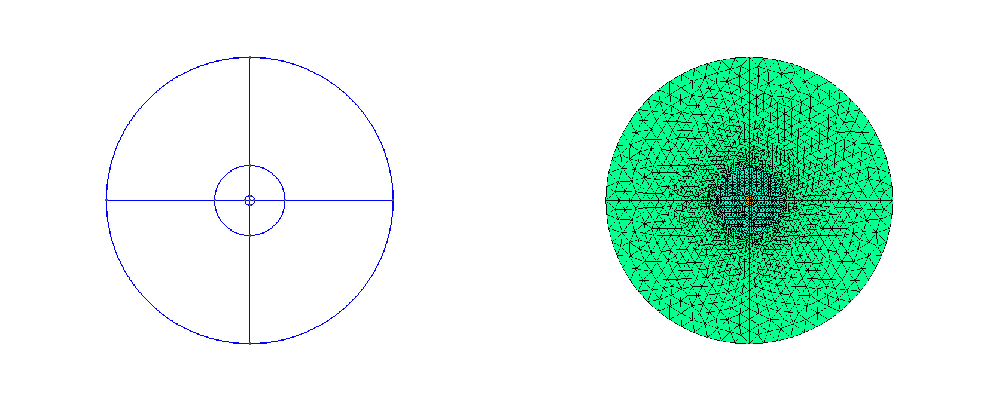

   A two-layered concentric structure with a circular outer boundary using shape ``circ_onion2`` (template ``circ_onion2``).

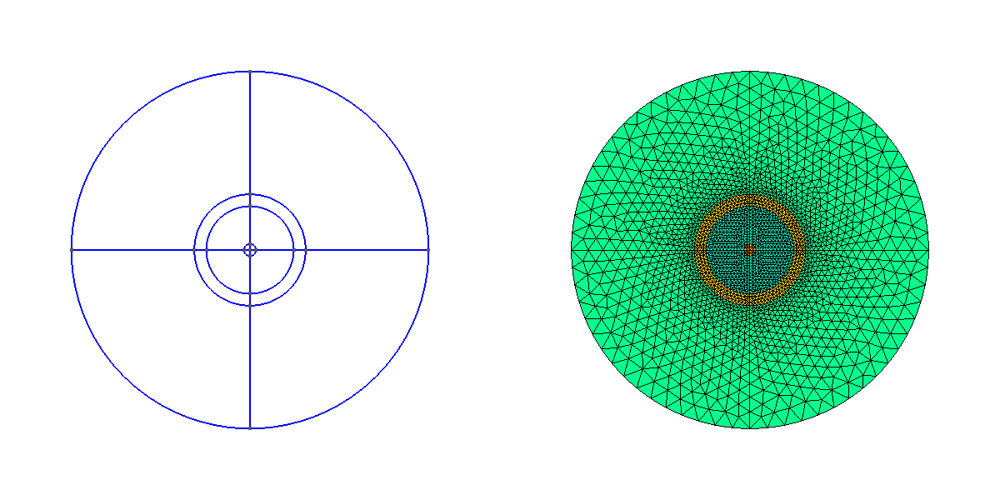

   A three-layered concentric structure with a circular outer boundary using shape ``circ_onion3`` (template ``circ_onion3``).

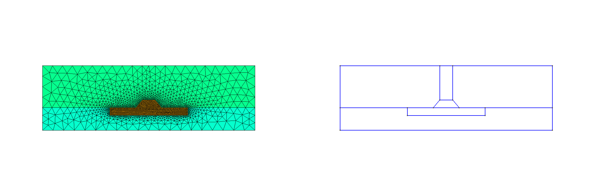

   A trapezoidal rib structure using shape ``trapezoidal_rib``.

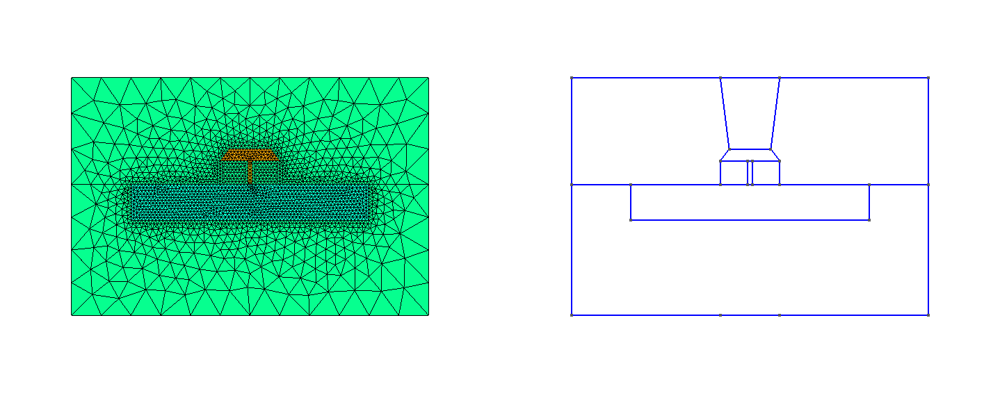

   A supported pedestal structure using shape ``pedestal``.

.. raw:: latex

    \clearpage

Structure parameters
----------------------

The parameters ``lc_bkg``, ``lc_refine_1``, ``lc_refine_2`` labelled in the above figures
control the fineness of the FEM mesh and are set when constructing the waveguide, as discussed in the next chapter. 
The first parameter ``lc_bkg`` sets the reference background mesh size, typically as a fraction of the length of the outer boundary edge. 
A larger ``lc_bkg`` yields a coarser mesh. Reasonable starting values are ``lc_bkg=0.1`` (10 mesh points on the outer boundary) to ``lc_bkg=0.05`` (20 mesh points on the outer boundary). 
   
As well as setting the overall mesh scale with ``lc_bkg``, one can also refine 
the mesh near interfaces and near select points
in the domain, as may be observed in the figures in the previous section. 
This helps to increase the mesh resolution in regions where there 
the electromagnetic and acoustic fields are likely to be strong and/or rapidly varying.
This is achieved using the
``lc_refine_n`` parameters as follows. At the interface between
materials, the mesh is refined to have characteristic length ``lc_bkg/lc_refine_1``, 
therefore a *larger* ``lc_refine_1`` gives a *finer* mesh by a factor of ``lc_refine_1`` 
at these interfaces.  The meshing program ``Gmsh``
automatically adjusts the mesh size to smoothly transition from a point that
has one mesh parameter to points that have other meshing parameters. The mesh
is typically also refined in the vicinity of important regions, such as in the
center of a waveguide, which is done with ``lc_refine_2``, which analogously to
``lc_refine_1``, refines the mesh size at these points as
``lc_bkg/lc_refine_2``. 

For more complicated structures, there are additional ``lc_refine_<n>`` parameters.
To see their exact function, look for these expressions in the particular .geo file.

Choosing appropriate values of ``lc_bkg``, ``lc_refine_1``, ``lc_refine_2`` is
crucial for |NUMBAT| to give accurate results. The appropriate values depend strongly on the type of structure being studied, and so we strongly recommended carrying out a convergence test before delving into new structures (see Tutorial 5 for an example) starting
from similar parameters as used in the tutorial simulations. 

As will as giving low accuracy, a structure with too coarse a mesh is often the cause of the eigensolver failing to converge in which case |NUMBAT| will terminate with an error. 
If you encounter such an error, try the calculation again with a slightly smaller value for ``lc_bkg``, or slightly higher values  for the ``lc_refine_n`` parameters.

On the other hand, it is wise to begin with relatively coarse meshes. It will be apparent that the number of  elements scales roughly *quadratically* with the ``lc_refine`` parameters and so the run-time increases rapidly as the mesh becomes finer.
For each problem,  some initial experimentation to identify a mesh resolution that gives reasonable convergence in acceptable simulation is usually worthwhile.

Viewing the mesh 
----------------------
When |NUMBAT| constructs a waveguide, the template ``geo`` file is converted to a concrete instatiation with the ``lc_refine`` and geometric parameters adjusted to the requested values. This file is then converted into a ``gmsh``  ``.msh`` file. When exploring new structures and their convergence behaviour, it is a very good idea to view the generated mesh frequently.

You can examine the resolution of your mesh by calling the
``plot_mesh(<prefix>)`` or ``check_mesh()`` methods on a waveguide ``Structure`` object.
The first of these functions saves a pair of images of the mesh to a ``<prefix>-mesh.png`` file in the local directory which can be viewed with your preferred image viewer;
the second opens the mesh in a ``gmsh`` window (see Tutorial 1 above).

In addition, the ``.msh`` file generated by |NUMBAT| in any calculation is stored 
in ``<NumBAT>/backend/fortran/msh/build`` and can be viewed by running the command ::
    
    gmsh <msh_filename>.msh

In some error situations, |NUMBAT| will explicitly suggest viewing the mesh and will print out the required command to do so.

.. .. raw:: latex

    \clearpage

