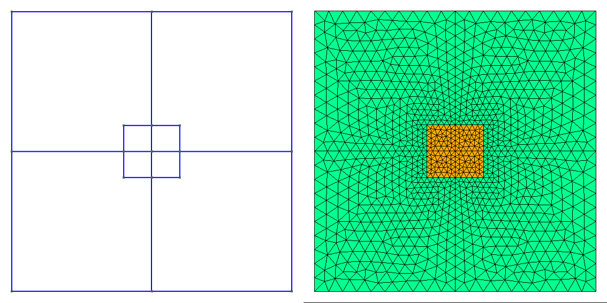

.. include:: numbatdefs.txt

.. _chap-usage-label:

**************
Basic Usage
**************

A First Calculation
------------------------------------------------
We're now ready to start using |NUMBAT|.

Let's jump straight in and run a simple calculation. Later in the chapter, we go deeper
into some of the details that we will encounter in this first example.

Tutorial 1 -- Basic SBS Gain Calculation
^^^^^^^^^^^^^^^^^^^^^^^^^^^^^^^^^^^^^^^^

Simulations with |NUMBAT| are generally carried out using a python script file.

This example, contained in ``<NumBAT>examples/tutorials/sim-tut_01-first_calc.py`` calculates the backward SBS gain for a rectangular silicon waveguide surrounded by air.

Move into the examples/tutorials directory and then run the script by entering::

    $ python3 sim-tut_01-first_calc.py

After a short while, you should see some values for the SBS gain printed to the screen.
In many more examples/tutorials in the subsequent chapters, we will meet much more convenient forms of output, but for now let's focus on the steps involved in this basic calculation.

The sequence of operations (annotated in the source code below as Step 1, Step 2, etc) is:

#. Add the |NUMBAT| install directory to Python's module search path and then import the |NUMBAT| python modules.

#. Set parameters to define the structure shape and dimensions.

#. Set parameters determining the range of electromagnetic and elastic modes to be solved.

#. Create the primary ``NumBATApp`` object to access most |NUMBAT| features and set the filename prefix for all outputs.

#. Construct the waveguide with ``nbapp.make_structure`` out of a number of ``materials.Material`` objects.

#. Generate output files containing images of the finite element mesh and final refractive index. These are illustrated in figures below.

#. Solve the electromagnetic problem at a given *free space* wavelength :math:`\lambda`. The function ``modecalcs.calc_EM_modes()`` returns an ``EMSimResult`` object containing electromagnetic mode profiles, propagation constants, and potentially other data which can be accessed through various methods we will meet in later examples/tutorials. The calculation is provided with a rough estimate of the effective index to guide the solver the find guided eigenmodes in the desired part of the spectrum. After the calculation, we can obtain the exact effective index of the fundamental mode using ``modecalcs.neff()``.

#. Display the propagation constants in units of :math:`\text{m}^{-1}` of the EM modes using ``modecalcs.kz_EM_all()``

#. Calculate the electromagnetic fields for the Stokes mode. As the pump and Stokes frequencies are very similar, the Stokes modes can be found with high precision by a simple complex conjugate transformation of the pump fields.

#. Identify the desired elastic wavenumber from the difference of the pump and Stokes propagation constants and solve the elastic problem.  ``modecalcs.calc_AC_modes()`` returns an ``ACSimResult`` object containing the elastic mode profiles, frequencies and potentially other data at the specified propagation constant ``k_AC``.

#. Display the elastic frequencies in Hz using ``modecalcs.nu_AC_all()``.

#. Use ``integration.get_gains_and_qs()`` to generate a ``GainProps`` object containing information on the total SBS gain, contributions from photoelasticity and moving boundary effects, and the elastic loss.

#. Extract desired values from the gain properties and print them to the screen.

You may have noticed from this description that the eigenproblems for the
electromagnetic and acoustic problems are framed in opposite senses. The
electromagnetic problem finds the wavenumbers :math:`k_{z,n}(\omega)` (or
equivalently the effective indices) of the modes at a given free space
wavelength (ie. at a specified frequency :math:`\omega=2\pi c/\lambda`). The
elastic solver, however, works in the opposite direction, finding the elastic modal
frequencies :math:`\nu_n(q_0)` at a given elastic propagation constant
:math:`q_0`. While this might seem odd at first, it is actually the natural way to frame SBS
calculations.

We emphasise again, that for convenience, the physical dimensions of waveguides are
specified in nanometres.  All other quantities in |NUMBAT| are expressed
in the standard SI base units.

   Generated meshes and refractive index profile.

Here's the full source code for this tutorial:

.. literalinclude:: ../../examples/tutorials/sim-tut_01-first_calc.py
    :lines: 0-

In the next few chapters, we meet many more examples that show the different
capabilities of |NUMBAT| and provided comparisons against analytic and
experimental results from the literature.

For the remainder of this chapter, we will explore some of the details involved
in specifying a wide range of waveguide structures.

General Simulation Procedures
------------------------------------------------

Simulations with |NUMBAT| are generally carried out using a python script file.
This file is kept in its own directory which may or may not be within your |NUMBAT| tree.
All results of the simulation are automatically created within this directory. This directory then serves as a complete record of the calculation. Often, we will also save the simulation objects within this directory for future inspection, manipulation, plotting, etc.

These files can be edited using your choice of text editor (for instance ``nano`` or ``vim``) or an IDE (for instance MS Visual Code or ``pycharm``) which allow you to run and debug code within the IDE.

To save the results from a simulation that are displayed upon execution (the print statements in your script) use::

    $ python3 ./sim-tut_01-first_calc.py | tee log-simo.log

To have direct access to the simulation objects upon the completion of a script use::

    $ python3 -i ./sim-tut_01-first_calc.py

This will execute the python script and then return you into an interactive
python session within the terminal. This terminal session provides the user
experience of an ipython type shell where the python environment and all the
simulation objects are in the same state as in the script when it has finished executing. In this session you can access the docstrings of objects,
classes and methods. For example::

    >>> from pydoc import help
    >>> help(objects.Structure)

where we have accessed the docstring of the Struct class from ``objects.py``.

Script Structure
----------------------------

As with our first example above, most |NUMBAT| scripts proceed with a standard structure:

* importing |NUMBAT| modules

* defining materials

* defining waveguide geometries and associating them with material properties

* solving electromagnetic and acoustic modes

* calculating gain and other derived quantities

